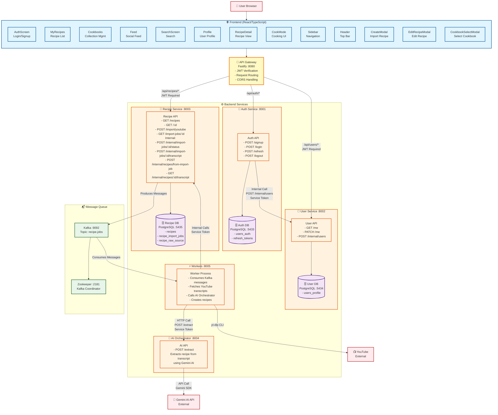
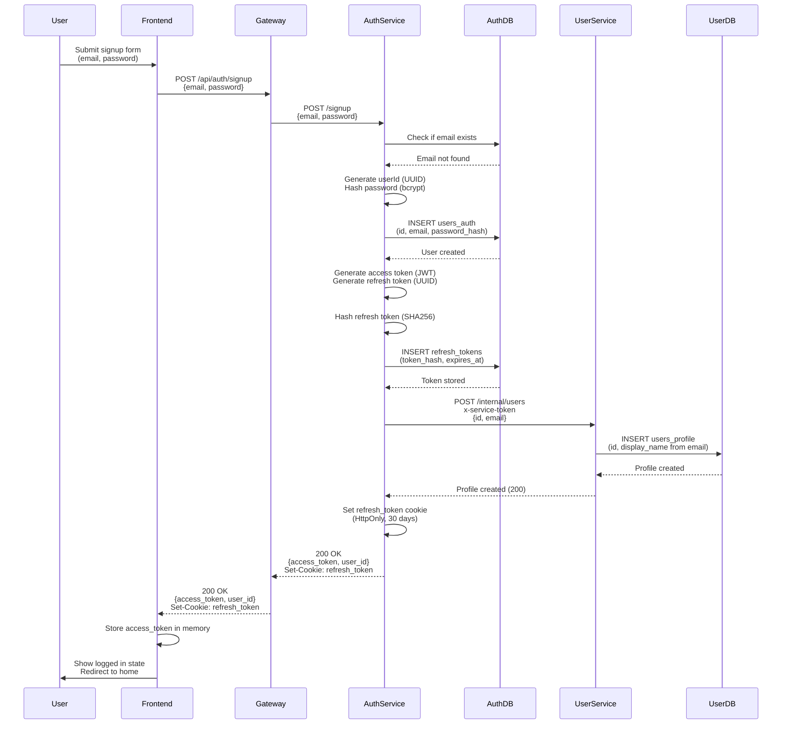
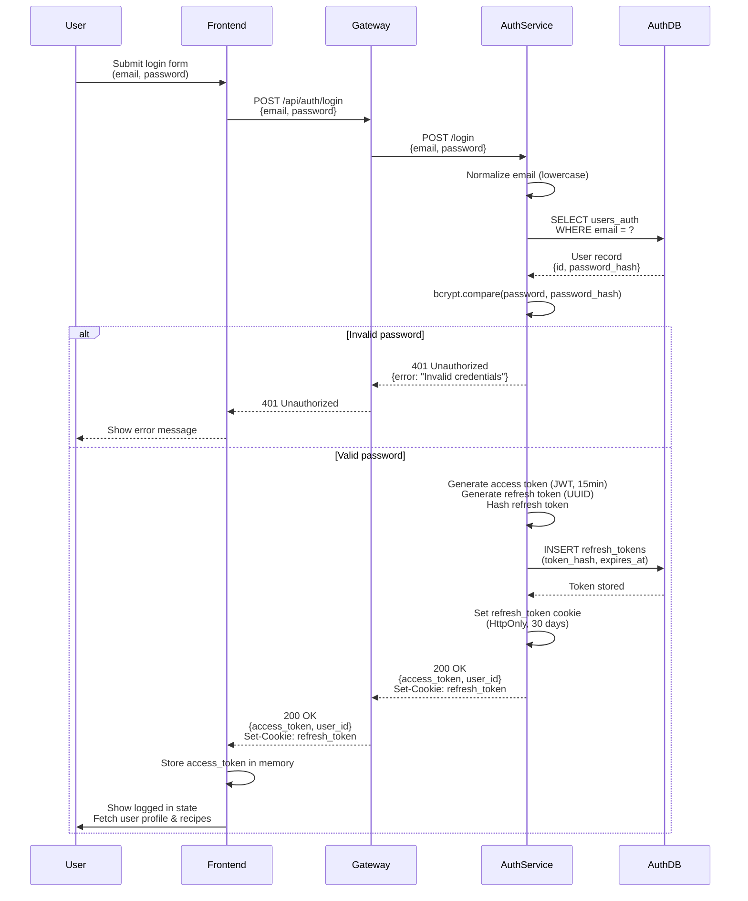
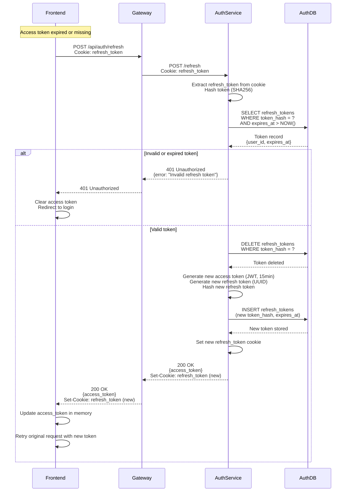
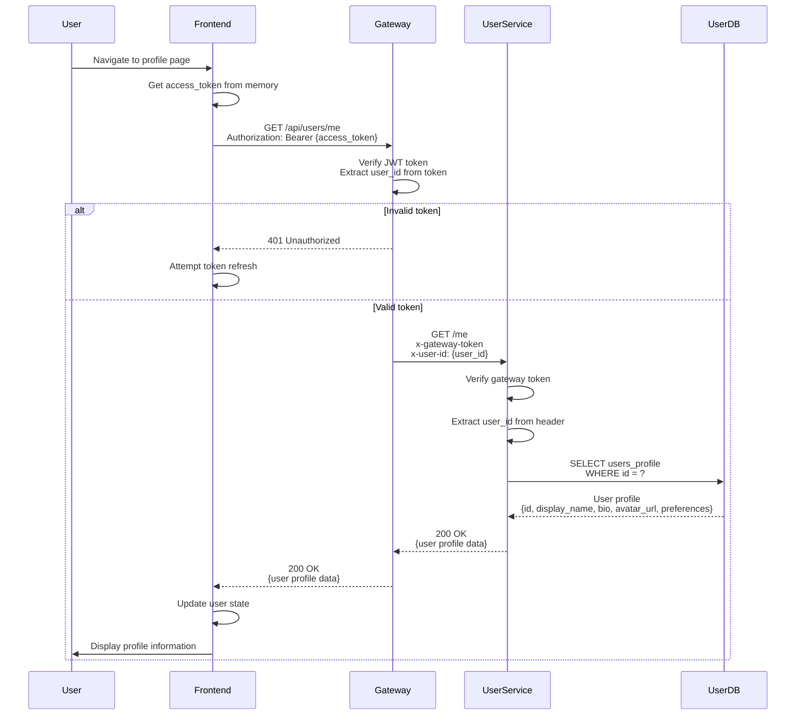
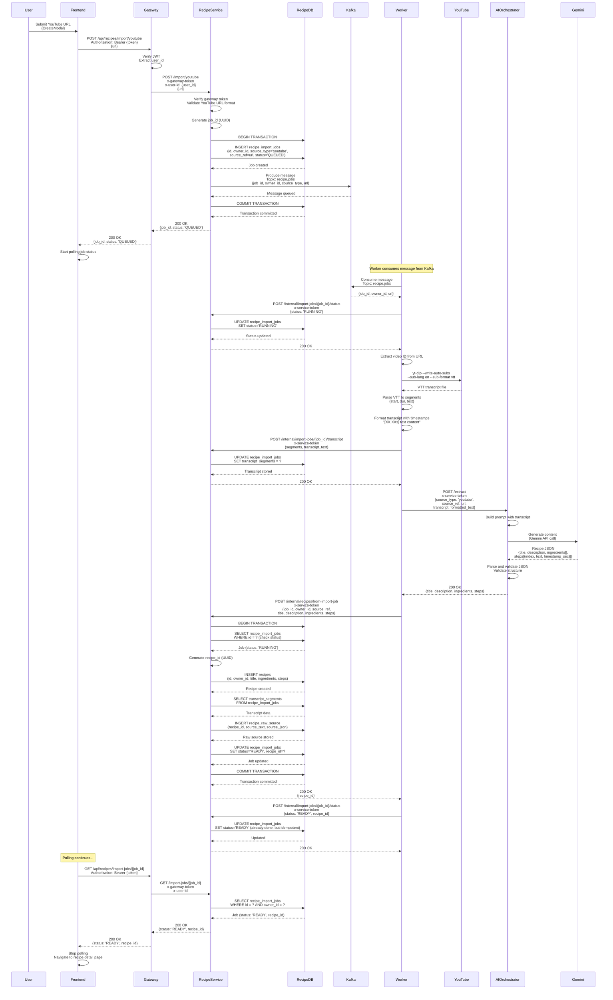
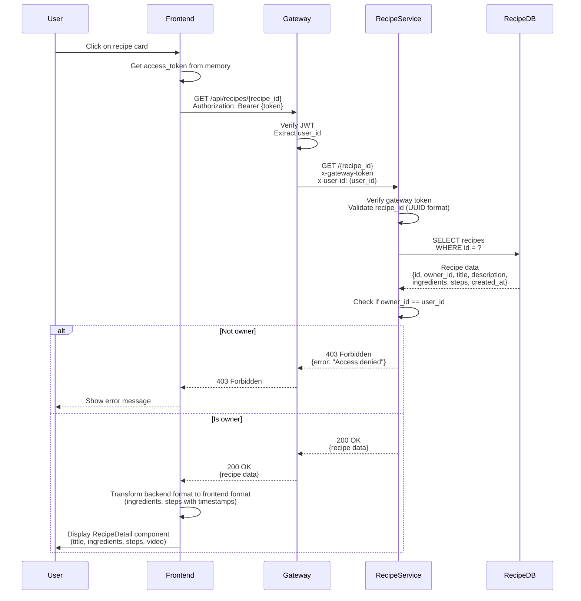
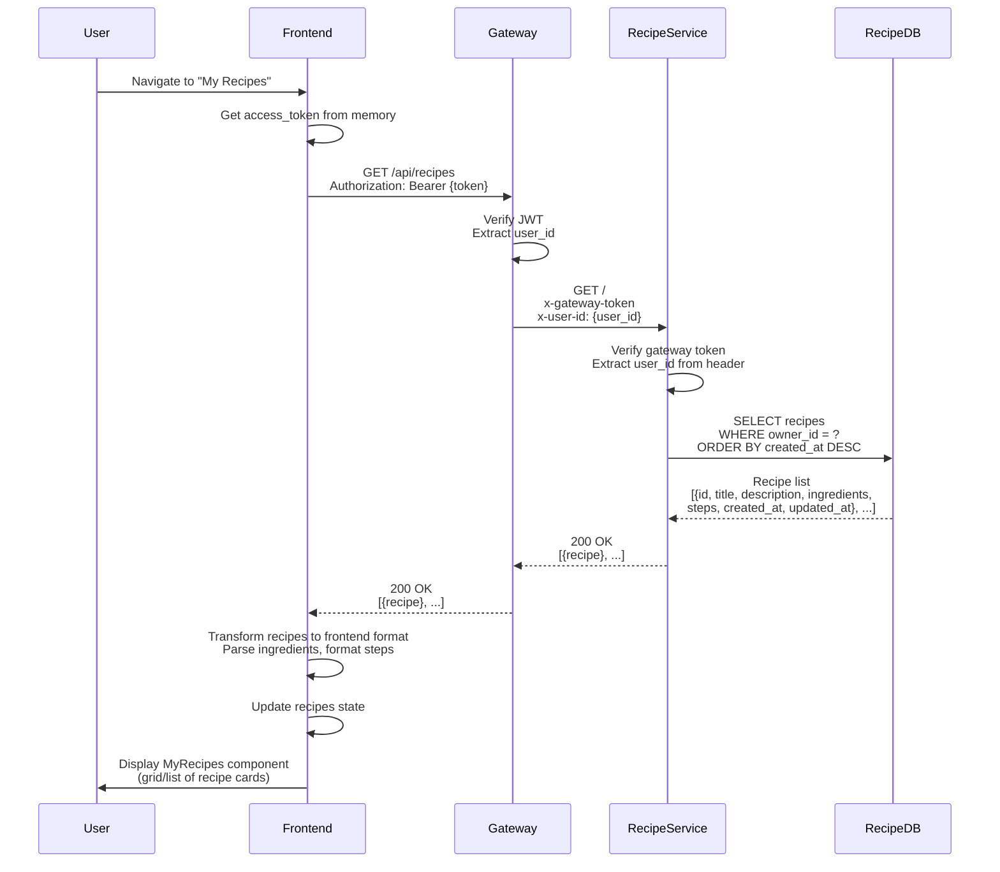
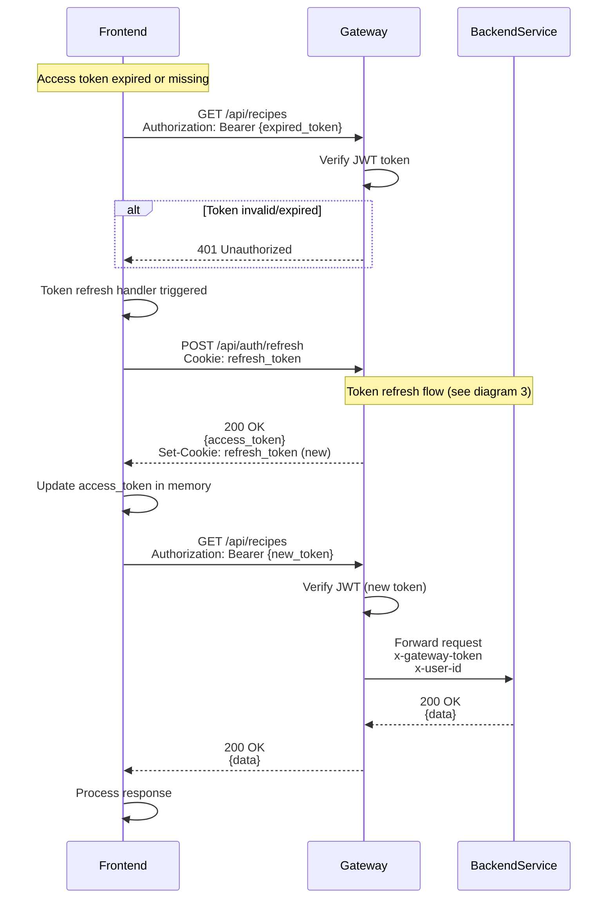

# MyCookbook Architecture Diagram

## System Architecture

## Component Details

### Frontend Components
- **AuthScreen**: Login/Signup interface
- **MyRecipes**: Recipe list view with filtering and sorting
- **Cookbooks**: Collection management UI
- **Feed**: Social feed (mock data for now)
- **SearchScreen**: Search functionality
- **Profile**: User profile view
- **RecipeDetail**: Detailed recipe view
- **CookMode**: Step-by-step cooking interface with timers
- **Sidebar**: Navigation sidebar
- **Header**: Top navigation bar
- **CreateModal**: YouTube import interface
- **EditRecipeModal**: Recipe editing interface
- **CookbookSelectModal**: Cookbook selection dialog

### Backend Services

#### API Gateway (Port 8080)
- Routes all frontend requests
- JWT token verification for protected routes
- CORS configuration
- Request/response proxying

#### Auth Service (Port 8001)
- User authentication (signup, login, logout, refresh)
- JWT token generation and validation
- Password hashing with bcrypt
- Refresh token management
- Creates user profile in User Service after signup

#### User Service (Port 8002)
- User profile management (GET/PATCH /me)
- Internal endpoint for profile creation
- Service token authentication for internal calls

#### Recipe Service (Port 8003)
- Recipe CRUD operations
- YouTube import job creation
- Import job status tracking
- Transcript storage
- Recipe creation from import jobs
- Kafka producer for job queueing

#### AI Orchestrator (Port 8004)
- Recipe extraction from transcripts
- Gemini AI integration
- Structured recipe data generation (title, ingredients, steps with timestamps)

#### Workers (Port 8005)
- Kafka consumer for import jobs
- YouTube transcript fetching using yt-dlp
- Transcript parsing and storage
- AI Orchestrator integration
- Recipe creation in Recipe Service

### Databases

#### Auth DB (Port 5433)
- `users_auth`: Email, password hash, provider
- `refresh_tokens`: Refresh token management

#### User DB (Port 5434)
- `users_profile`: Username, display name, bio, avatar, preferences

#### Recipe DB (Port 5435)
- `recipes`: Recipe data (title, ingredients, steps, metadata)
- `recipe_import_jobs`: Import job tracking and status
- `recipe_raw_source`: Original transcripts and source data

### Infrastructure

#### Kafka (Port 9092)
- Message broker for async job processing
- Topic: `recipe.jobs`
- Handles YouTube import job queueing

#### Zookeeper (Port 2181)
- Kafka coordination service

## Data Flow Examples

### User Registration Flow
1. User submits signup form (Frontend)
2. Frontend → Gateway → Auth Service
3. Auth Service creates auth record in Auth DB
4. Auth Service generates JWT tokens
5. Auth Service → User Service (internal) to create profile
6. User Service creates profile in User DB
7. Response with access token → Gateway → Frontend

### Recipe Import Flow
1. User submits YouTube URL (Frontend → CreateModal)
2. Frontend → Gateway → Recipe Service
3. Recipe Service creates import job in Recipe DB (status: QUEUED)
4. Recipe Service publishes job message to Kafka
5. Worker consumes message from Kafka
6. Worker updates job status to RUNNING
7. Worker uses yt-dlp to fetch transcript from YouTube
8. Worker stores transcript in Recipe DB
9. Worker → AI Orchestrator with transcript
10. AI Orchestrator → Gemini API for extraction
11. AI Orchestrator returns structured recipe data
12. Worker creates recipe in Recipe DB
13. Worker updates job status to READY
14. Frontend polls job status and displays recipe when ready

### Recipe View Flow
1. User navigates to recipe detail (Frontend)
2. Frontend → Gateway (with JWT) → Recipe Service
3. Recipe Service queries Recipe DB
4. Returns recipe data → Gateway → Frontend
5. Frontend displays RecipeDetail component

## Authentication Flow

1. User logs in via AuthScreen
2. Frontend → Gateway → Auth Service
3. Auth Service validates credentials against Auth DB
4. Auth Service returns access token (15min TTL) and sets refresh token cookie (30 days)
5. Frontend stores access token in memory
6. For protected routes, Frontend includes JWT in Authorization header
7. Gateway verifies JWT before proxying to backend services
8. Gateway adds `x-user-id` header for backend services
9. On token expiry, Frontend calls refresh endpoint
10. Auth Service validates refresh token cookie and returns new access token

## Internal Service Communication

- **Service Tokens**: Internal services use `x-service-token` header for service-to-service auth
- **Gateway Tokens**: Gateway uses `x-gateway-token` header when calling backend services
- **User ID**: Gateway extracts user ID from JWT and forwards via `x-user-id` header

## Technology Stack

- **Frontend**: React, TypeScript, Vite, TailwindCSS, React Router
- **Backend**: Node.js, Fastify, TypeScript, Python, FastAPI
- **Databases**: PostgreSQL 15
- **Message Queue**: Apache Kafka
- **AI**: Google Gemini API
- **External Tools**: yt-dlp (YouTube transcript extraction)

---

## Sequence Diagrams

### 1. User Signup Flow

### 2. User Login Flow

### 3. Token Refresh Flow

### 4. Get User Profile Flow

### 5. Recipe Import Flow (YouTube URL → Recipe)

### 6. Get Recipe Detail Flow

### 7. List User Recipes Flow

### 8. Authenticated Request with Token Refresh

