# MyCookbook Architecture (MVP)

## Overview

MyCookbook is a recipe management platform that allows users to import recipes from YouTube videos, organize them into cookbooks, and follow step-by-step cooking instructions. The system uses a microservices architecture with an API Gateway, separate services for authentication, user management, and recipe processing, and an async job pipeline for YouTube transcript extraction and AI-powered recipe parsing.

**Key Features:**
- User authentication with JWT tokens and refresh cookies
- YouTube recipe import via async job processing
- AI-powered recipe extraction using Google Gemini
- Recipe viewing and editing
- Cook Mode with ingredient scaling and step-by-step guidance
- Recipe organization into cookbooks (UI ready, backend pending)

## System Context

```mermaid
flowchart LR
    %% High-contrast, readable defaults
    classDef frontend fill:#E3F2FD,stroke:#0D47A1,stroke-width:2px,color:#0b0f14
    classDef gateway fill:#FFF9C4,stroke:#F57F17,stroke-width:3px,color:#0b0f14
    classDef service fill:#FFE0B2,stroke:#E65100,stroke-width:2px,color:#0b0f14
    classDef database fill:#E1BEE7,stroke:#4A148C,stroke-width:2px,color:#0b0f14
    classDef async fill:#C8E6C9,stroke:#1B5E20,stroke-width:2px,color:#0b0f14
    classDef external fill:#FFCDD2,stroke:#B71C1C,stroke-width:2px,color:#0b0f14

    %% Nodes
    User[👤 User Browser<br/>React App :3000]
    Gateway[🔌 API Gateway<br/>Fastify :8080]

    subgraph FE["🌐 Frontend"]
        React[React + TypeScript<br/>Vite Dev Server]
        YouTubeIframe[YouTube IFrame API]
    end

    subgraph Services["⚙️ Backend Services"]
        Auth[🔐 Auth Service<br/>:8001]
        UserSvc[👤 User Service<br/>:8002]
        Recipe[📝 Recipe Service<br/>:8003]
        AI[🤖 AI Orchestrator<br/>FastAPI :8004]
        Worker[⚡ Workers<br/>:8005]
    end

    subgraph Async["📬 Async Infrastructure"]
        Kafka[Kafka :9092<br/>Topic: recipe.jobs]
        Zookeeper[Zookeeper :2181]
    end

    subgraph DBs["🗄️ Databases"]
        AuthDB[(Auth DB<br/>PostgreSQL :5433)]
        UserDB[(User DB<br/>PostgreSQL :5434)]
        RecipeDB[(Recipe DB<br/>PostgreSQL :5435)]
    end

    subgraph External["🌍 External Services"]
        Gemini[Google Gemini API]
        YouTube[YouTube<br/>yt-dlp]
    end

    %% Flows
    User --> FE
    FE --> Gateway
    Gateway -->|/api/auth/*| Auth
    Gateway -->|/api/users/*<br/>JWT Required| UserSvc
    Gateway -->|/api/recipes/*<br/>JWT Required| Recipe

    Auth --> AuthDB
    Auth -->|POST /internal/users<br/>x-service-token| UserSvc
    UserSvc --> UserDB

    Recipe --> RecipeDB
    Recipe -->|Produce| Kafka
    Kafka -->|Consume| Worker
    Worker -->|yt-dlp CLI| YouTube
    Worker -->|POST /extract<br/>x-service-token| AI
    Worker -->|Internal Calls<br/>x-service-token| Recipe
    AI --> Gemini

    React --> YouTubeIframe

    %% Styling (ONLY real nodes)
    class User,React,YouTubeIframe frontend
    class Gateway gateway
    class Auth,UserSvc,Recipe,AI,Worker service
    class AuthDB,UserDB,RecipeDB database
    class Kafka,Zookeeper async
    class Gemini,YouTube external

    %% Link styling (kept from yours)
    linkStyle 0 stroke:#0D47A1,stroke-width:2px
    linkStyle 1 stroke:#0D47A1,stroke-width:2px
    linkStyle 2 stroke:#F57F17,stroke-width:2px
    linkStyle 3 stroke:#F57F17,stroke-width:2px
    linkStyle 4 stroke:#F57F17,stroke-width:2px
    linkStyle 5 stroke:#E65100,stroke-width:2px
    linkStyle 6 stroke:#E65100,stroke-width:2px
    linkStyle 7 stroke:#E65100,stroke-width:2px
    linkStyle 8 stroke:#E65100,stroke-width:2px
    linkStyle 9 stroke:#1B5E20,stroke-width:2px,stroke-dasharray: 5 5
    linkStyle 10 stroke:#1B5E20,stroke-width:2px,stroke-dasharray: 5 5
    linkStyle 11 stroke:#B71C1C,stroke-width:2px
    linkStyle 12 stroke:#B71C1C,stroke-width:2px
    linkStyle 13 stroke:#0D47A1,stroke-width:2px

```



## High-Level Architecture

The system follows a microservices pattern with:

1. **Frontend**: Single-page React application served by Vite dev server
2. **API Gateway**: Routes all requests, verifies JWT tokens, handles CORS
3. **Backend Services**: Stateless services handling specific domains
4. **Message Queue**: Kafka for async job processing
5. **Databases**: Separate PostgreSQL instances per service (MVP pattern)

**Authentication Flow:**
- Users authenticate via Auth Service, receive JWT access token (15min TTL)
- Refresh token stored in HttpOnly cookie (30 days)
- Gateway verifies JWT and forwards `x-user-id` and `x-gateway-token` headers
- Internal services use `x-service-token` for service-to-service auth

**Async Job Processing:**
- Recipe imports create jobs in QUEUED status
- Jobs published to Kafka topic `recipe.jobs`
- Workers consume jobs, fetch transcripts, call AI Orchestrator, create recipes
- Frontend polls job status with ETag/Retry-After for efficient updates

## Core Data Models

### Recipe Ingredient Format

Ingredients are stored as JSONB arrays of objects:

```typescript
{
  qty: string;    // Decimal string ("0.5", "2.5") or descriptive ("To taste", "As required")
  unit: string;   // Unit of measurement ("cup", "tsp", "") - empty string if no unit
  item: string;   // Ingredient name/description excluding qty/unit
}[]
```

**Scaling Logic (CookMode):**
- Numeric `qty` values are scaled: `Number(qty) * multiplier`
- Non-numeric `qty` values (e.g., "To taste", "As required") are displayed as-is
- Display format: `[orange qty] [unit] [item]`

### Recipe Steps Format

```typescript
{
  index: number;           // Step number (1-indexed)
  text: string;            // Step instruction
  timestamp_sec: number;   // Video timestamp in seconds (0 if unknown)
}[]
```

### Database Tables

**Auth DB (`auth_db`):**
- `users_auth`: `id` (UUID), `email` (TEXT, unique), `password_hash` (TEXT), `provider` (TEXT), `email_verified` (BOOLEAN), `created_at` (TIMESTAMPTZ)
- `refresh_tokens`: `id` (UUID), `user_id` (UUID, FK), `token_hash` (TEXT, unique), `expires_at` (TIMESTAMPTZ), `created_at` (TIMESTAMPTZ)

**User DB (`user_db`):**
- `users_profile`: `id` (UUID, PK), `username` (TEXT, unique, nullable), `display_name` (TEXT), `bio` (TEXT), `avatar_url` (TEXT), `preferences` (JSONB), `created_at` (TIMESTAMPTZ), `updated_at` (TIMESTAMPTZ)

**Recipe DB (`recipe_db`):**
- `recipes`: `id` (UUID, PK), `owner_id` (UUID), `title` (TEXT), `description` (TEXT), `is_public` (BOOLEAN), `source_type` (TEXT), `source_ref` (TEXT), `status` (TEXT), `ingredients` (JSONB), `steps` (JSONB), `created_at` (TIMESTAMPTZ), `updated_at` (TIMESTAMPTZ)
- `recipe_import_jobs`: `id` (UUID, PK), `owner_id` (UUID), `source_type` (TEXT), `source_ref` (TEXT), `status` (TEXT: QUEUED|RUNNING|READY|FAILED), `recipe_id` (UUID, unique, nullable), `error_message` (TEXT), `transcript_segments` (JSONB), `created_at` (TIMESTAMPTZ), `updated_at` (TIMESTAMPTZ)
- `recipe_raw_source`: `recipe_id` (UUID, PK, FK), `source_text` (TEXT), `source_json` (JSONB), `created_at` (TIMESTAMPTZ)

## Services

### Frontend (React/TypeScript)

**Port:** 3000 (Vite dev server)  
**Framework:** React 18, TypeScript, Vite, TailwindCSS, React Router

**Key Components:**
- `AuthScreen`: Login/signup interface
- `MyRecipes`: Recipe list view
- `RecipeDetail`: Recipe viewing with ingredients and steps
- `CookMode`: Step-by-step cooking interface with ingredient scaling, timers, YouTube player
- `CreateModal`: YouTube URL import interface with polling
- `EditRecipeModal`: Recipe editing (title, description, ingredients, steps)
- `Cookbooks`: Collection management (UI ready, backend pending)
- `Feed`: Social feed (mock data)
- `SearchScreen`: Search functionality (mock data)

**API Client (`frontend/src/api/client.ts`):**
- Base URL: `http://localhost:8080/api` (configurable via `VITE_API_BASE_URL`)
- Automatic token refresh on 401 responses
- Single-flight refresh token handling
- 10-second request timeouts

**State Management:**
- React Context API for global state (user, recipes, cookbooks)
- Local component state for UI interactions

### API Gateway (Fastify)

**Port:** 8080  
**Framework:** Fastify, http-proxy

**Responsibilities:**
- JWT token verification for protected routes
- Request routing to backend services
- CORS handling (configurable origin)
- Header forwarding (`x-user-id`, `x-gateway-token`)
- ETag/Retry-After forwarding for recipe import job polling
- Concurrency limiting for import job creation and status checks
- Upstream timeout handling (5s default)

**Routes:**
- `/api/auth/*` → Auth Service (no JWT required)
- `/api/users/*` → User Service (JWT required)
- `/api/recipes/*` → Recipe Service (JWT required)
- `/health` → Health check

**Environment Variables:**
- `PORT`: 8080
- `AUTH_URL`: http://auth:8001
- `USER_URL`: http://user:8002
- `RECIPE_URL`: http://recipe:8003
- `JWT_PUBLIC_OR_SHARED_SECRET`: JWT verification secret
- `GATEWAY_TOKEN`: Token for backend service authentication
- `FRONTEND_ORIGIN`: CORS allowed origin
- `GATEWAY_UPSTREAM_TIMEOUT_MS`: Upstream timeout (default: 5000)
- `CORS_MAX_AGE_SECONDS`: CORS preflight cache (default: 600)

### Auth Service

**Port:** 8001  
**Framework:** Fastify, PostgreSQL, bcrypt, jsonwebtoken

**Endpoints:**
- `POST /signup`: Create account, generate tokens, create user profile
- `POST /login`: Authenticate, generate tokens
- `POST /refresh`: Refresh access token using refresh token cookie
- `POST /logout`: Invalidate refresh token
- `GET /health`: Health check

**Token Management:**
- Access tokens: JWT with 15-minute TTL, signed with `JWT_SECRET`
- Refresh tokens: UUID stored as SHA256 hash in database, 30-day TTL
- Refresh tokens sent as HttpOnly cookies (secure in production, sameSite: lax)

**Internal Calls:**
- `POST /internal/users` to User Service (with `x-service-token`) after signup

**Environment Variables:**
- `PORT`: 8001
- `DATABASE_URL`: PostgreSQL connection string
- `JWT_SECRET`: JWT signing secret
- `ACCESS_TOKEN_TTL_MIN`: 15
- `REFRESH_TOKEN_TTL_DAYS`: 30
- `USER_SERVICE_INTERNAL_URL`: http://user:8002
- `SERVICE_TOKEN`: Service-to-service auth token
- `BCRYPT_COST`: Password hashing cost (default: 12)

### User Service

**Port:** 8002  
**Framework:** Fastify, PostgreSQL

**Endpoints:**
- `GET /me`: Get user profile (protected, requires `x-gateway-token` and `x-user-id`)
- `PATCH /me`: Update user profile (protected)
- `POST /internal/users`: Create user profile (internal, requires `x-service-token`)
- `GET /health`: Health check

**Environment Variables:**
- `PORT`: 8002
- `DATABASE_URL`: PostgreSQL connection string
- `SERVICE_TOKEN`: Service-to-service auth token
- `GATEWAY_TOKEN`: Gateway authentication token

### Recipe Service

**Port:** 8003  
**Framework:** Fastify, PostgreSQL, KafkaJS

**Endpoints (Protected):**
- `GET /recipes`: List user's recipes
- `GET /:recipe_id`: Get recipe by ID
- `POST /import/youtube`: Create YouTube import job
- `GET /import-jobs/:job_id`: Get import job status (with ETag/Retry-After)
- `PATCH /:recipe_id`: Update recipe (validates ingredient format: `{qty, unit, item}`)

**Internal Endpoints (Service Token Required):**
- `POST /internal/import-jobs/:job_id/status`: Update job status
- `POST /internal/import-jobs/:job_id/transcript`: Store transcript segments
- `POST /internal/recipes/from-import-job`: Create recipe from import job
- `GET /internal/recipes/:recipe_id/transcript`: Get recipe transcript
- `GET /internal/import-jobs/:job_id`: Check job status (for workers)

**Kafka Integration:**
- Produces messages to topic `recipe.jobs` on import job creation
- Message format: `{job_id, owner_id, source_type, url, requested_at}`

**ETag/Retry-After:**
- `GET /import-jobs/:job_id` returns ETag header (SHA256 hash of job state)
- Returns 304 Not Modified if `If-None-Match` matches ETag
- Returns `Retry-After` header for non-terminal job statuses:
  - QUEUED: 1 second
  - RUNNING: 3 seconds (5 seconds if long-running >30s)
  - READY/FAILED: No Retry-After

**Environment Variables:**
- `PORT`: 8003
- `DATABASE_URL`: PostgreSQL connection string
- `KAFKA_BROKERS`: Comma-separated Kafka broker addresses
- `KAFKA_TOPIC_JOBS`: recipe.jobs
- `SERVICE_TOKEN`: Service-to-service auth token
- `GATEWAY_TOKEN`: Gateway authentication token

### AI Orchestrator (FastAPI)

**Port:** 8004  
**Framework:** FastAPI, Google Gemini SDK

**Endpoints:**
- `POST /extract`: Extract recipe from transcript (requires `x-service-token`)
- `GET /health`: Health check

**Request Model:**
```python
{
  "source_type": "youtube",
  "source_ref": "YouTube URL",
  "transcript": "Formatted transcript with timestamps [XX.XXs] text",
  "options": {}
}
```

**Response Model:**
```python
{
  "title": str,
  "description": Optional[str],
  "ingredients": [
    {
      "qty": str,      # Decimal string or "To taste"/"As required"
      "unit": str,     # Unit or empty string
      "item": str      # Ingredient name
    }
  ],
  "steps": [
    {
      "index": int,           # 1-indexed
      "text": str,
      "timestamp_sec": int    # Seconds from video start
    }
  ]
}
```

**AI Prompt:**
- Enforces structured ingredient format with qty/unit/item
- Requires decimal strings for numeric quantities (no fractions)
- Validates response structure and ingredient fields

**Environment Variables:**
- `PORT`: 8004
- `GEMINI_API_KEY`: Google Gemini API key (required)
- `GEMINI_MODEL`: Model name (default: gemini-2.5-flash)
- `REQUEST_TIMEOUT_SEC`: Request timeout (default: 60)
- `SERVICE_TOKEN`: Service-to-service auth token
- `FRONTEND_ORIGIN`: CORS origin

### Workers

**Port:** 8005 (health check only)  
**Framework:** Node.js, KafkaJS, yt-dlp CLI

**Responsibilities:**
- Consume messages from Kafka topic `recipe.jobs`
- Fetch YouTube transcripts using yt-dlp CLI
- Parse VTT files to structured segments
- Store transcripts in Recipe Service
- Call AI Orchestrator for recipe extraction
- Create recipes in Recipe Service
- Update job status (RUNNING → READY/FAILED)

**Worker Flow:**
1. Consume job message from Kafka
2. Check job status (skip if already terminal)
3. Update status to RUNNING
4. Fetch transcript via yt-dlp (VTT format)
5. Parse VTT to segments `{start, dur, text}`
6. Format transcript with timestamps: `[XX.XXs] text`
7. Store transcript segments in Recipe Service
8. Call AI Orchestrator `/extract` endpoint
9. Create recipe via Recipe Service internal endpoint
10. Update job status to READY (or FAILED on error)

**Error Handling:**
- Failed transcript fetch → status FAILED with error message
- AI extraction failure → status FAILED
- Retry logic with exponential backoff for API calls

**Environment Variables:**
- `KAFKA_BROKERS`: Comma-separated Kafka broker addresses
- `KAFKA_TOPIC_JOBS`: recipe.jobs
- `RECIPE_INTERNAL_URL`: http://recipe:8003
- `AI_ORCHESTRATOR_URL`: http://ai-orchestrator:8004
- `SERVICE_TOKEN`: Service-to-service auth token
- `WORKER_CONCURRENCY`: Max concurrent jobs (default: 4)

### Kafka/Zookeeper

**Kafka Port:** 9092  
**Zookeeper Port:** 2181

**Topic:**
- `recipe.jobs`: Import job messages

**Message Format:**
```json
{
  "job_id": "UUID",
  "owner_id": "UUID",
  "source_type": "youtube",
  "url": "YouTube URL",
  "requested_at": "ISO 8601 timestamp"
}
```

**Configuration:**
- Auto-create topics enabled
- Single broker (MVP)
- Replication factor: 1

### Databases

All databases use PostgreSQL 15.

**Auth DB (Port 5433):**
- Database: `auth_db`
- User: `auth_user`
- Tables: `users_auth`, `refresh_tokens`

**User DB (Port 5434):**
- Database: `user_db`
- User: `user_user`
- Tables: `users_profile`

**Recipe DB (Port 5435):**
- Database: `recipe_db`
- User: `recipe_user`
- Tables: `recipes`, `recipe_import_jobs`, `recipe_raw_source`

## Key Flows

### Signup


### Login + Refresh


### Recipe Import (YouTube → Job → Recipe)


### Recipe View


### Recipe Edit (PATCH)


### Cook Mode (Scaling + Step Seek)

**Ingredient Scaling:**
- User sets serving multiplier (e.g., 4.5x)
- For each ingredient:
  - If `Number(qty)` is finite: `scaled = Number(qty) * multiplier`
  - Format: up to 2 decimals, trim trailing zeros
  - If `qty` is non-numeric (e.g., "To taste"): display as-is
- Display: `[orange qty] [unit] [item]`

**Step Seeking:**
- Each step has `timestamp_sec` (seconds from video start)
- User clicks step → YouTube player seeks to timestamp
- YouTube IFrame API loaded dynamically
- Player auto-plays when seeking to step

## Local Development

### How to Run

**Prerequisites:**
- Docker and Docker Compose
- Node.js 18+ (for frontend development)
- Python 3.9+ (for AI Orchestrator)
- yt-dlp installed in workers container

**Start All Services:**
```bash
docker-compose -f docker-compose.local.yml up
```

**Start Frontend (separate terminal):**
```bash
cd frontend
npm install
npm run dev
```

**Environment Variables:**
Create `.env` file in project root:
```bash
JWT_SECRET=dev-secret-change-in-production
SERVICE_TOKEN=dev-service-token
GEMINI_API_KEY=your-gemini-api-key
GATEWAY_TOKEN=dev-service-token  # Optional, defaults to SERVICE_TOKEN
```

**Service URLs:**
- Frontend: http://localhost:3000
- Gateway: http://localhost:8080
- Auth Service: http://localhost:8001 (internal)
- User Service: http://localhost:8002 (internal)
- Recipe Service: http://localhost:8003 (internal)
- AI Orchestrator: http://localhost:8004 (internal)
- Workers: http://localhost:8005 (health check only)

### Health Checks

All services expose `/health` endpoints:
- Gateway: `GET http://localhost:8080/health`
- Auth: `GET http://localhost:8001/health`
- User: `GET http://localhost:8002/health`
- Recipe: `GET http://localhost:8003/health`
- AI Orchestrator: `GET http://localhost:8004/health`
- Workers: `GET http://localhost:8005/health`

### Common Debugging Tips

**Database Access:**
```bash
# Auth DB
docker exec -it mycookbook-auth-db-1 psql -U auth_user -d auth_db

# User DB
docker exec -it mycookbook-user-db-1 psql -U user_user -d user_db

# Recipe DB
docker exec -it mycookbook-recipe-db-1 psql -U recipe_user -d recipe_db
```

**Kafka Topics:**
```bash
# List topics
docker exec -it mycookbook-kafka-1 kafka-topics --list --bootstrap-server localhost:9092

# Consume messages
docker exec -it mycookbook-kafka-1 kafka-console-consumer --bootstrap-server localhost:9092 --topic recipe.jobs --from-beginning
```

**Service Logs:**
```bash
# All services
docker-compose -f docker-compose.local.yml logs -f

# Specific service
docker-compose -f docker-compose.local.yml logs -f recipe
docker-compose -f docker-compose.local.yml logs -f workers
```

**Common Issues:**
- **Import jobs stuck in QUEUED**: Check Kafka is running and workers are consuming
- **401 Unauthorized**: Check JWT_SECRET matches between gateway and auth service
- **Recipe import fails**: Check GEMINI_API_KEY is set and valid
- **yt-dlp errors**: Ensure workers container has yt-dlp installed
- **ETag/304 issues**: Check gateway forwards `If-None-Match` header correctly

## Appendix

### Endpoints Summary

| Service | Method | Path | Auth | Description |
|---------|--------|------|------|-------------|
| Gateway | GET | `/health` | None | Health check |
| Gateway | * | `/api/auth/*` | None | Proxy to Auth Service |
| Gateway | * | `/api/users/*` | JWT | Proxy to User Service |
| Gateway | * | `/api/recipes/*` | JWT | Proxy to Recipe Service |
| Auth | POST | `/signup` | None | Create account |
| Auth | POST | `/login` | None | Authenticate |
| Auth | POST | `/refresh` | Cookie | Refresh access token |
| Auth | POST | `/logout` | Cookie | Logout |
| Auth | GET | `/health` | None | Health check |
| User | GET | `/me` | Gateway | Get user profile |
| User | PATCH | `/me` | Gateway | Update user profile |
| User | POST | `/internal/users` | Service | Create user profile |
| User | GET | `/health` | None | Health check |
| Recipe | GET | `/recipes` | Gateway | List user recipes |
| Recipe | GET | `/:recipe_id` | Gateway | Get recipe |
| Recipe | POST | `/import/youtube` | Gateway | Create import job |
| Recipe | GET | `/import-jobs/:job_id` | Gateway | Get job status (ETag) |
| Recipe | PATCH | `/:recipe_id` | Gateway | Update recipe |
| Recipe | POST | `/internal/import-jobs/:job_id/status` | Service | Update job status |
| Recipe | POST | `/internal/import-jobs/:job_id/transcript` | Service | Store transcript |
| Recipe | POST | `/internal/recipes/from-import-job` | Service | Create recipe |
| Recipe | GET | `/internal/recipes/:recipe_id/transcript` | Service | Get transcript |
| Recipe | GET | `/health` | None | Health check |
| AI | POST | `/extract` | Service | Extract recipe from transcript |
| AI | GET | `/health` | None | Health check |

### Event/Message Shapes

**Kafka Message (`recipe.jobs` topic):**
```json
{
  "job_id": "550e8400-e29b-41d4-a716-446655440000",
  "owner_id": "660e8400-e29b-41d4-a716-446655440000",
  "source_type": "youtube",
  "url": "https://www.youtube.com/watch?v=...",
  "requested_at": "2024-01-15T10:30:00Z"
}
```

**AI Orchestrator Request:**
```json
{
  "source_type": "youtube",
  "source_ref": "https://www.youtube.com/watch?v=...",
  "transcript": "[0.00s] Welcome to my cooking channel\n[5.23s] Today we're making pasta...",
  "options": {}
}
```

**AI Orchestrator Response:**
```json
{
  "title": "Homemade Pasta",
  "description": "Fresh pasta recipe",
  "ingredients": [
    {"qty": "2", "unit": "cups", "item": "all-purpose flour"},
    {"qty": "3", "unit": "", "item": "eggs"},
    {"qty": "To taste", "unit": "", "item": "salt"}
  ],
  "steps": [
    {"index": 1, "text": "Mix flour and eggs", "timestamp_sec": 120},
    {"index": 2, "text": "Knead for 10 minutes", "timestamp_sec": 180}
  ]
}
```

### Error Handling & Statuses

**Import Job Statuses:**
- `QUEUED`: Job created, waiting for worker
- `RUNNING`: Worker processing (fetching transcript, calling AI)
- `READY`: Recipe created successfully
- `FAILED`: Error occurred (check `error_message` field)

**Status Transitions:**
- QUEUED → RUNNING (worker picks up job)
- RUNNING → READY (recipe created)
- RUNNING → FAILED (error occurred)
- Terminal states (READY, FAILED) cannot be changed

**HTTP Error Codes:**
- `400`: Validation error (e.g., invalid ingredient format, empty qty)
- `401`: Unauthorized (invalid/missing token)
- `403`: Forbidden (user doesn't own resource)
- `404`: Not found
- `409`: Conflict (e.g., email already exists)
- `422`: Unprocessable entity (e.g., AI extraction failed)
- `500`: Internal server error
- `503`: Service overloaded (concurrency limit reached)
- `504`: Gateway upstream timeout

**Error Response Format:**
```json
{
  "error": {
    "code": "ERROR_CODE",
    "message": "Human-readable message",
    "request_id": "correlation-id"
  }
}
```
