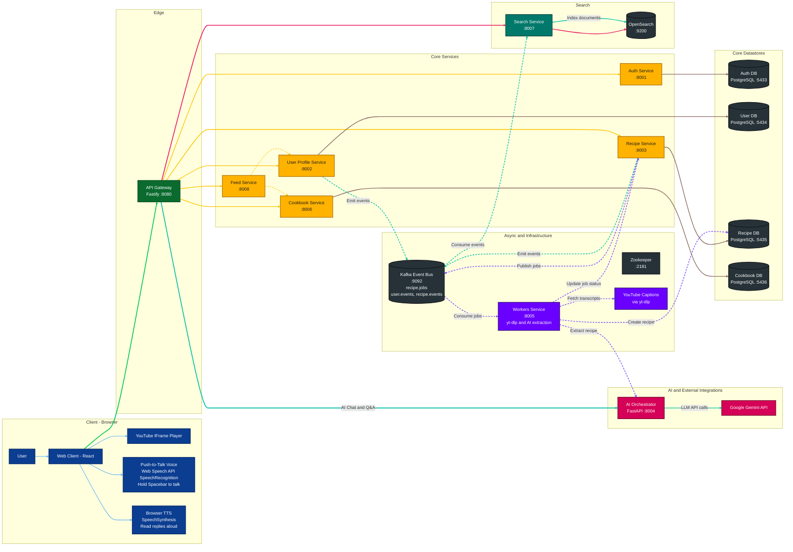

# MyCookbook

MyCookbook is a microservices-based recipe platform that turns YouTube cooking videos into interactive, cookable recipes. It supports recipe organization via cookbooks, a social feed, global search, an AI cooking assistant (Chat assistant and voice assistant push-to-talk), and a Cook Mode experience with YouTube step syncing.

> MyCookbook is built around one idea:  
    **Cooking should feel calm, focused, and enjoyable. Not like fighting a video player.**  
    It bridges the gap between watching recipes and actually cooking them.

## ✨ Key Features

### Turn any YouTube cooking video into a real recipe
Found an amazing recipe on YouTube but hate scrubbing back and forth whie cooking or is hard to manage propotions?  
Just paste the video link. MyCookbook transforms it into a clean, structured recipe with ingredients and step-by-step instructions you can actually cook from. No more pausing every 5 seconds or rewinding to hear one line again.

### Your personal recipe library, beautifully organized
Every recipe you import lives in your own library. Group them into cookbooks that match how you cook in real life: weeknight meals, comfort food, meal prep, desserts, or anything you want. You can keep your cookbook private or make it public and share it with your friends.

### Discover and explore
Explore recipes beyond your own collection. Follow other cooks, browse public cookbooks, and discover new ideas through your feed. Whether you’re searching for inspiration or looking for something specific, everything is easy to find in one unified search.

### Cook Mode: designed for when you’re actually cooking
Cook Mode isn’t just a recipe view—it’s your kitchen companion.
- One step at a time, clearly highlighted so you always know where you are
- Instantly jump between steps without losing your place
- Scale ingredients up or down with a tap (no mental math required)
- Start timers alongside your steps so nothing burns
- Watch the video right next to the recipe, perfectly synced

It’s built to stay out of your way and support you while your hands are busy.

### Video that follows your steps
Each recipe stays connected to its original video. Jump to a step, and the video jumps with you. No more hunting for “that moment where they add the spices.” Everything stays in sync so you can cook with confidence.

### Ask questions while you cook
Not sure what to do next? Curious about substitutions or timing?
You can ask questions directly inside Cook Mode:
- “What happens if I skip this step?”
- “When do I add the tomatoes?”
- “Can I replace butter with oil?”

The assistant understands the recipe you’re cooking and responds in context—like having a knowledgeable friend in the kitchen with you.

### Hands-free control with Push-to-Talk
Cooking with messy hands? No problem.
Hold the spacebar, speak naturally, and let go. That’s it.
You can move between steps, ask questions, or control the flow without touching your keyboard. The app listens only while you’re holding the key—simple, intentional, and frustration-free.

## 🏗️ System Architecture

MyCookbook follows a microservices architecture. The diagram below shows the **current implementation**:



## 🛠️ Technology Stack

### Frontend
- **React 18** with TypeScript
- **Vite** for build tooling
- **Tailwind CSS** for styling
- **React Router** for navigation
- **YouTube IFrame Player API** for cookmode player
- **Web Speech API** for voice commands (browser-native)

### Backend Services
- **Node.js** (Fastify) for most services
- **Python** (FastAPI) for AI Orchestrator
- **PostgreSQL** for data persistence (separate DB per service)
- **Kafka** for message queuing and event streaming
- **OpenSearch** for full-text search
- **Docker** & **Docker Compose** for containerization
- **Google Gemini API** for AI-powered recipe extraction

## 📁 Project Structure

```
MyCookbook/
├── frontend/              # React frontend application
├── gateway/               # API Gateway service
├── auth/                  # Authentication service
├── user/                  # User profile & social graph service
├── recipe/                # Recipe management service
├── cookbook/              # Cookbook organization service
├── feed/                  # Social feed service (fanout-on-read)
├── search/                # Search service (OpenSearch)
├── ai-orchestrator/       # AI recipe extraction (Python/FastAPI)
├── workers/               # Async job workers (YouTube processing)
├── docker-compose.local.yml  # Local development orchestration
```

Each service directory contains:
- `README.md` - Service-specific documentation
- `Design.md` - High-level and low-level design docs
- `Dockerfile` - Container definition
- `docker-compose.yml` - Standalone deployment config

## 📋 Prerequisites

- **Docker** and **Docker Compose** (v2.0+)
- **Node.js** 18+ (for frontend development)
- **Google Gemini API Key** ([Get one here](https://makersuite.google.com/app/apikey))
- **Git** (for cloning the repository)

## 🚀 Quick Start

### 1. Clone the Repository

```bash
git clone <repository-url>
cd MyCookbook
```

### 2. Set Environment Variables

Create a `.env` file in the root directory or export the following:

```bash
# JWT Secret (change in production!)
export JWT_SECRET="your-secret-key-change-in-production"

# Service-to-service authentication
export SERVICE_TOKEN="your-service-token"
export GATEWAY_TOKEN="your-gateway-token"  # Can be same as SERVICE_TOKEN

# Google Gemini API Key (required for recipe extraction)
export GEMINI_API_KEY="your-gemini-api-key"

# Optional: Customize ports, timeouts, etc.
export GEMINI_MODEL="gemini-2.5-flash"  # Default model
export REQUEST_TIMEOUT_SEC=30
```

### 3. Start Backend Services

Start all infrastructure and backend services:

```bash
docker compose -f docker-compose.local.yml up --build
```

This will start:
- **Infrastructure**: Kafka, Zookeeper, OpenSearch, PostgreSQL databases
- **Services**: Gateway, Auth, User, Recipe, Cookbook, Feed, Search, AI Orchestrator, Workers

Wait for all services to be healthy (check logs or use `docker compose ps`).

### 4. Start Frontend

In a separate terminal:

```bash
cd frontend
npm install
npm run dev
```

The frontend will be available at `http://localhost:3000` (or the port Vite assigns).

**Note**: The frontend reads the API URL from `VITE_API_BASE_URL` environment variable. If not set, it defaults to `http://localhost:8080/api`. Create a `.env.local` file in the `frontend/` directory if needed:

```bash
# frontend/.env
VITE_API_BASE_URL=http://localhost:8080/api
```

### 5. Access the Application

- **Frontend**: http://localhost:3000
- **API Gateway**: http://localhost:8080
- **Health Check**: http://localhost:8080/health

## 🔧 Service Ports

| Service | Port | Description |
|---------|------|-------------|
| Frontend | 3000 | React development server |
| Gateway | 8080 | API Gateway (main entry point) |
| Auth | 8001 | Authentication service |
| User | 8002 | User profile service |
| Recipe | 8003 | Recipe management service |
| AI Orchestrator | 8004 | AI recipe extraction service |
| Workers | 8005 | Async job workers |
| Cookbook | 8006 | Cookbook service |
| Search | 8007 | Search service |
| Feed | 8008 | Social feed service |
| Kafka | 9092 | Kafka broker |
| Zookeeper | 2181 | Zookeeper (for Kafka) |
| OpenSearch | 9200 | OpenSearch instance |
| PostgreSQL | 5433-5436 | Separate databases per service |

## 🧪 Testing the System

### 1. Create an Account

```bash
curl -X POST http://localhost:8080/api/auth/signup \
  -H "Content-Type: application/json" \
  -d '{
    "email": "test@example.com",
    "password": "password123"
  }'
```

### 2. Login

```bash
curl -X POST http://localhost:8080/api/auth/login \
  -H "Content-Type: application/json" \
  -c cookies.txt \
  -d '{
    "email": "test@example.com",
    "password": "password123"
  }'
```

Save the `access_token` from the response for authenticated requests.

### 3. Import a YouTube Recipe

```bash
curl -X POST http://localhost:8080/api/recipes/import/youtube \
  -H "Content-Type: application/json" \
  -H "Authorization: Bearer YOUR_ACCESS_TOKEN" \
  -d '{
    "url": "https://www.youtube.com/watch?v=..."
  }'
```

This returns a `job_id`. Poll the job status:

```bash
curl http://localhost:8080/api/recipes/import-jobs/JOB_ID \
  -H "Authorization: Bearer YOUR_ACCESS_TOKEN"
```

### 4. Get Your Recipes

```bash
curl http://localhost:8080/api/recipes \
  -H "Authorization: Bearer YOUR_ACCESS_TOKEN"
```

## 📚 Service Documentation

Each service has detailed documentation:

- **[Gateway](gateway/README.md)** - API Gateway with routing, auth, rate limiting
- **[Auth](auth/README.md)** - Authentication and authorization
- **[User](user/README.md)** - User profiles and social graph
- **[Recipe](recipe/README.md)** - Recipe management and YouTube imports
- **[Cookbook](cookbook/README.md)** - Cookbook organization
- **[Feed](feed/README.md)** - Social feed generation
- **[Search](search/README.md)** - Global search with OpenSearch
- **[AI Orchestrator](ai-orchestrator/README.md)** - AI-powered recipe extraction
- **[Workers](workers/README.md)** - Async job processing
- **[Frontend](frontend/README.md)** - React application

Each service also includes a `Design.md` file with:
- High-Level Design (HLD) diagrams
- Low-Level Design (LLD) details
- Data models and flows
- Mermaid diagrams for visualization

## 🛠️ Development Workflow

### Running Services Individually

Each service can run standalone using its own `docker-compose.yml`:

```bash
cd auth
docker compose up
```

See individual service READMEs for specific instructions.

### Viewing Logs

```bash
# All services
docker compose -f docker-compose.local.yml logs -f

# Specific service
docker compose -f docker-compose.local.yml logs -f gateway
docker compose -f docker-compose.local.yml logs -f recipe
```

### Rebuilding Services

```bash
# Rebuild all
docker compose -f docker-compose.local.yml up --build

# Rebuild specific service
docker compose -f docker-compose.local.yml up --build auth
```

### Database Access

Connect to any database using the ports listed above:

```bash
# Auth DB
psql -h localhost -p 5433 -U auth_user -d auth_db

# User DB
psql -h localhost -p 5434 -U user_user -d user_db

# Recipe DB
psql -h localhost -p 5435 -U recipe_user -d recipe_db

# Cookbook DB
psql -h localhost -p 5436 -U cookbook_user -d cookbook_db
```

Default passwords are defined in `docker-compose.local.yml`.

### Stopping Services

```bash
# Stop all services (keep data)
docker compose -f docker-compose.local.yml down

# Stop and remove volumes (clean slate)
docker compose -f docker-compose.local.yml down -v
```

## 🔐 Security Features

- **JWT Authentication**: Short-lived access tokens (15min) with refresh tokens
- **HttpOnly Cookies**: Refresh tokens stored securely
- **Rate Limiting**: Token bucket algorithm for auth and authenticated endpoints
- **Service-to-Service Auth**: Internal services use `x-service-token` headers
- **CORS Protection**: Configured for frontend origin only
- **Input Validation**: Request validation on all endpoints
- **SQL Injection Protection**: Parameterized queries

## 🚦 Rate Limiting

Rate limiting is configurable via environment variables:

- **Auth endpoints** (login/signup): Per-IP rate limiting
- **Authenticated endpoints**: Per-user rate limiting
- Disabled by default in development (set `RATE_LIMIT_ENABLED=true` to enable)

## 🐛 Troubleshooting

### Kafka Not Ready
Wait 30-60 seconds after starting for Kafka to fully initialize. Check logs:
```bash
docker compose -f docker-compose.local.yml logs kafka
```

### Database Connection Errors
Ensure databases are healthy:
```bash
docker compose -f docker-compose.local.yml ps
```
All databases should show "healthy" status.

### Gemini API Errors
Verify `GEMINI_API_KEY` is set correctly:
```bash
echo $GEMINI_API_KEY
```

### Port Conflicts
If ports are already in use, modify `docker-compose.local.yml` to use different ports.

### Frontend Can't Connect to API
1. Ensure Gateway is running on port 8080
2. Check `VITE_API_BASE_URL` in `frontend/.env`
3. Verify CORS settings in Gateway (should allow `http://localhost:3000`)

## ⚠️ Areas for Future Improvement (todo)

This is an early MVP and a few rough edges are expected. Below is a transparent checklist of known issues, limitations, and intentional trade-offs so expectations are clear.

### 🔐 Authentication & Session
- [ ] Page refresh or hard reload may redirect to the login screen  
(token persistence / refresh flow still being finalized)
- [ ] No “remember me” or multi-device session management yet

### 🎙️ Voice & Push-to-Talk
- [ ] Voice recognition behavior may vary by browser (Chrome/Safari works best; others can be inconsistent)
- [ ] Push-to-talk currently works via keyboard only (no on-screen press-and-hold button)
- [ ] Accents and background noise may reduce accuracy

### 📹 YouTube & Recipe Import
- [ ] Some YouTube videos may fail to import
- [ ] Recipe duplication is currently allowed (Multiple entities for the same source)

### 🍳 Cook Mode
- [ ] Need to make the UI responsive
- [ ] No offline support yet (requires an active internet connection)
- [ ] No completely hands-free mode (It causes a feedbackloop - video sound it taken as input, need to implement echo cancellation if we want truly hands-free mode)

### 🔍 Search & Discovery
- [ ] Search ranking is basic and not personalized yet
- [ ] No filters for dietary preferences, cooking time, or difficulty

### 👥 Social & Feed
- [ ] No notifications for new recipes from followed users
- [ ] Feed ordering is simple chronological sorting
- [ ] No likes, comments, or saves yet
- [ ] No private sharing links for recipes or cookbooks

### 📱 UX & Accessibility
- [ ] Mobile experience is functional but not fully optimized
- [ ] No dark/light mode toggle
- [ ] No onboarding walkthrough or tutorial

### 🛠️ Platform & Infrastructure
- [ ] No production monitoring or alerting configured
- [ ] No analytics or usage tracking yet

## 🤝 Contributing

This is a personal project, but suggestions and feedback are welcome!

