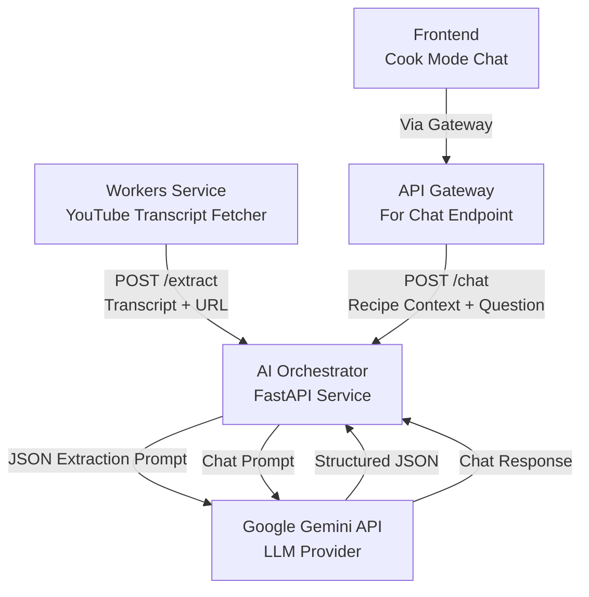
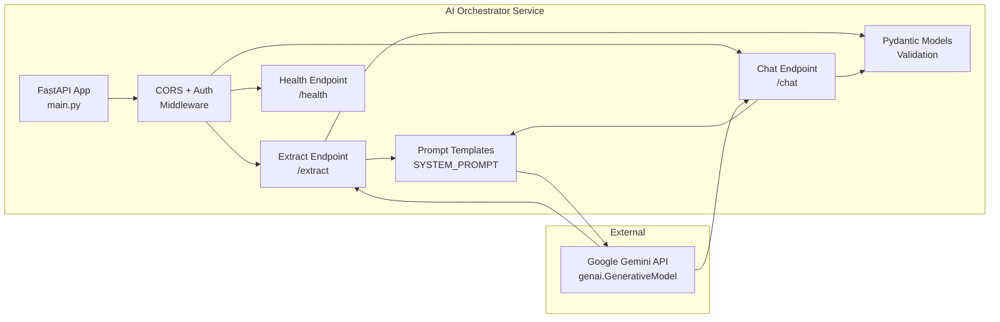
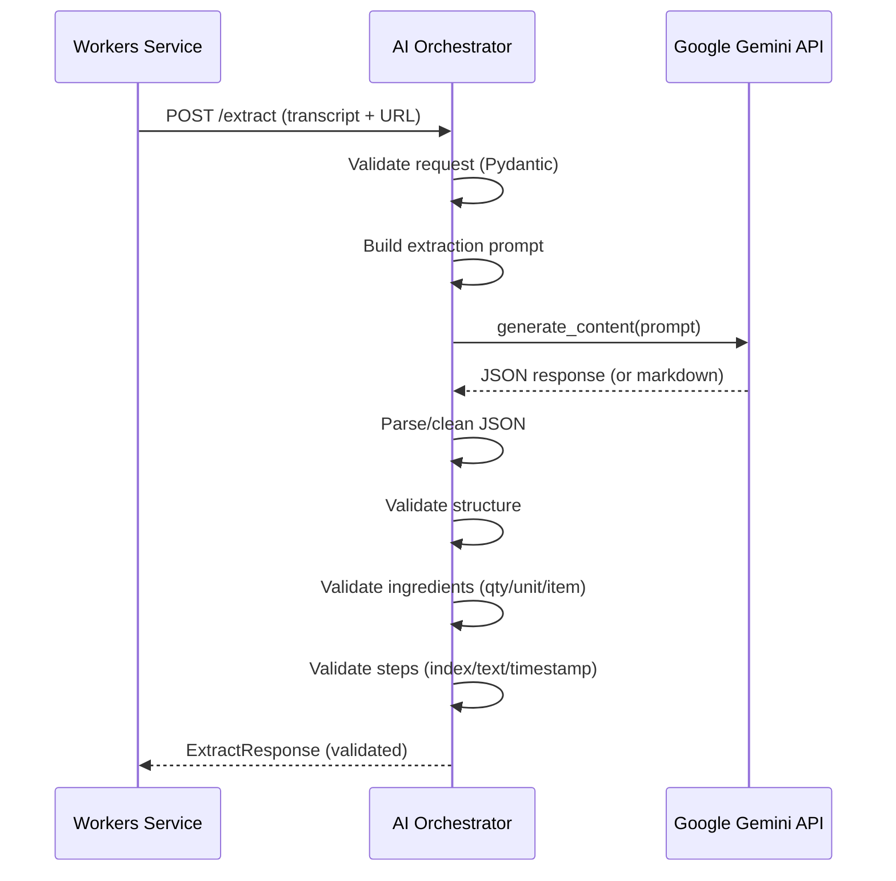
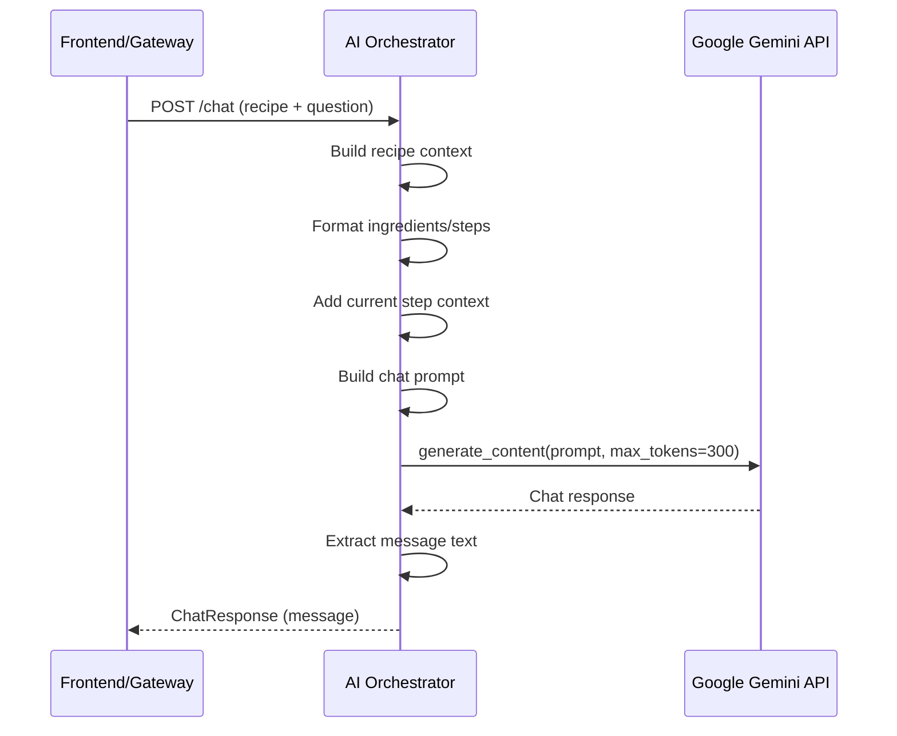
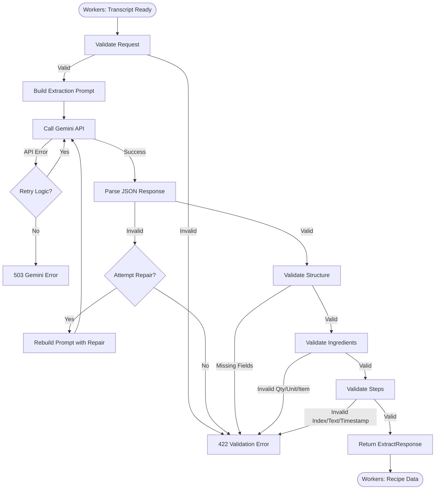
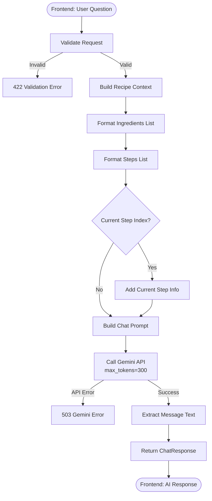
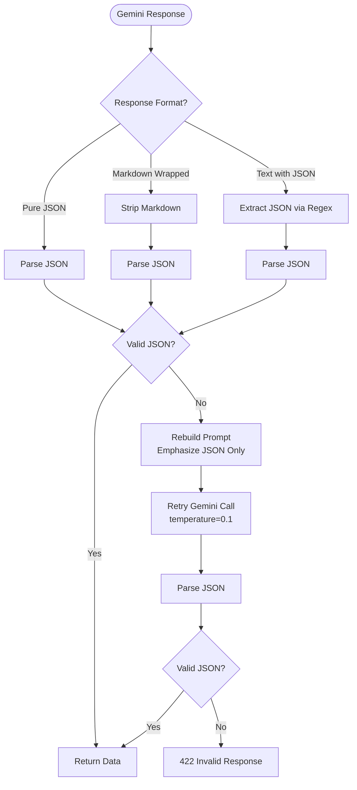

# AI Orchestrator Service - Design Document

## Table of Contents

1. [High-Level Design (HLD)](#high-level-design-hld)
2. [Low-Level Design (LLD)](#low-level-design-lld)
3. [Data Structures](#data-structures)
4. [API Design](#api-design)
5. [Flow Diagrams](#flow-diagrams)
6. [Error Handling](#error-handling)
7. [Performance Considerations](#performance-considerations)

## High-Level Design (HLD)

### System Context

The AI Orchestrator is a stateless FastAPI service that provides AI-powered recipe extraction and cooking assistance. It serves as the AI layer for the CookFlow application.



### Responsibilities

1. **Recipe Extraction**: Converts unstructured video transcripts into structured recipe data (title, ingredients with qty/unit/item, steps with timestamps)
2. **Cook Mode Chat**: Provides context-aware cooking assistance during active cooking sessions
3. **Schema Validation**: Ensures AI responses conform to expected schemas
4. **Error Recovery**: Attempts to repair invalid JSON responses from AI

### Design Principles

- **Stateless**: No database, all processing in-memory
- **Idempotent**: Same input produces same output (deterministic prompts)
- **Fail-Fast**: Invalid inputs rejected immediately
- **Retry-Aware**: Workers service handles retries, not this service

## Low-Level Design (LLD)

### Service Architecture



### Component Details

#### 1. FastAPI Application (`main.py`)

- **Framework**: FastAPI (async support)
- **Port**: 8004 (configurable)
- **CORS**: Restricted to `FRONTEND_ORIGIN`
- **Authentication**: Service token verification via dependency injection

#### 2. Extract Endpoint (`POST /extract`)

**Purpose**: Extract structured recipe from transcript

**Flow**:


**Prompt Structure**:
1. System prompt with schema definition
2. User prompt with transcript and URL
3. Emphasizes timestamp extraction from transcript format `[XX.XXs]`

#### 3. Chat Endpoint (`POST /chat`)

**Purpose**: Provide cooking assistance during Cook Mode

**Flow**:


**Prompt Structure**:
1. System prompt: Role as cooking assistant, use recipe context when relevant
2. Context: Recipe title, description, ingredients, steps, current step
3. User question: User's message

#### 4. Gemini Client Configuration

```python
genai.configure(api_key=GEMINI_API_KEY)
model = genai.GenerativeModel(GEMINI_MODEL)

# For extraction (deterministic):
model.generate_content(
    prompt,
    generation_config={
        "temperature": 0.3,  # Lower for structured output
    }
)

# For chat (creative):
model.generate_content(
    prompt,
    generation_config={
        "temperature": 0.7,  # Higher for conversational
        "max_output_tokens": 300,  # Limit for cost efficiency
    }
)
```

## Data Structures

### Request Models

#### ExtractRequest
```typescript
{
  source_type: string;        // "youtube"
  source_ref: string;         // YouTube URL
  transcript: string;         // Transcript with [XX.XXs] timestamps
  options?: {
    include_timestamps?: boolean;
  };
}
```

#### ChatRequest
```typescript
{
  recipe_id: string;
  title: string;
  description?: string;
  ingredients: Ingredient[];
  steps: ChatStep[];          // {text, index?}
  user_message: string;
  current_step_index?: number;
}
```

### Response Models

#### ExtractResponse
```typescript
{
  title: string;
  description?: string;
  ingredients: Ingredient[];
  steps: Step[];
}
```

#### Ingredient
```typescript
{
  qty: string;      // "2.5" or "To taste" or "As required"
  unit: string;     // "cup", "tsp", "" (empty if not applicable)
  item: string;     // "all-purpose flour", "salt"
}
```

#### Step
```typescript
{
  index: number;           // 1-indexed
  text: string;            // Step instruction
  timestamp_sec: number;   // Seconds from video start (0 if unknown)
}
```

#### ChatResponse
```typescript
{
  message: string;  // AI assistant response
}
```

### Internal Structures

#### Gemini Response Handling

The service handles multiple response formats:

1. **Pure JSON**: Direct JSON object (preferred)
2. **Markdown-wrapped**: JSON in ```json blocks
3. **Text with JSON**: JSON embedded in text

**Cleaning Process**:
```python
# Strip markdown code fences
if content.startswith('```json'):
    content = content[7:]
elif content.startswith('```'):
    content = content[3:]
if content.endswith('```'):
    content = content[:-3]
content = content.strip()

# Try parsing
recipe_data = json.loads(content)
```

## API Design

### Endpoints

#### POST /extract

**Authentication**: `x-service-token` header required

**Request**:
```json
{
  "source_type": "youtube",
  "source_ref": "https://www.youtube.com/watch?v=...",
  "transcript": "[0.00s] Hello...\n[30.00s] First step...",
  "options": {
    "include_timestamps": true
  }
}
```

**Response** (200 OK):
```json
{
  "title": "Recipe Title",
  "description": "Optional description",
  "ingredients": [
    {
      "qty": "2.5",
      "unit": "cup",
      "item": "flour"
    }
  ],
  "steps": [
    {
      "index": 1,
      "text": "Step instruction",
      "timestamp_sec": 30
    }
  ]
}
```

**Error Responses**:
- `401`: Missing/invalid service token
- `422`: Invalid request format or AI response format
- `503`: Gemini API error
- `500`: Internal server error

#### POST /chat

**Authentication**: `x-service-token` header required

**Request**:
```json
{
  "recipe_id": "uuid",
  "title": "Recipe Title",
  "description": "Optional",
  "ingredients": [
    {
      "qty": "2",
      "unit": "cup",
      "item": "flour"
    }
  ],
  "steps": [
    {
      "text": "Step 1",
      "index": 1
    }
  ],
  "user_message": "What temperature should I use?",
  "current_step_index": 0
}
```

**Response** (200 OK):
```json
{
  "message": "Preheat your oven to 375°F (190°C) for best results."
}
```

**Error Responses**:
- `401`: Missing/invalid service token
- `422`: Invalid request format
- `503`: Gemini API error
- `500`: Internal server error

#### GET /health

**Authentication**: None required

**Response** (200 OK):
```json
{
  "status": "healthy",
  "service": "ai-orchestrator"
}
```

## Flow Diagrams

### Recipe Extraction Flow



### Chat Flow



### Error Recovery Flow



## Error Handling

### Error Categories

1. **Validation Errors (422)**
   - Invalid request format
   - Missing required fields
   - Invalid AI response format
   - Missing title/ingredients/steps

2. **Authentication Errors (401)**
   - Missing `x-service-token` header
   - Invalid service token

3. **Service Errors (503)**
   - Gemini API failures
   - API timeout
   - Rate limiting

4. **Internal Errors (500)**
   - Unexpected exceptions
   - JSON parsing failures after retry

### Error Response Format

```json
{
  "detail": "Human-readable error message"
}
```

### Retry Strategy

**Important**: This service does NOT implement retries. Retries are handled by:
- **Workers Service**: Retries `/extract` calls with exponential backoff
- **Gateway**: Can retry `/chat` calls (if configured)

**Rationale**: Service remains stateless and simple. Caller is responsible for retries.

## Performance Considerations

### Request Timeout

- **Default**: 60 seconds (`REQUEST_TIMEOUT_SEC`)
- **Rationale**: Gemini API can be slow for complex transcripts
- **Configurable**: Via environment variable

### Token Limits

- **Extraction**: No limit (transcripts can be long)
- **Chat**: 300 tokens max (`max_output_tokens`)
  - Keeps responses concise
  - Reduces API costs
  - Improves response time

### Concurrency

- **FastAPI**: Handles async requests efficiently
- **No Database**: No connection pool limits
- **Gemini API**: Rate limits apply (handled by API)

### Caching

- **No Caching**: Service is stateless
- **Rationale**: 
  - Same transcript may produce different results (AI non-deterministic)
  - Chat context changes with each question
  - Simpler architecture

### Optimization Opportunities

1. **Prompt Caching**: Gemini API supports prompt caching (not implemented)
2. **Response Streaming**: Could stream chat responses (not implemented)
3. **Batch Processing**: Could process multiple transcripts (not implemented)

## Integration Points

### Upstream (Calls This Service)

1. **Workers Service**
   - Calls `/extract` after fetching YouTube transcript
   - Retries on failure
   - Handles job status updates

2. **Gateway/Frontend**
   - Calls `/chat` during Cook Mode
   - Requires authentication via gateway

### Downstream (This Service Calls)

1. **Google Gemini API**
   - `generate_content()` for extraction
   - `generate_content()` for chat

### Dependencies

- **FastAPI**: Web framework
- **google-generativeai**: Gemini client
- **pydantic**: Request/response validation
- **uvicorn**: ASGI server

## Security Considerations

1. **Service Token**: Required for all endpoints except `/health`
2. **CORS**: Restricted to `FRONTEND_ORIGIN` (not wildcard)
3. **Input Validation**: All inputs validated via Pydantic
4. **No Storage**: Stateless service, no user data stored
5. **API Key**: `GEMINI_API_KEY` stored as environment variable (never logged)

## Monitoring and Observability

### Health Check

- **Endpoint**: `GET /health`
- **Response Time**: Should be < 100ms
- **No Dependencies**: Always returns healthy if service is running

### Metrics to Track

1. **Request Rate**: Requests per second to `/extract` and `/chat`
2. **Error Rate**: 422/503/500 error rates
3. **Latency**: P50, P95, P99 for extraction and chat
4. **Gemini API Calls**: Success/failure rate, latency
5. **JSON Parse Failures**: Rate of repair attempts

### Logging

- **Request Logging**: FastAPI default logging
- **Error Logging**: Log all exceptions with context
- **API Errors**: Log Gemini API errors with request IDs
- **Sensitive Data**: Never log API keys or full transcripts

## Future Enhancements

1. **Photo-based Extraction**: OCR + LLM for recipe photos
2. **Multi-language Support**: Detect and handle non-English transcripts
3. **Recipe Validation**: Cross-check ingredients and steps for consistency
4. **Recipe Enhancement**: Suggest improvements or variations
5. **Conversation Memory**: Maintain chat context across multiple messages
6. **Streaming Responses**: Stream chat responses for better UX

