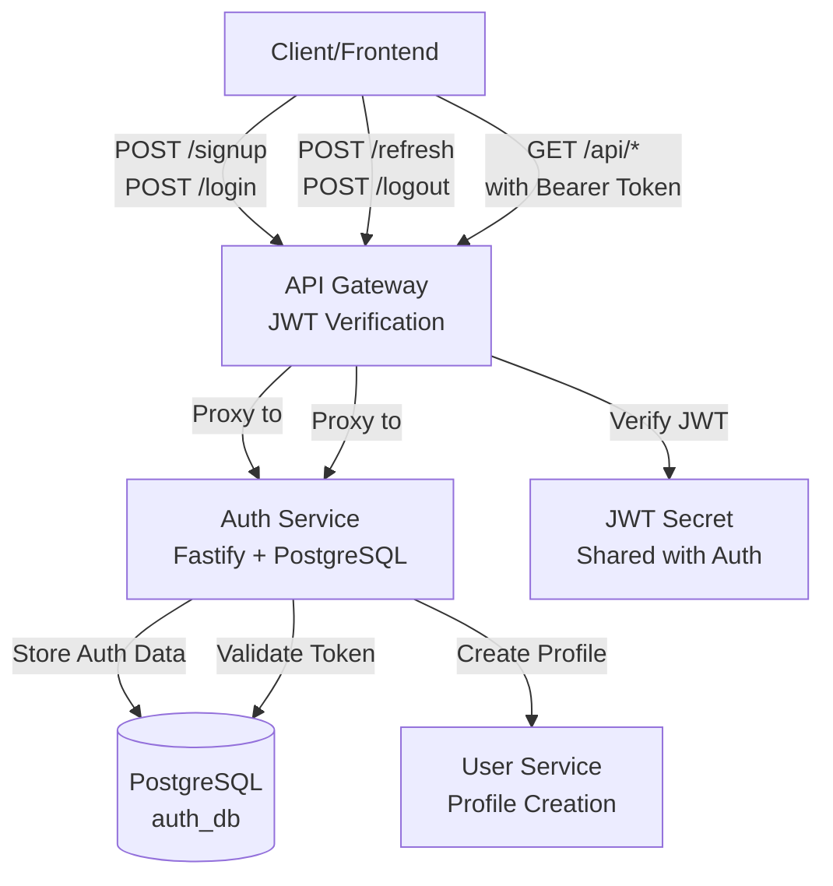
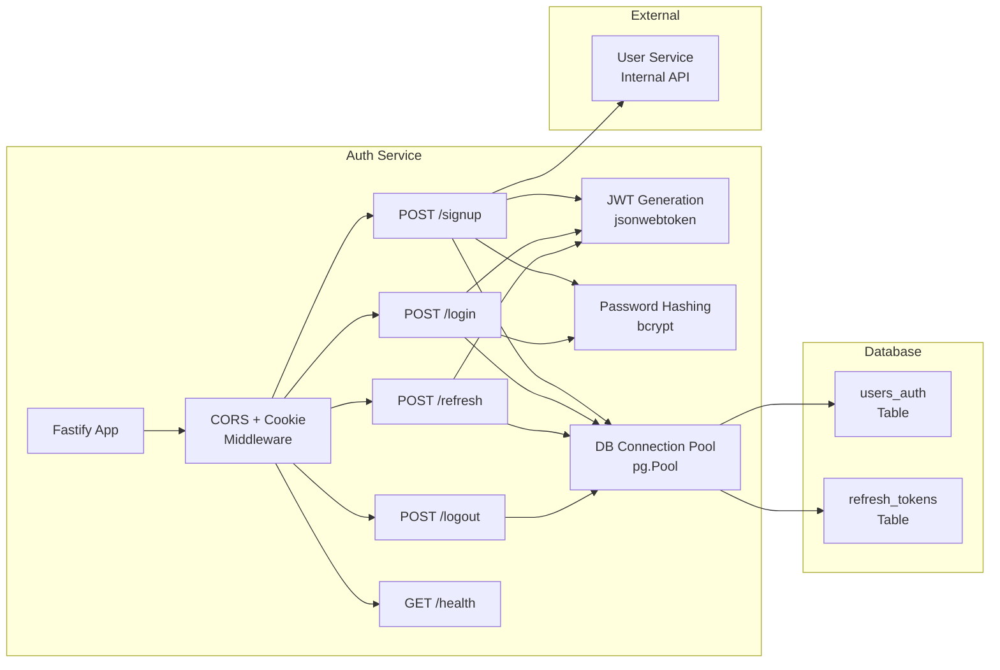
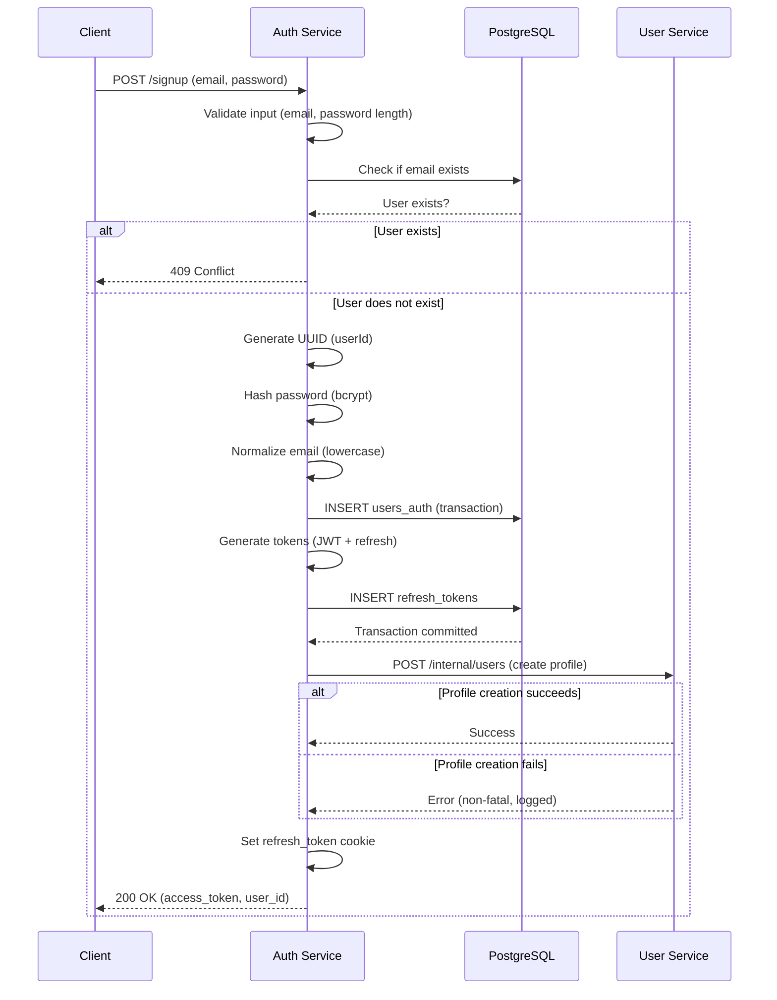
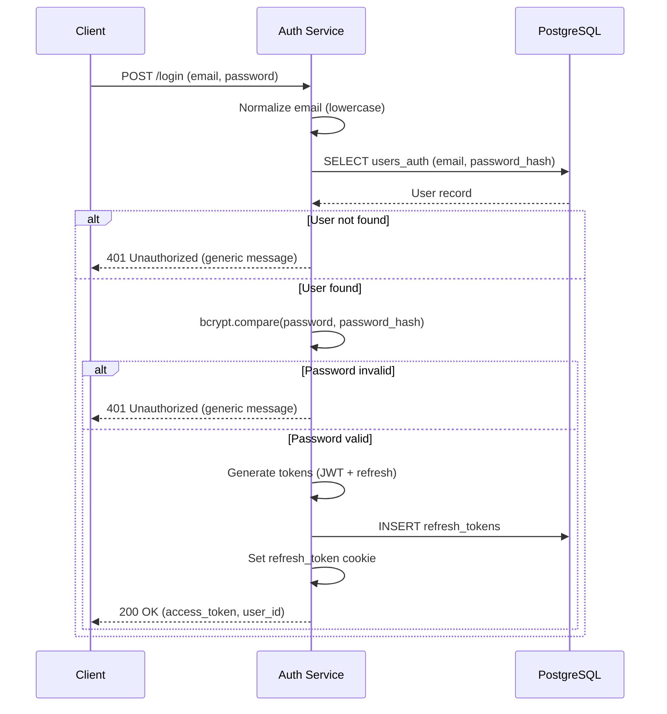
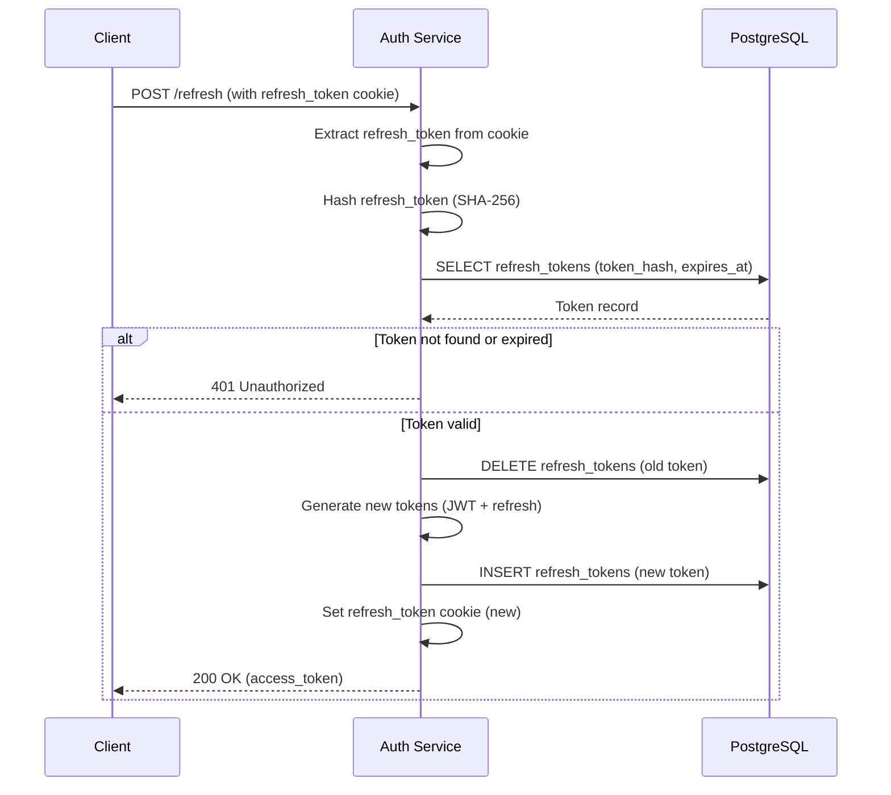
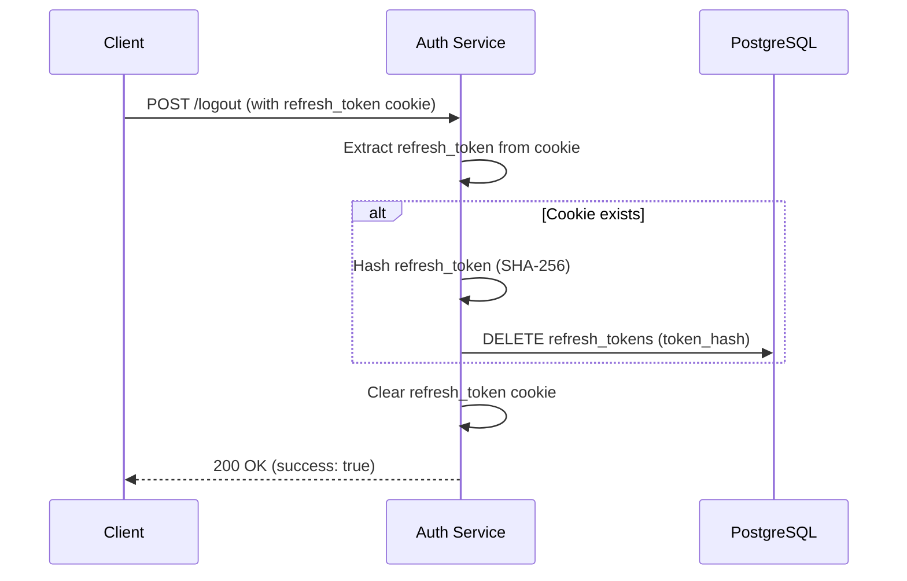
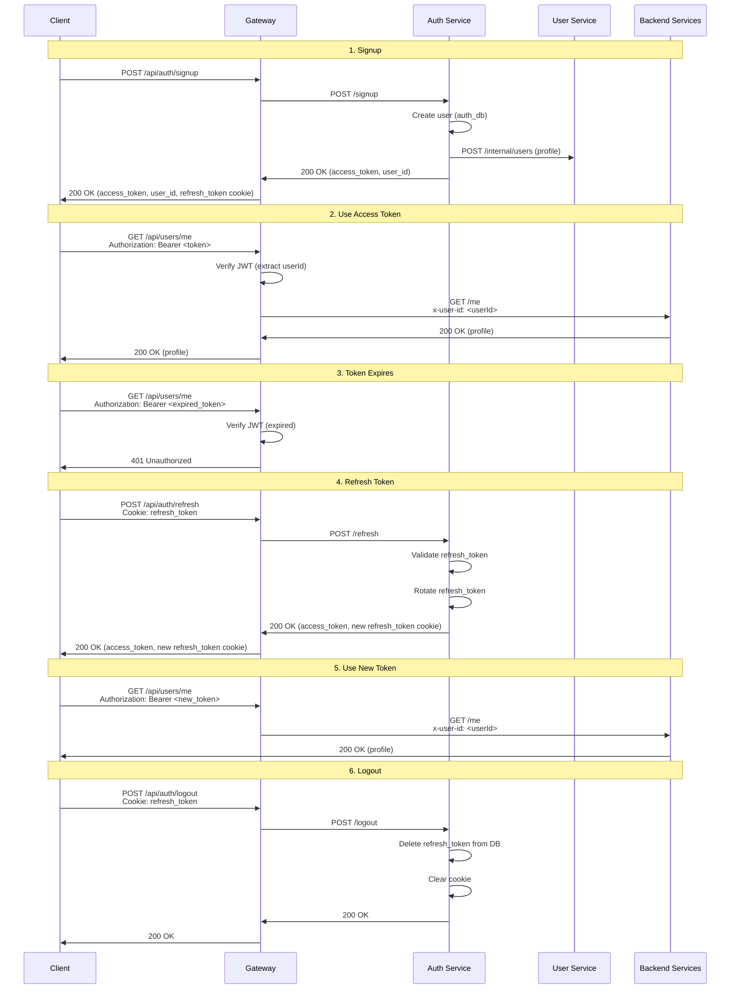
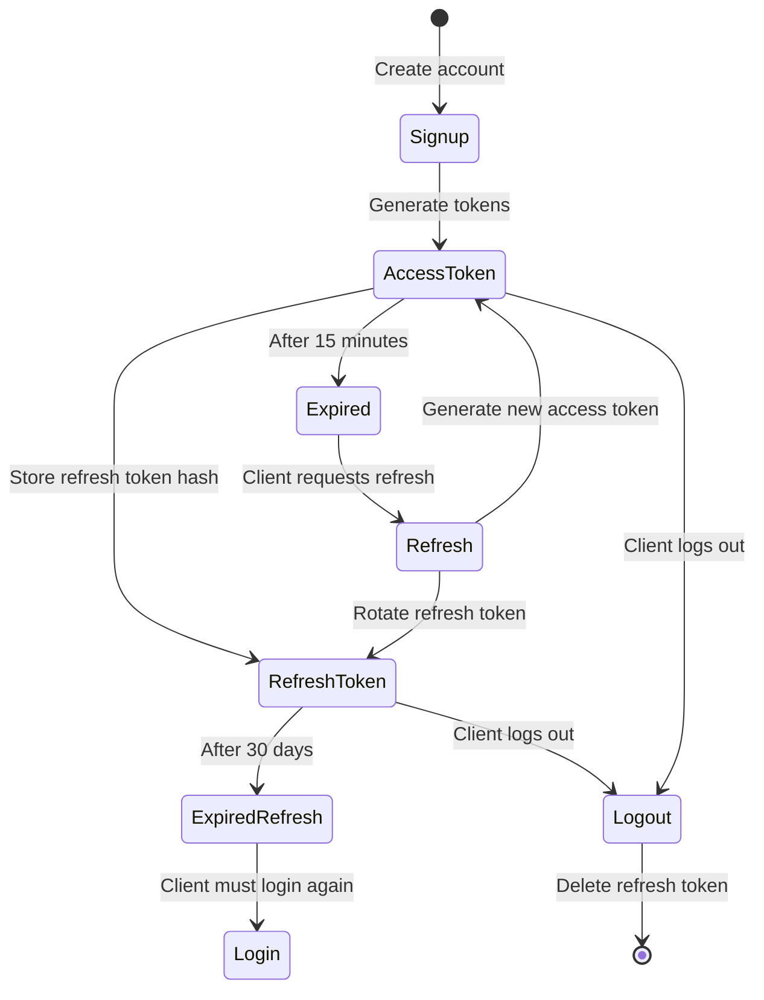

# Auth Service - Design Document

## Table of Contents

1. [High-Level Design (HLD)](#high-level-design-hld)
2. [Low-Level Design (LLD)](#low-level-design-lld)
3. [Data Structures](#data-structures)
4. [API Design](#api-design)
5. [Authentication Flow](#authentication-flow)
6. [Token Management](#token-management)
7. [Security Considerations](#security-considerations)

## High-Level Design (HLD)

### System Context

The Auth Service handles user authentication and session management for the CookFlow application. It provides JWT-based authentication with refresh token support.



### Responsibilities

1. **User Authentication**: Email/password signup and login
2. **JWT Generation**: Generate short-lived access tokens (15 minutes default)
3. **Refresh Token Management**: Issue, rotate, and invalidate long-lived refresh tokens (30 days default)
4. **Session Management**: Handle logout and token invalidation
5. **Profile Creation**: Automatically create user profiles in User Service after signup

### Design Principles

- **Security First**: Passwords hashed with bcrypt, refresh tokens stored as hashes
- **Stateless Access Tokens**: JWT tokens don't require database lookup for verification
- **Token Rotation**: Refresh tokens rotated on each refresh to limit attack window
- **Fail-Safe Profile Creation**: Profile creation failure doesn't fail signup (logged as warning)

## Low-Level Design (LLD)

### Service Architecture



### Component Details

#### 1. Fastify Application (`src/index.ts`)

- **Framework**: Fastify (TypeScript/Node.js)
- **Port**: 8001 (configurable)
- **CORS**: Restricted to `FRONTEND_ORIGIN`
- **Cookie Support**: `@fastify/cookie` plugin
- **Database**: PostgreSQL connection pool

#### 2. Database Schema

**users_auth Table**:
```sql
CREATE TABLE users_auth (
  id UUID PRIMARY KEY,
  email TEXT UNIQUE NOT NULL,
  password_hash TEXT NOT NULL,
  provider TEXT NOT NULL DEFAULT 'local',
  email_verified BOOLEAN NOT NULL DEFAULT false,
  created_at TIMESTAMPTZ NOT NULL DEFAULT now()
);
```

**refresh_tokens Table**:
```sql
CREATE TABLE refresh_tokens (
  id UUID PRIMARY KEY,
  user_id UUID NOT NULL REFERENCES users_auth(id) ON DELETE CASCADE,
  token_hash TEXT NOT NULL UNIQUE,
  expires_at TIMESTAMPTZ NOT NULL,
  created_at TIMESTAMPTZ NOT NULL DEFAULT now()
);
```

**Indexes**:
- `users_auth.email` (unique)
- `refresh_tokens.user_id`
- `refresh_tokens.token_hash` (unique)
- `refresh_tokens(token_hash, expires_at)` (composite)

#### 3. Token Generation

**Access Token**:
```typescript
const accessToken = jwt.sign(
  { sub: userId, type: 'access' },
  JWT_SECRET,
  { expiresIn: `${ACCESS_TOKEN_TTL_MIN}m` }
);
```

**Refresh Token**:
```typescript
const refreshToken = uuidv4();  // Random UUID
const refreshTokenHash = createHash('sha256')
  .update(refreshToken)
  .digest('hex');
```

#### 4. Password Hashing

```typescript
const passwordHash = await bcrypt.hash(password, BCRYPT_COST);
// BCRYPT_COST = 12 (default)
```

**Verification**:
```typescript
const isValid = await bcrypt.compare(password, passwordHash);
```

## Data Structures

### Request Models

#### SignupRequest
```typescript
{
  email: string;      // Required, will be normalized to lowercase
  password: string;   // Required, minimum 8 characters
}
```

#### LoginRequest
```typescript
{
  email: string;      // Required
  password: string;   // Required
}
```

### Response Models

#### SignupResponse / LoginResponse
```typescript
{
  access_token: string;  // JWT access token
  user_id: string;       // UUID
}
```

#### RefreshResponse
```typescript
{
  access_token: string;  // New JWT access token
}
```

#### LogoutResponse
```typescript
{
  success: boolean;
}
```

### JWT Payload (Access Token)

```typescript
{
  sub: string;        // User ID (UUID)
  type: 'access';     // Token type
  iat: number;        // Issued at (timestamp)
  exp: number;        // Expiration (timestamp)
}
```

## API Design

### Endpoints

#### POST /signup

**Flow**:


#### POST /login

**Flow**:


#### POST /refresh

**Flow**:


#### POST /logout

**Flow**:


## Authentication Flow

### Complete User Journey



## Token Management

### Access Token (JWT)

**Purpose**: Authenticate API requests

**Characteristics**:
- Short-lived (15 minutes default)
- Stateless (no database lookup required)
- Signed with HS256 algorithm
- Contains: `{sub: userId, type: 'access'}`

**Storage**: Client-side (memory, localStorage, or cookie)

**Usage**:
```
Authorization: Bearer <access_token>
```

**Verification**: Gateway verifies signature and expiration using `JWT_SECRET`

### Refresh Token

**Purpose**: Obtain new access tokens without re-authentication

**Characteristics**:
- Long-lived (30 days default)
- Random UUID (not JWT)
- Stored as SHA-256 hash in database
- HTTP-only cookie (not accessible via JavaScript)
- Rotated on each refresh (old one invalidated, new one issued)

**Storage**: HTTP-only cookie (secure, httpOnly, sameSite: 'lax')

**Rotation Strategy**:
1. Client sends refresh request with refresh_token cookie
2. Service validates token hash in database
3. Service deletes old token from database
4. Service generates new refresh token (UUID)
5. Service stores new token hash in database
6. Service sets new refresh_token cookie

**Security Benefits**:
- If token is stolen, rotation limits attack window
- HTTP-only cookie prevents XSS attacks
- Token hash in database prevents plaintext token theft

### Token Lifecycle



## Security Considerations

### Password Security

1. **Hashing**: bcrypt with cost factor 12 (configurable)
2. **Never Plaintext**: Passwords never stored or logged in plaintext
3. **Minimum Length**: 8 characters required
4. **Generic Errors**: "Invalid email or password" (prevents user enumeration)

### JWT Security

1. **Secret Key**: Must match gateway's `JWT_PUBLIC_OR_SHARED_SECRET`
2. **Short Expiration**: 15 minutes (limits attack window if token is stolen)
3. **Type Claim**: `type: 'access'` prevents refresh tokens from being used as access tokens
4. **Signature Verification**: Gateway verifies signature before accepting token

### Refresh Token Security

1. **HTTP-Only Cookie**: Prevents JavaScript access (XSS protection)
2. **Hash Storage**: Stored as SHA-256 hash, never plaintext
3. **Rotation**: Rotated on each refresh (limits attack window)
4. **Expiration**: 30 days (balancing security and UX)
5. **SameSite**: 'lax' (CSRF protection)

### Email Normalization

- All emails normalized to lowercase before storage
- Prevents duplicate accounts: `User@Example.com` = `user@example.com`

### Database Security

1. **Connection Pooling**: Limited connections (max 10 default)
2. **Prepared Statements**: All queries use parameterized queries (SQL injection protection)
3. **Cascade Delete**: Refresh tokens deleted when user is deleted
4. **Indexes**: Optimized for common queries (email lookup, token lookup)

### Error Handling

1. **Generic Messages**: "Invalid email or password" (not "user not found")
2. **No Information Leakage**: Don't reveal which part of authentication failed
3. **Logging**: Log errors for debugging, but don't expose details to client

### Integration Security

1. **Service Token**: User Service calls use `x-service-token` header
2. **Timeout**: HTTP requests to User Service have 3-second timeout
3. **Fail-Safe**: Profile creation failure doesn't fail signup (logged as warning)
4. **CORS**: Restricted to `FRONTEND_ORIGIN` (not wildcard)

## Performance Considerations

### Database Connection Pooling

- **Max Connections**: 10 (default, configurable)
- **Idle Timeout**: 30 seconds
- **Connection Timeout**: 2 seconds

### Password Hashing

- **Bcrypt Cost**: 12 (default)
  - Higher cost = more secure but slower
  - ~100ms per hash (acceptable for signup/login)

### Token Generation

- **JWT Signing**: Fast (synchronous, no I/O)
- **UUID Generation**: Fast (cryptographically secure random)
- **SHA-256 Hashing**: Fast (synchronous)

### Query Optimization

- **Indexes**: 
  - `users_auth.email` (unique) - O(log n) lookup
  - `refresh_tokens.token_hash` (unique) - O(log n) lookup
  - `refresh_tokens(user_id, expires_at)` - O(log n) cleanup queries

## Error Handling

### Error Categories

1. **Validation Errors (400)**
   - Missing email/password
   - Password too short (< 8 characters)

2. **Conflict Errors (409)**
   - User already exists (signup)

3. **Unauthorized Errors (401)**
   - Invalid email/password (login)
   - Invalid/expired refresh token (refresh)

4. **Internal Errors (500)**
   - Database errors
   - User Service errors (non-fatal for signup)

### Error Response Format

```json
{
  "error": {
    "code": "VALIDATION_ERROR",
    "message": "Email and password are required",
    "request_id": "uuid"
  }
}
```

## Migration

Migrations are automatically run on container startup. To run manually:

```bash
npm run migrate
```

Migration file: `src/migrations/001_initial.sql`

Creates:
- `users_auth` table
- `refresh_tokens` table
- Required indexes
- Foreign key constraints
- Check constraints

## Future Enhancements

1. **OAuth Support**: Google OAuth login (provider column already exists)
2. **Email Verification**: Email verification flow (email_verified column exists)
3. **Password Reset**: Password reset via email
4. **Multi-Factor Authentication**: 2FA support
5. **Rate Limiting**: Per-IP rate limiting for signup/login
6. **Account Lockout**: Lock account after N failed login attempts
7. **Session Management**: Allow users to view/revoke active sessions

