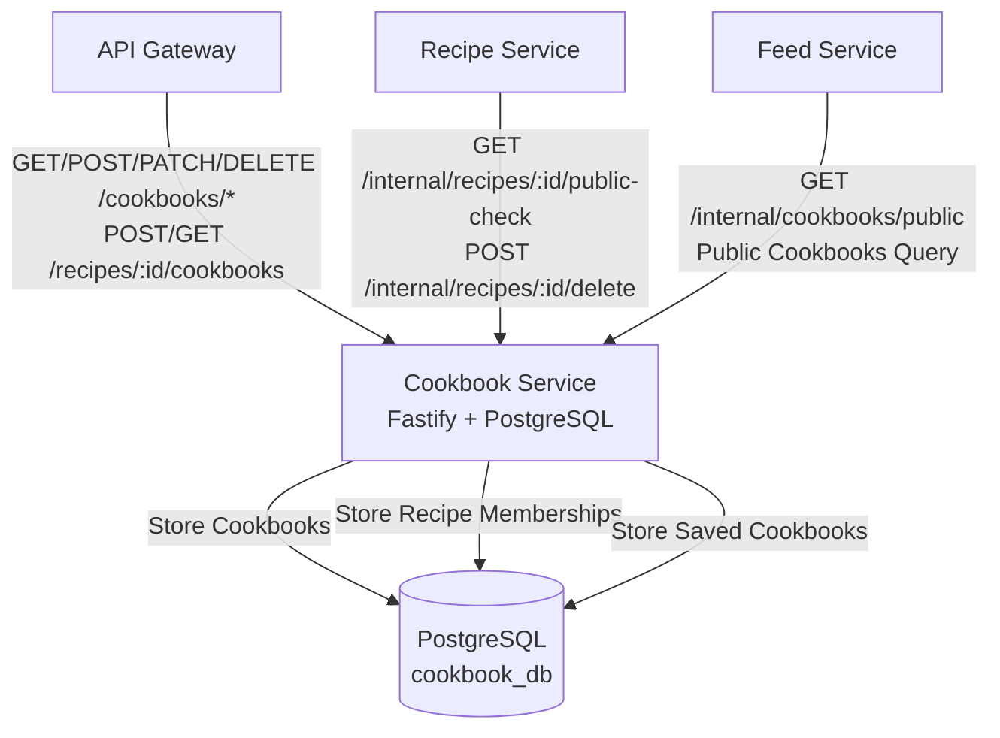
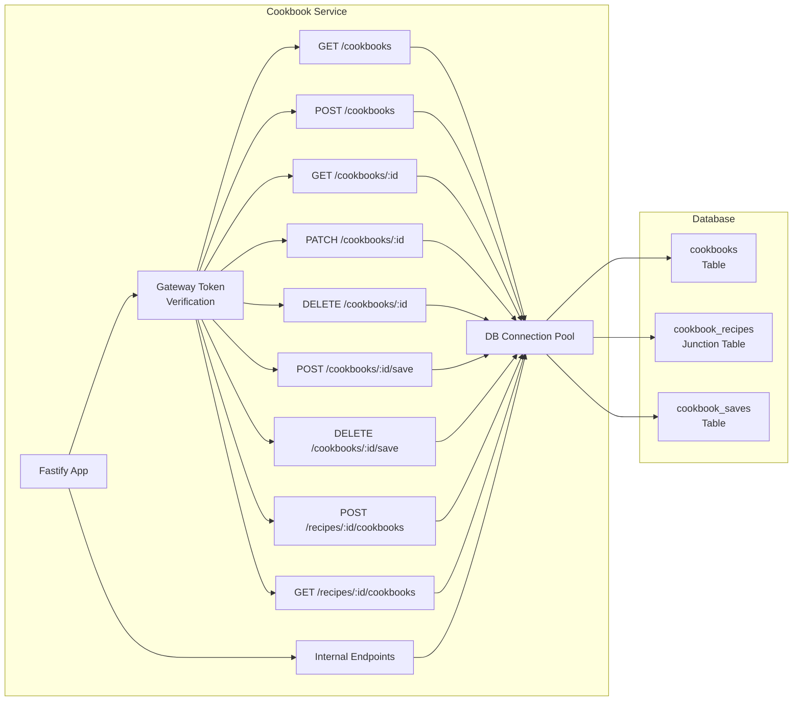
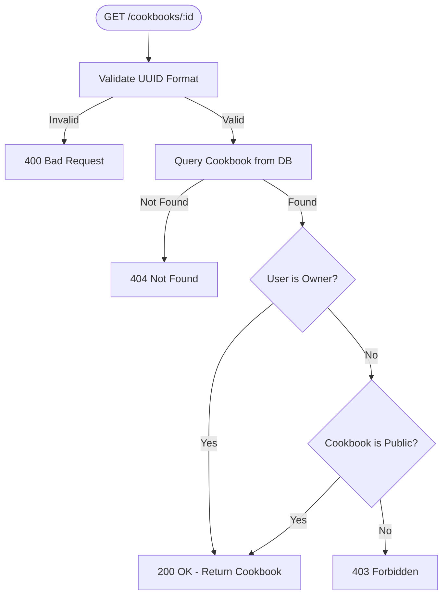
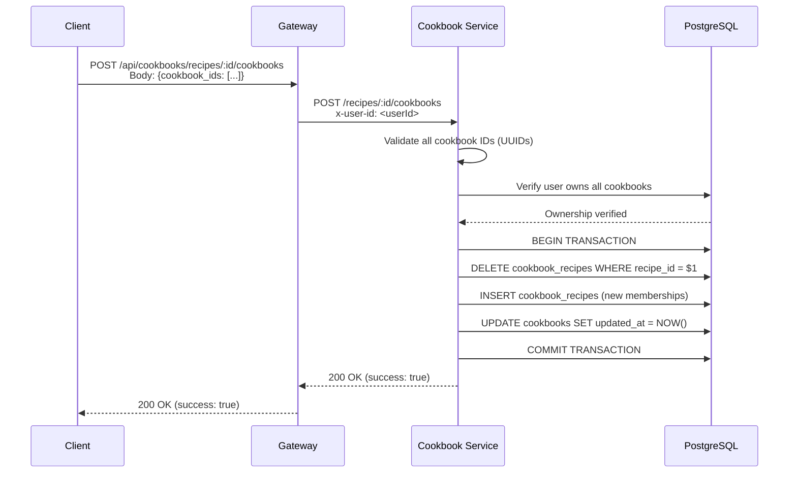
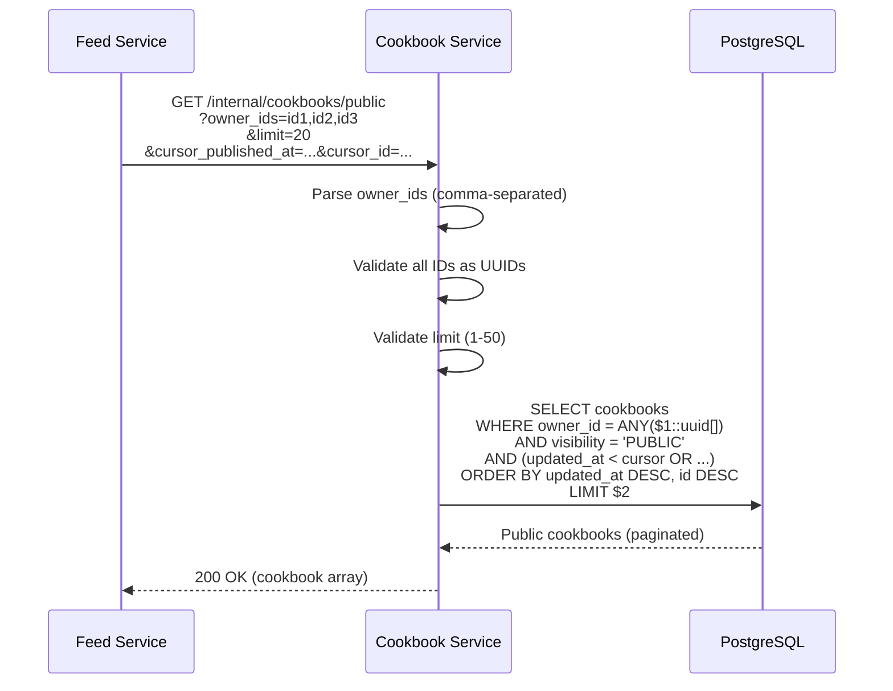

# Cookbook Service - Design Document

## Table of Contents

1. [High-Level Design (HLD)](#high-level-design-hld)
2. [Low-Level Design (LLD)](#low-level-design-lld)
3. [Data Model](#data-model)
4. [Access Control](#access-control)
5. [Recipe Membership Management](#recipe-membership-management)
6. [Feed Integration](#feed-integration)

## High-Level Design (HLD)

### System Context

The Cookbook Service manages cookbooks (collections of recipes) and their relationships.



### Responsibilities

1. **Cookbook Management**: CRUD operations for cookbooks
2. **Recipe Membership**: Manage many-to-many relationship between recipes and cookbooks
3. **Saved Cookbooks**: Handle users saving other users' public cookbooks (bookmark behavior)
4. **Privacy Rules**: Enforce PRIVATE (default) and PUBLIC visibility
5. **Access Control**: Enforce ownership rules for cookbook operations
6. **Feed Integration**: Provide public cookbook queries for feed service

## Low-Level Design (LLD)

### Service Architecture



## Data Model

### Database Schema

**cookbooks Table**:
```sql
CREATE TABLE cookbooks (
  id UUID PRIMARY KEY,
  owner_id UUID NOT NULL,
  title TEXT NOT NULL,
  description TEXT NULL,
  visibility TEXT NOT NULL DEFAULT 'PRIVATE' 
    CHECK (visibility IN ('PRIVATE', 'PUBLIC')),
  created_at TIMESTAMPTZ NOT NULL DEFAULT now(),
  updated_at TIMESTAMPTZ NOT NULL DEFAULT now()
);
```

**cookbook_recipes Junction Table** (Many-to-Many):
```sql
CREATE TABLE cookbook_recipes (
  cookbook_id UUID NOT NULL REFERENCES cookbooks(id) ON DELETE CASCADE,
  recipe_id UUID NOT NULL,
  added_at TIMESTAMPTZ NOT NULL DEFAULT now(),
  PRIMARY KEY (cookbook_id, recipe_id)
);
```

**cookbook_saves Table**:
```sql
CREATE TABLE cookbook_saves (
  user_id UUID NOT NULL,
  cookbook_id UUID NOT NULL REFERENCES cookbooks(id) ON DELETE CASCADE,
  saved_at TIMESTAMPTZ NOT NULL DEFAULT now(),
  PRIMARY KEY (user_id, cookbook_id)
);
```

### Indexes

**cookbooks**:
- `owner_id` (for user's cookbooks queries)
- `visibility` (for public cookbook queries)
- `(owner_id, updated_at DESC, id DESC) WHERE visibility = 'PUBLIC'` (composite index for feed queries)

**cookbook_recipes**:
- `cookbook_id` (for cookbook's recipes queries)
- `recipe_id` (for recipe's cookbooks queries)

**cookbook_saves**:
- `user_id` (for user's saved cookbooks queries)
- `cookbook_id` (for cookbook's saves count queries)

## Access Control

### Cookbook Access Rules

1. **Owner**: User who created the cookbook can always access and modify
2. **Public Cookbook**: Any authenticated user can view public cookbooks
3. **Private Cookbook**: Only owner can view private cookbooks
4. **Saved Cookbook**: Users can save and view saved public cookbooks

### Access Control Flow



### Ownership Rules

**Owner-Only Operations**:
- `PATCH /cookbooks/:id` - Update cookbook
- `DELETE /cookbooks/:id` - Delete cookbook

**Public Operations**:
- `GET /cookbooks/:id` - View cookbook (if public)
- `POST /cookbooks/:id/save` - Save public cookbook

**User's Own Cookbooks**:
- `POST /recipes/:recipe_id/cookbooks` - Add recipe to user's own cookbooks only

## Recipe Membership Management

### Set Membership Flow

**Purpose**: Atomically set which cookbooks a recipe belongs to

**Flow**:


**Key Points**:
- **Atomic**: All membership changes in single transaction
- **Ownership Check**: User must own all cookbooks being added to
- **Replace**: Removes all existing memberships, then adds new ones
- **Update Timestamp**: Updates cookbooks' `updated_at` for feed ordering

## Feed Integration

### Public Cookbook Query

**Purpose**: Get public cookbooks for feed service (by owner IDs)

**Endpoint**: `GET /internal/cookbooks/public`

**Query Flow**:


**Keyset Pagination**:
- **Cursor**: `(updated_at, id)` tuple
- **Ordering**: `updated_at DESC, id DESC` (newest first)
- **Cursor Condition**: `(updated_at < cursor_updated_at) OR (updated_at = cursor_updated_at AND id < cursor_id)`

**Index Usage**: Uses composite index `(owner_id, updated_at DESC, id DESC) WHERE visibility = 'PUBLIC'` for efficient feed queries.

## Privacy Model

### Visibility Levels

**PRIVATE** (default):
- Only owner can view cookbook
- Recipes in private cookbook are not accessible via cookbook
- Cannot be saved by other users

**PUBLIC**:
- Any authenticated user can view cookbook
- Recipes in public cookbook become accessible (via Recipe Service check)
- Can be saved by other users
- Appears in feed for users following the owner

### Recipe Visibility

**Important**: Recipe visibility is determined by cookbook visibility:
- Recipe in private cookbook: Not accessible (unless user owns recipe)
- Recipe in public cookbook: Accessible (checked by Recipe Service via `/internal/recipes/:id/public-check`)

## Performance Considerations

### Database Queries

**Cookbook Listing**:
- **Owned**: O(log n) - Indexed on `owner_id`
- **Saved**: O(log n) - Join with `cookbook_saves` on `user_id`, then join with `cookbooks`

**Recipe Membership**:
- **Get Recipe's Cookbooks**: O(log n) - Indexed on `recipe_id`
- **Get Cookbook's Recipes**: O(log n) - Indexed on `cookbook_id`

**Feed Query**:
- **Public Cookbooks by Owner IDs**: O(log n) - Uses composite index `(owner_id, updated_at DESC, id DESC) WHERE visibility = 'PUBLIC'`

### Recipe Count Queries

Recipe counts are computed via `COUNT(DISTINCT cookbook_recipes.recipe_id)` with LEFT JOIN:
```sql
SELECT c.*, COUNT(DISTINCT cr.recipe_id) as recipe_count
FROM cookbooks c
LEFT JOIN cookbook_recipes cr ON c.id = cr.cookbook_id
WHERE c.owner_id = $1
GROUP BY c.id
```

**Optimization**: Indexes on `cookbook_recipes.cookbook_id` ensure efficient counting.

## Security Considerations

1. **Gateway Token**: All protected endpoints verify `x-gateway-token` header
2. **Service Token**: Internal endpoints require `x-service-token` header
3. **User ID**: Extracted from gateway (verified JWT), never from client
4. **UUID Validation**: All IDs validated as UUIDs before database queries
5. **Ownership Checks**: Verify user owns cookbooks before allowing operations
6. **SQL Injection**: All queries use parameterized statements
7. **Cascade Deletes**: Recipe memberships and saves deleted when cookbook is deleted

## Integration Points

### Upstream (Calls This Service)

1. **Gateway**: Routes `/api/cookbooks/*` requests
2. **Recipe Service**: Calls `GET /internal/recipes/:id/public-check` for access control
3. **Recipe Service**: Calls `POST /internal/recipes/:id/delete` for cleanup on recipe deletion
4. **Feed Service**: Calls `GET /internal/cookbooks/public` for feed queries

### Downstream (This Service Calls)

- **None** (database-only service)

## Future Enhancements

1. **Cookbook Categories/Tags**: Organize cookbooks by category
2. **Cookbook Analytics**: View counts, engagement metrics
3. **Cookbook Collaboration**: Share cookbooks with specific users (not just public)
4. **Recipe Ordering**: Allow custom ordering of recipes within cookbook
5. **Cookbook Templates**: Save cookbooks as templates
6. **Batch Operations**: Batch add/remove recipes from cookbooks
7. **Cookbook Search**: Search within cookbooks by recipe name/ingredients

