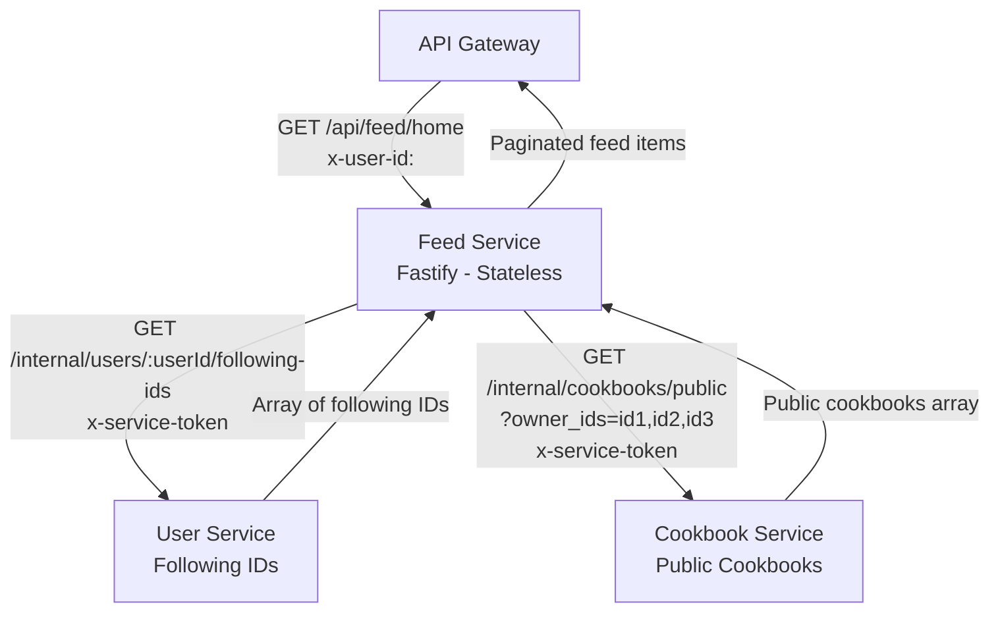
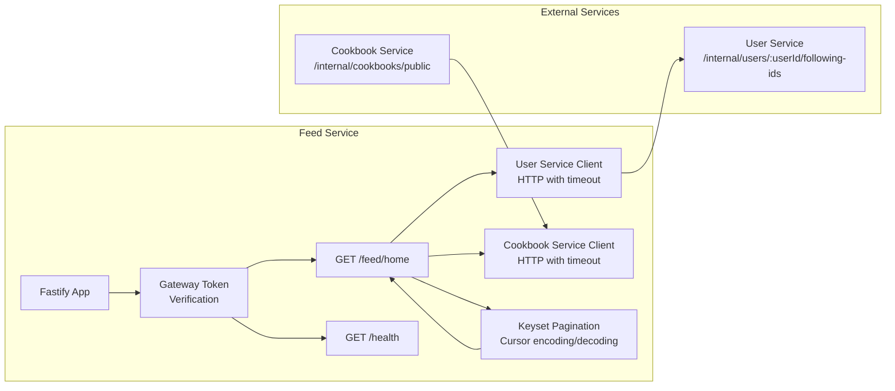
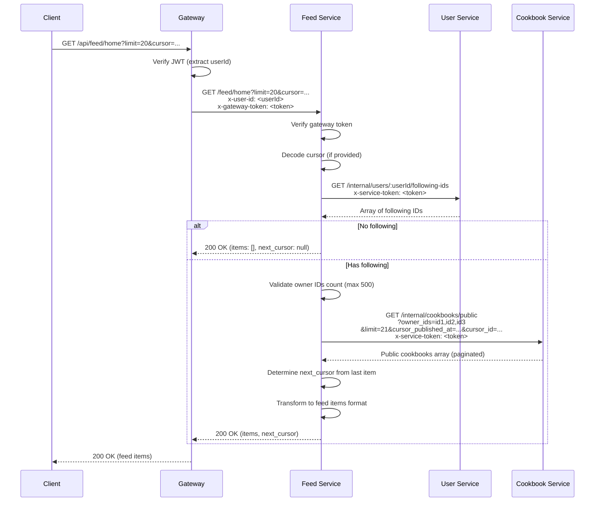

# Feed Service - Design Document

## Table of Contents

1. [High-Level Design (HLD)](#high-level-design-hld)
2. [Low-Level Design (LLD)](#low-level-design-lld)
3. [Feed Generation Flow](#feed-generation-flow)
4. [Keyset Pagination](#keyset-pagination)
5. [Performance Considerations](#performance-considerations)

## High-Level Design (HLD)

### System Context

The Feed Service generates user feeds by aggregating data from User Service and Cookbook Service.



### Responsibilities

1. **Feed Generation**: Aggregate public cookbooks from followed users
2. **Following-Only Logic**: Only include cookbooks from users being followed
3. **Keyset Pagination**: Efficient cursor-based pagination
4. **Service Aggregation**: Call User Service and Cookbook Service internally

### Design Principles

- **Stateless**: No database, aggregates data on-demand
- **Fanout-on-Read**: Queries are performed at read time (not pre-computed)
- **Following-Only**: Only shows content from users being followed
- **Real-Time**: Always returns latest data from source services

## Low-Level Design (LLD)

### Service Architecture



### Component Details

#### 1. Feed Generation Flow



## Feed Generation Flow

### Complete Feed Generation Process

```mermaid
flowchart TD
    Start([GET /feed/home]) --> Validate[Validate Request<br/>userId, cursor, limit]
    Validate -->|Invalid| Error400[400 Bad Request]
    Validate -->|Valid| GetFollowing[Call User Service<br/>GET /internal/users/:userId/following-ids]
    GetFollowing -->|Service Error| Error502[502 Bad Gateway]
    GetFollowing -->|Success| CheckFollowing{Following IDs Empty?}
    CheckFollowing -->|Yes| EmptyFeed[Return Empty Feed<br/>items: [], next_cursor: null]
    CheckFollowing -->|No| ValidateCount{Count > MAX_OWNER_IDS?}
    ValidateCount -->|Yes| Error400
    ValidateCount -->|No| DecodeCursor{Has Cursor?}
    DecodeCursor -->|Yes| Decode[Decode Base64 Cursor<br/>updated_at, id]
    DecodeCursor -->|No| NoCursor[No Cursor<br/>Start from beginning]
    Decode -->|Invalid| Error400
    Decode -->|Valid| CallCookbook[Call Cookbook Service<br/>GET /internal/cookbooks/public<br/>?owner_ids=id1,id2,id3<br/>&limit=limit+1<br/>&cursor_published_at=...&cursor_id=...]
    NoCursor --> CallCookbook
    CallCookbook -->|Service Error| Error502
    CallCookbook -->|Success| CheckHasMore{Cookbooks Length > limit?}
    CheckHasMore -->|Yes| HasMore[Slice to limit items<br/>Generate next_cursor from last item]
    CheckHasMore -->|No| NoMore[All items<br/>next_cursor: null]
    HasMore --> Transform[Transform to Feed Items<br/>Add published_at field]
    NoMore --> Transform
    Transform --> Return[Return Feed Response]
    EmptyFeed --> Return
    Return --> End([Client Response])
```

### Feed Item Transformation

**Cookbook Service Response** → **Feed Service Response**:

```typescript
// Cookbook Service response
{
  id: "uuid",
  owner_id: "uuid",
  title: "Cookbook Title",
  description: "Description",
  visibility: "PUBLIC",
  recipe_count: 5,
  created_at: "2024-01-01T00:00:00Z",
  updated_at: "2024-01-02T00:00:00Z"
}

// Feed Service response (transformed)
{
  id: "uuid",
  owner_id: "uuid",
  title: "Cookbook Title",
  description: "Description",
  visibility: "PUBLIC",
  recipe_count: 5,
  created_at: "2024-01-01T00:00:00Z",
  updated_at: "2024-01-02T00:00:00Z",
  published_at: "2024-01-02T00:00:00Z"  // Added: uses updated_at as published_at
}
```

## Keyset Pagination

### Cursor Encoding

**Format**: Base64-encoded string containing `updated_at|id`

**Encoding**:
```typescript
function encodeCursor(published_at: string, id: string): string {
  return Buffer.from(`${published_at}|${id}`).toString('base64');
}
```

**Example**:
- Input: `published_at = "2024-01-02T00:00:00Z"`, `id = "550e8400-..."`
- Encoded: `MjAyNC0wMS0wMlQwMDowMDowMFp8NTUwZTg0MDAtLi4u`

### Cursor Decoding

**Decoding**:
```typescript
function decodeCursor(cursor: string): { published_at: string; id: string } | null {
  try {
    const decoded = Buffer.from(cursor, 'base64').toString('utf-8');
    const [published_at, id] = decoded.split('|');
    if (!published_at || !id || !isValidUUID(id)) return null;
    return { published_at, id };
  } catch {
    return null;
  }
}
```

**Error Handling**: Returns `null` if cursor is invalid (client should start from beginning)

### Pagination Logic

**First Page** (no cursor):
- Query: All public cookbooks for following IDs, ordered by `updated_at DESC, id DESC`
- Limit: `limit + 1` (fetch one extra to determine if there's a next page)

**Subsequent Pages** (with cursor):
- Query: Same, but with cursor condition:
  ```sql
  WHERE (updated_at < cursor_updated_at) 
     OR (updated_at = cursor_updated_at AND id < cursor_id)
  ```

**Next Cursor Generation**:
- If `cookbooks.length > limit`: Generate cursor from last item's `(updated_at, id)`
- If `cookbooks.length <= limit`: Set `next_cursor = null`

## Performance Considerations

### Query Performance

**User Service Call**:
- **Complexity**: O(1) - Single query by primary key (user_id)
- **Latency**: ~10-50ms (local network)

**Cookbook Service Call**:
- **Complexity**: O(n log m) where n = number of owner IDs, m = total cookbooks
- **Index**: Uses composite index `(owner_id, updated_at DESC, id DESC) WHERE visibility = 'PUBLIC'`
- **Latency**: ~50-200ms (depends on number of owner IDs and cookbooks)

**Total Latency**: ~100-300ms (typical), up to 500ms (large following lists)

### Optimization Strategies

1. **Owner ID Limit**: Maximum 500 owner IDs prevents abuse
2. **Limit + 1**: Fetch one extra item to determine next page (avoids extra query)
3. **Composite Index**: Cookbook Service uses optimized index for feed queries
4. **HTTP Timeout**: 3 seconds default (prevents hanging requests)
5. **Retries**: 1 retry on timeout/connection errors (with 100ms delay)

### Scalability Considerations

**Current Design (Fanout-on-Read)**:
- **Pros**:
  - Simple implementation
  - No pre-computation
  - Real-time data (always fresh)
  - Low storage requirements
- **Cons**:
  - O(n) query time where n = number of following
  - Multiple service calls per request
  - Latency increases with following list size

**Future Enhancement (Fanout-on-Write)**:
- **Pre-compute feed entries** when cookbook is published
- **Store in database** or cache (Redis)
- **Trade-off**: More storage, faster reads
- **Implementation**: Kafka consumer that listens to cookbook publish events

## Security Considerations

1. **Gateway Token**: All endpoints verify `x-gateway-token` header
2. **User ID**: Extracted from gateway (verified JWT), never from client
3. **Service Token**: Internal service calls use `x-service-token` header
4. **Owner ID Limit**: Maximum 500 owner IDs prevents abuse
5. **UUID Validation**: All IDs validated as UUIDs before service calls
6. **No Database**: Stateless service, no sensitive data stored

## Integration Points

### Upstream (Calls This Service)

1. **Gateway**: Routes `/api/feed/*` requests

### Downstream (This Service Calls)

1. **User Service**: `GET /internal/users/:userId/following-ids` - Get following IDs
2. **Cookbook Service**: `GET /internal/cookbooks/public` - Get public cookbooks by owner IDs

### Dependencies

- **User Service**: Must be running and accessible
- **Cookbook Service**: Must be running and accessible
- **No Database**: Service is stateless

## Error Handling

### Error Categories

1. **400 Bad Request**: Invalid cursor format, limit out of range, too many following IDs
2. **401 Unauthorized**: Missing/invalid gateway token
3. **502 Bad Gateway**: User Service or Cookbook Service error
4. **500 Internal Server Error**: Unexpected errors

### Error Response Format

```json
{
  "error": {
    "code": "UPSTREAM_ERROR",
    "message": "Failed to fetch following users",
    "request_id": "uuid"
  }
}
```

### Retry Logic

Internal service calls include retry logic:
- **Retries**: 1 retry on timeout/connection errors
- **Delay**: 100ms between retries
- **Timeout**: 3 seconds per request (configurable via `HTTP_TIMEOUT_MS`)

## Future Enhancements

1. **Fanout-on-Write**: Pre-compute feed entries on cookbook publish
2. **Feed Caching**: Cache feed results with TTL (Redis)
3. **Filtering**: Filter feed by cookbook title, recipe count, etc.
4. **Personalized Ranking**: Rank feed items by relevance (not just recency)
5. **Feed Preferences**: User preferences for feed content (cookbook types, cuisines)
6. **Real-Time Updates**: WebSocket support for real-time feed updates
7. **Feed Analytics**: Track feed engagement (views, clicks)

