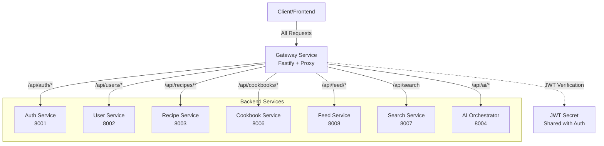
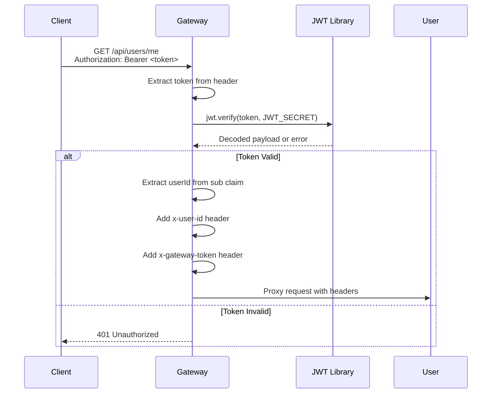
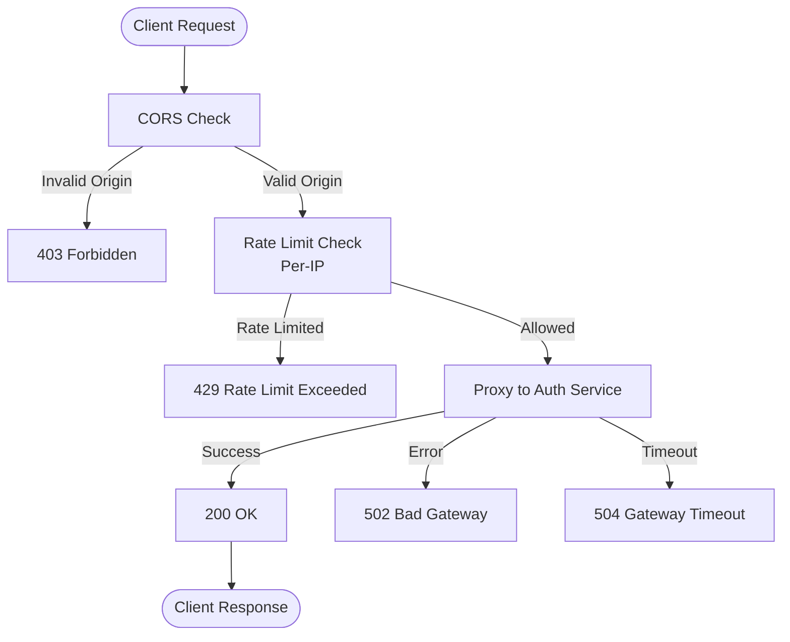
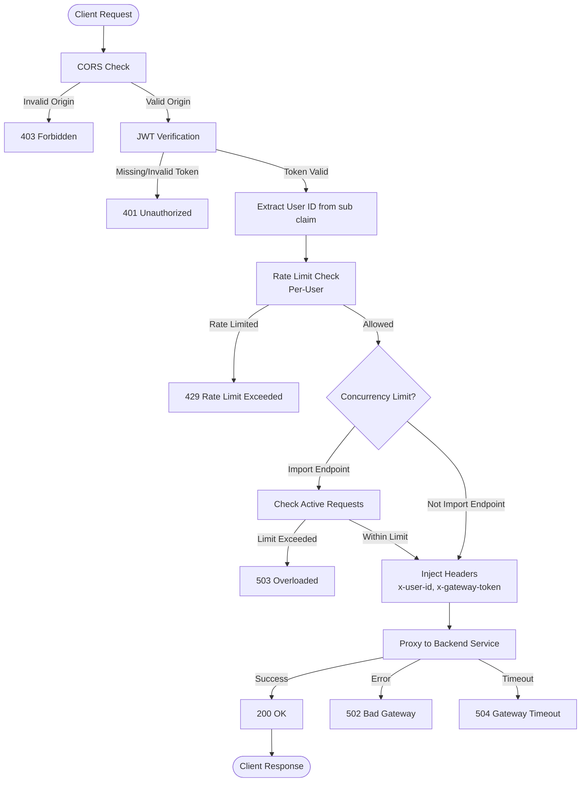
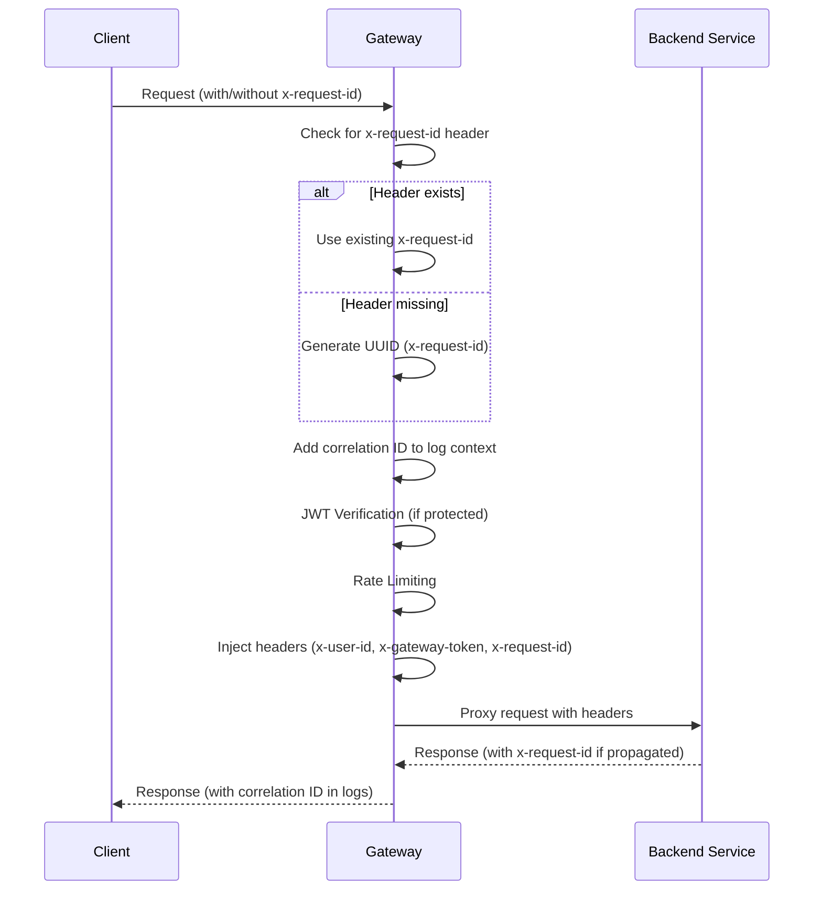

# Gateway Service - Design Document

## Table of Contents

1. [High-Level Design (HLD)](#high-level-design-hld)
2. [Low-Level Design (LLD)](#low-level-design-lld)
3. [Request Flow](#request-flow)
4. [Authentication & Authorization](#authentication--authorization)
5. [Rate Limiting](#rate-limiting)
6. [Routing Configuration](#routing-configuration)

## High-Level Design (HLD)

### System Context

The Gateway Service is the single entry point for all client requests. It handles authentication, routing, rate limiting, and CORS.



### Responsibilities

1. **Request Routing**: Route requests to appropriate backend services
2. **JWT Verification**: Verify access tokens for protected routes
3. **Rate Limiting**: Token bucket rate limiting per-IP and per-user
4. **CORS**: Handle cross-origin requests
5. **Header Injection**: Inject service-specific headers (x-user-id, x-gateway-token)
6. **Correlation IDs**: Generate and propagate correlation IDs
7. **Concurrency Control**: Reject-fast limits for high-load endpoints
8. **Error Handling**: Handle upstream timeouts and errors

## Low-Level Design (LLD)

### Service Architecture

```mermaid
graph LR
    subgraph "Gateway Service"
        Fastify[Fastify App]
        Middleware[CORS + Cookie<br/>Middleware]
        AuthRoutes[/api/auth/*<br/>Public Routes]
        ProtectedRoutes[/api/*<br/>Protected Routes]
        JWTVerify[JWT Verification<br/>Hook]
        RateLimit[Rate Limiting<br/>Hook]
        Proxy[HTTP Proxy<br/>@fastify/http-proxy]
        Health[GET /health]
    end
    
    subgraph "Upstream Services"
        Auth[Auth Service]
        User[User Service]
        Recipe[Recipe Service]
        Cookbook[Cookbook Service]
        Feed[Feed Service]
        Search[Search Service]
        AI[AI Orchestrator]
    end
    
    Fastify --> Middleware
    Middleware --> AuthRoutes
    Middleware --> ProtectedRoutes
    Middleware --> Health
    ProtectedRoutes --> JWTVerify
    JWTVerify --> RateLimit
    RateLimit --> Proxy
    AuthRoutes --> RateLimit
    RateLimit --> Proxy
    Proxy --> Auth
    Proxy --> User
    Proxy --> Recipe
    Proxy --> Cookbook
    Proxy --> Feed
    Proxy --> Search
    Proxy --> AI
```

### Component Details

#### 1. Fastify Application (`src/index.ts`)

- **Framework**: Fastify (TypeScript/Node.js)
- **Port**: 8080 (configurable)
- **Plugins**: `@fastify/cors`, `@fastify/cookie`, `@fastify/http-proxy`
- **Request Timeout**: 5 seconds (configurable, prevents hanging requests)
- **Body Limit**: 256KB (configurable)

#### 2. JWT Verification Hook

**Purpose**: Verify JWT access tokens for protected routes

**Flow**:


**JWT Payload Structure**:
```typescript
{
  sub: string;        // User ID (UUID)
  type: 'access';     // Token type
  iat: number;        // Issued at
  exp: number;        // Expiration
}
```

#### 3. Rate Limiting Hook

**Purpose**: Limit request rate per-IP (auth) and per-user (authenticated)

**Token Bucket Algorithm**:
- **Sustained Rate**: Tokens refill at sustained rate (e.g., 60/min)
- **Burst Capacity**: Initial bucket size (e.g., 120 tokens)
- **Per-IP**: Key is `auth:${ip}` for auth endpoints
- **Per-User**: Key is `user:${userId}` for authenticated endpoints

**Implementation**:
```typescript
interface TokenBucket {
  tokens: number;
  lastRefillMs: number;
}

// Refill tokens based on elapsed time
const elapsedMs = now - bucket.lastRefillMs;
const tokensToAdd = (sustainedRate * elapsedMs) / 60000;
bucket.tokens = Math.min(burstLimit, bucket.tokens + tokensToAdd);

// Check if we have tokens
if (bucket.tokens >= 1) {
  bucket.tokens -= 1;
  return true; // Allow request
}
return false; // Rate limit exceeded
```

#### 4. HTTP Proxy Configuration

**Purpose**: Proxy requests to upstream services

**Features**:
- **Header Rewriting**: Remove user-supplied headers, inject gateway headers
- **Cookie Forwarding**: Automatically forwards Set-Cookie headers
- **Response Forwarding**: Forwards all response headers (ETag, Retry-After, etc.)
- **Error Handling**: Handles upstream errors and timeouts

**Header Injection**:
- **`x-user-id`**: User ID from JWT (protected routes only)
- **`x-gateway-token`**: Gateway authentication token (protected routes)
- **`x-service-token`**: Service-to-service token (AI orchestrator routes)
- **`x-request-id`**: Correlation ID (all routes)

## Request Flow

### Public Route Flow (Auth Endpoints)



### Protected Route Flow (Authenticated Endpoints)



### Complete Request Flow (with Correlation ID)



## Authentication & Authorization

### JWT Verification

**Algorithm**: HS256 (HMAC-SHA256)

**Verification Steps**:
1. Extract token from `Authorization: Bearer <token>` header
2. Verify signature using `JWT_PUBLIC_OR_SHARED_SECRET`
3. Check expiration (`exp` claim)
4. Verify token type is `access`
5. Extract user ID from `sub` claim

**Error Handling**:
- **Missing Header**: 401 Unauthorized
- **Invalid Token**: 401 Unauthorized
- **Expired Token**: 401 Unauthorized
- **Wrong Type**: 401 Unauthorized (if type !== 'access')

### Header Injection

**Protected Routes** (after JWT verification):
- **`x-user-id`**: User ID from JWT `sub` claim
- **`x-gateway-token`**: Gateway authentication token (backend services verify this)

**AI Orchestrator Routes**:
- **`x-service-token`**: Service-to-service authentication token

**All Routes**:
- **`x-request-id`**: Correlation ID for request tracing

### Header Sanitization

Gateway removes user-supplied headers that could be used to impersonate:
- `x-user-id`
- `x-gateway-token`
- `x-service-token`

This prevents clients from injecting these headers directly.

## Rate Limiting

### Token Bucket Algorithm

**Per-IP (Auth Endpoints)**:
- **Sustained Rate**: 10 requests/minute
- **Burst Capacity**: 20 requests
- **Key**: `auth:${ip}`

**Per-User (Authenticated Endpoints)**:
- **Sustained Rate**: 60 requests/minute
- **Burst Capacity**: 120 requests
- **Key**: `user:${userId}`

### Cleanup

Periodic cleanup of unused entries (every 5 minutes):
- Entries older than 5 minutes are removed from in-memory store
- Prevents memory leaks from abandoned buckets

### Multi-Instance Support

For production multi-instance deployments, consider Redis-backed rate limiting:
- Shared state across instances
- Consistent rate limiting regardless of which instance handles request

## Routing Configuration

### Route Mapping

```typescript
// Public routes (no JWT required)
/api/auth/* → AUTH_URL/*

// Protected routes (JWT required)
/api/users/* → USER_URL/*
/api/recipes/* → RECIPE_URL/*
/api/cookbooks/* → COOKBOOK_URL/*
/api/feed/* → FEED_URL/feed/*
/api/search → SEARCH_URL/search
/api/ai/* → AI_ORCHESTRATOR_URL/*
```

### URL Rewriting

Some routes require URL prefix rewriting:
- `/api/feed/home` → `/feed/home` (FEED_URL)
- `/api/search` → `/search` (SEARCH_URL)

Others use exact path matching:
- `/api/auth/*` → `/*` (AUTH_URL)
- `/api/users/*` → `/*` (USER_URL)

## Error Handling

### Error Categories

1. **401 Unauthorized**: Missing/invalid JWT token
2. **403 Forbidden**: Invalid CORS origin
3. **429 Rate Limit Exceeded**: Rate limit hit
4. **503 Overloaded**: Concurrency limit exceeded (import endpoints)
5. **504 Gateway Timeout**: Upstream service timeout (> 5 seconds)
6. **502 Bad Gateway**: Upstream service error

### Error Response Format

```json
{
  "error": {
    "code": "ERROR_CODE",
    "message": "Human-readable error message",
    "request_id": "uuid"
  }
}
```

### Timeout Handling

Fastify's `requestTimeout` aborts upstream requests after timeout:
- **Default**: 5 seconds
- **Behavior**: Returns 504 if upstream doesn't respond
- **Safety**: Prevents hanging requests from consuming resources

## Concurrency Control

### Import Job Endpoints

**Purpose**: Prevent resource exhaustion from concurrent import job creation

**Endpoints**:
- `POST /api/recipes/import/youtube`: Max 10 concurrent requests
- `GET /api/recipes/import-jobs/:job_id`: Max 50 concurrent requests

**Implementation**: Simple counters (no queueing)
- **Reject Fast**: If limit exceeded, immediately return 503
- **Resource Cleanup**: Counters decremented on request completion/error/abort

**Rationale**: Import jobs are resource-intensive (YouTube transcript fetching, AI processing). Limiting concurrency prevents system overload.

## Performance Considerations

### Request Timeout

- **Default**: 5 seconds (`GATEWAY_UPSTREAM_TIMEOUT_MS`)
- **Purpose**: Prevent hanging requests
- **Behavior**: Returns 504 if upstream doesn't respond

### Connection Pooling

- **@fastify/http-proxy**: Manages upstream connections internally
- **Connection Reuse**: Reuses connections to upstream services
- **No Explicit Pool**: Fastify handles connection management

### Rate Limiting Performance

- **In-Memory**: O(1) per request (token bucket lookup)
- **Cleanup**: Periodic cleanup (every 5 minutes) prevents memory leaks
- **Scalability**: For multi-instance, use Redis-backed rate limiting

### Body Size Limit

- **Default**: 256KB (`GATEWAY_BODY_LIMIT`)
- **Purpose**: Prevent abuse via large payloads
- **Configurable**: Via environment variable

## Security Considerations

1. **JWT Secret**: Must match auth service's `JWT_SECRET`
2. **Gateway Token**: Backend services verify `x-gateway-token` header
3. **Header Sanitization**: Removes user-supplied `x-user-id`, `x-gateway-token`, `x-service-token`
4. **CORS**: Restricted to specific origin (not wildcard)
5. **Rate Limiting**: Prevents abuse and DDoS attacks
6. **Concurrency Limits**: Prevents resource exhaustion
7. **Request Timeout**: Prevents hanging requests

## Monitoring and Observability

### Health Check

- **Endpoint**: `GET /health`
- **Response Time**: Should be < 100ms
- **No Dependencies**: Always returns healthy if service is running

### Metrics to Track

1. **Request Rate**: Requests per second per endpoint
2. **Error Rate**: 401/429/503/504 error rates
3. **Latency**: P50, P95, P99 for each upstream service
4. **Rate Limit Hits**: Number of 429 responses
5. **Upstream Timeouts**: Number of 504 responses
6. **JWT Verification Failures**: Number of 401 responses
7. **Concurrency Limit Hits**: Number of 503 responses (import endpoints)

### Logging

- **Request Logging**: Fastify default logging (includes correlation ID)
- **Error Logging**: Log all 4xx/5xx errors with context
- **Sensitive Data**: Never log access tokens or passwords
- **Correlation IDs**: Include in all log entries for request tracing

## Future Enhancements

1. **Redis Rate Limiting**: Shared rate limiting state across instances
2. **Request Aggregation**: Aggregate multiple requests into single upstream call (BFF pattern)
3. **Response Caching**: Cache responses for GET requests (ETag support)
4. **Circuit Breaker**: Circuit breaker for upstream services
5. **Retry Logic**: Retry failed requests with exponential backoff
6. **Request Compression**: Compress responses to reduce bandwidth
7. **API Versioning**: Support multiple API versions (/v1/, /v2/)
8. **GraphQL Gateway**: Add GraphQL gateway layer on top of REST services

