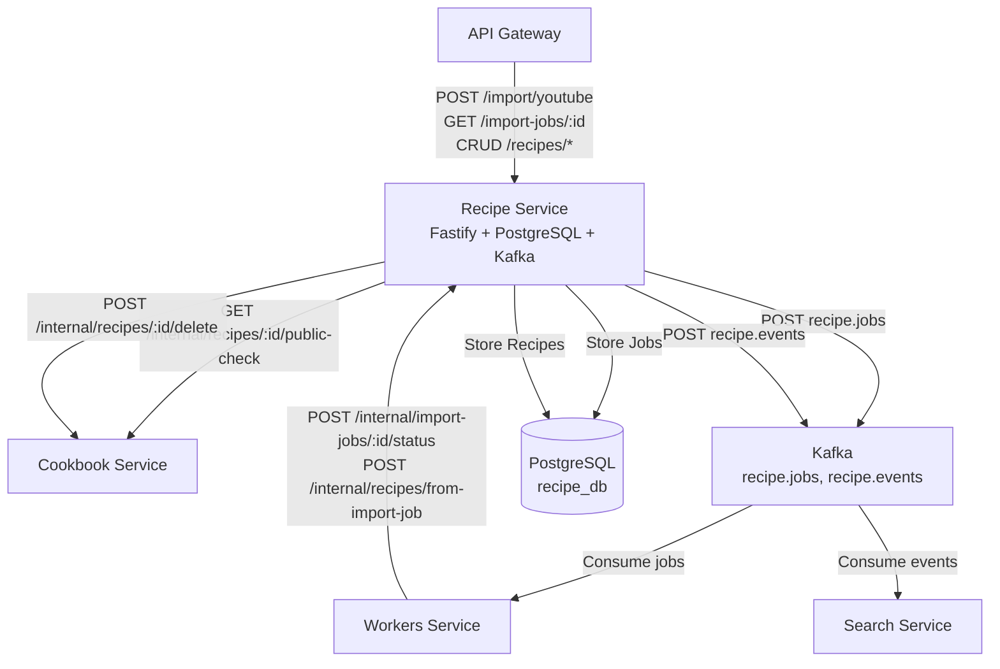
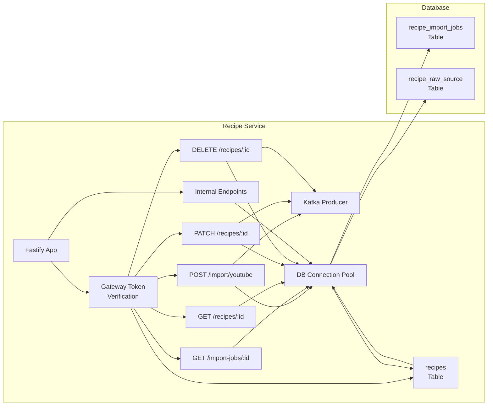
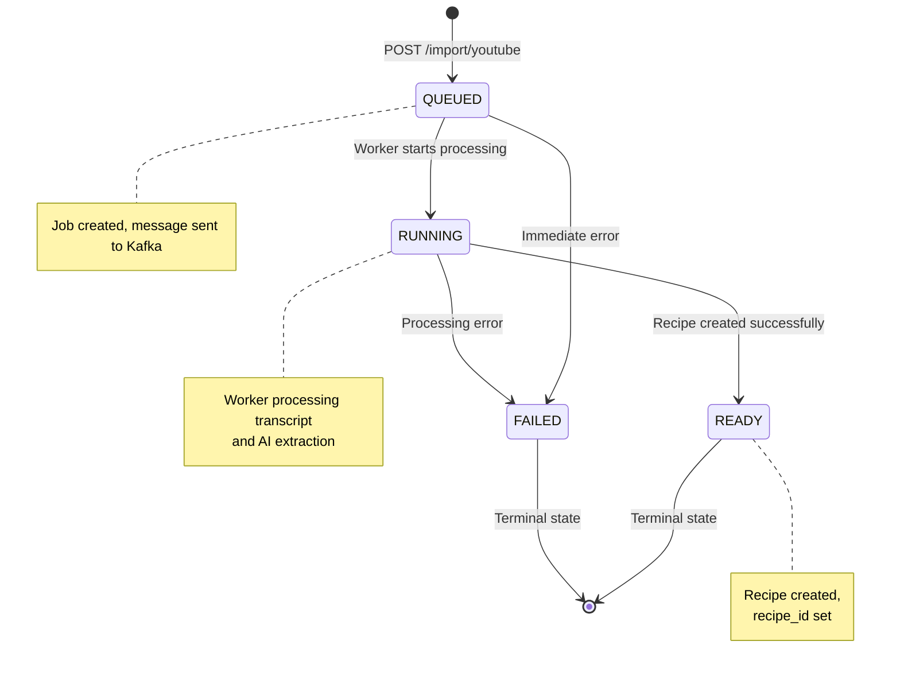
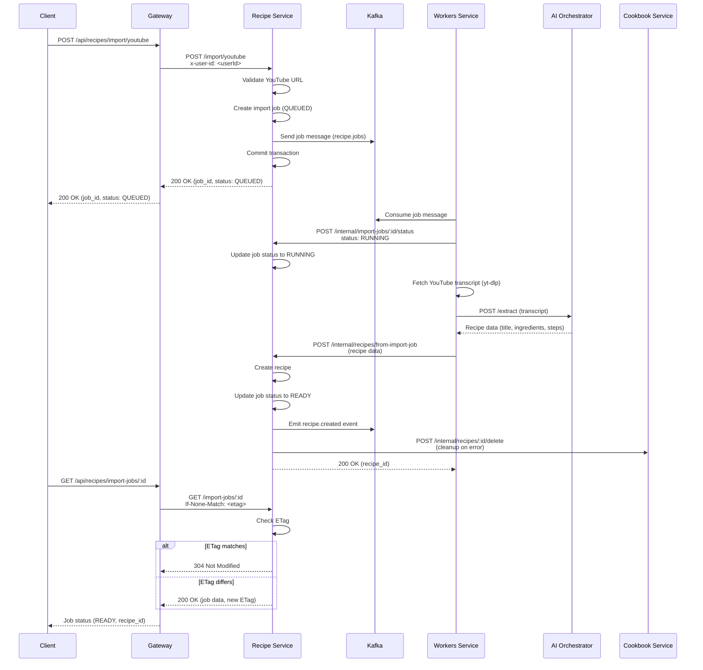
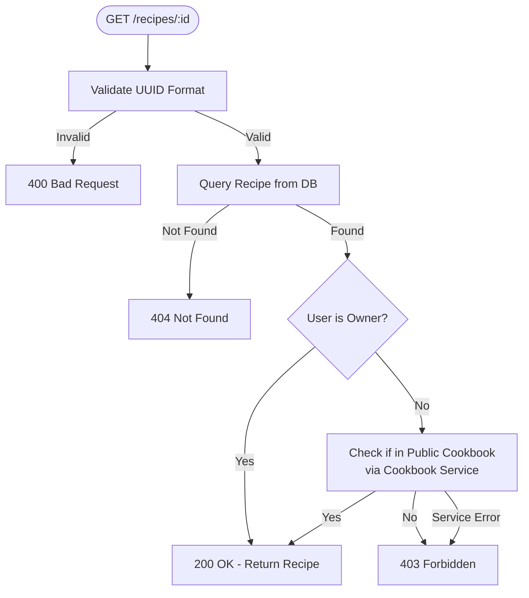

# Recipe Service - Design Document

## Table of Contents

1. [High-Level Design (HLD)](#high-level-design-hld)
2. [Low-Level Design (LLD)](#low-level-design-lld)
3. [Import Job Flow](#import-job-flow)
4. [Data Structures](#data-structures)
5. [Access Control](#access-control)
6. [Kafka Integration](#kafka-integration)

## High-Level Design (HLD)

### System Context

The Recipe Service manages recipe import jobs, recipe storage, and recipe CRUD operations.



### Responsibilities

1. **Import Job Management**: Create, track, and manage asynchronous recipe import jobs
2. **Recipe Storage**: Store structured recipes with ingredients and steps
3. **Recipe CRUD**: Create, read, update, delete recipes
4. **Access Control**: Enforce recipe ownership and public cookbook visibility
5. **Event Emission**: Emit recipe events to Kafka for search indexing
6. **Job Status API**: Provide endpoints for workers to update job status

## Low-Level Design (LLD)

### Service Architecture



### Component Details

#### 1. Import Job Lifecycle

**States**: `QUEUED` → `RUNNING` → `READY` | `FAILED`

**Monotonic State Enforcement**: States can only progress forward, never backward



#### 2. ETag-Based Caching

**Purpose**: Optimize polling of job status by clients

**Implementation**:
- Compute ETag from stable job fields: `id`, `status`, `updated_at`, `recipe_id`
- Return 304 Not Modified if ETag matches
- Set `Retry-After` header for non-terminal jobs

**Retry-After Logic**:
- `QUEUED`: 1 second (check quickly)
- `RUNNING` (< 30s old): 3 seconds
- `RUNNING` (≥ 30s old): 5 seconds (slower polling for long jobs)
- `READY`/`FAILED`: No Retry-After (terminal states)

## Import Job Flow

### Complete Import Flow



## Data Structures

### Recipe Data Model

**ingredients** (JSONB):
```typescript
[
  {
    qty: string;      // "2.5", "To taste", "As required"
    unit: string;     // "cup", "tsp", "" (empty if not applicable)
    item: string;     // "all-purpose flour", "salt"
  }
]
```

**steps** (JSONB):
```typescript
[
  {
    index: number;           // 1-indexed
    text: string;            // Step instruction
    timestamp_sec: number;   // Seconds from video start (0 if unknown)
  }
]
```

### Import Job Data Model

**transcript_segments** (JSONB, optional):
```typescript
{
  provider: string;    // "yt-dlp"
  lang: string;        // "en"
  segments: [
    {
      start: number;   // Start time in seconds
      dur: number;     // Duration in seconds
      text: string;    // Transcript text
    }
  ],
  transcript_text: string;  // Full transcript text
}
```

## Access Control

### Recipe Access Rules

1. **Owner**: User who created the recipe can always access
2. **Public Cookbook**: Recipe accessible if in a public cookbook (checked via Cookbook Service)
3. **Otherwise**: 403 Forbidden

**Access Check Flow**:


## Kafka Integration

### Topics

**recipe.jobs** (Producer):
- **Purpose**: Dispatch import jobs to workers
- **Key**: `job_id`
- **Value**: Job metadata (job_id, owner_id, source_type, url)

**recipe.events** (Producer):
- **Purpose**: Emit recipe lifecycle events for search indexing
- **Key**: `recipe_id`
- **Value**: Recipe data (full recipe object)
- **Events**: `recipe.created`, `recipe.updated`, `recipe.deleted`

### Event Emission

**recipe.created**:
- Emitted when recipe is created from import job
- Contains full recipe data
- Consumed by Search Service for indexing

**recipe.updated**:
- Emitted when recipe is updated (PATCH)
- Contains updated recipe data
- Consumed by Search Service for reindexing

**recipe.deleted**:
- Emitted when recipe is deleted
- Contains recipe data (for removal from index)
- Consumed by Search Service for index cleanup

## Performance Considerations

### Database Queries

**Recipe Lookups**:
- **Primary Key**: O(1) - `SELECT * FROM recipes WHERE id = $1`
- **Owner Queries**: O(log n) - Indexed on `owner_id`

**Job Status Queries**:
- **Primary Key**: O(1) - `SELECT * FROM recipe_import_jobs WHERE id = $1`
- **Owner Queries**: O(log n) - Indexed on `owner_id`
- **Status Queries**: O(log n) - Indexed on `status`

### ETag Caching

- **Purpose**: Reduce database load from polling
- **Implementation**: SHA-256 hash of stable fields
- **Impact**: 304 responses don't hit database

### Connection Pooling

- **Max Connections**: 10 (default, configurable)
- **Idle Timeout**: 30 seconds
- **Connection Timeout**: 2 seconds

## Security Considerations

1. **Gateway Token**: All protected endpoints verify `x-gateway-token` header
2. **Service Token**: Internal endpoints require `x-service-token` header
3. **User ID**: Extracted from gateway (verified JWT), never from client
4. **UUID Validation**: Recipe IDs validated as UUIDs before database queries
5. **SQL Injection**: All queries use parameterized statements
6. **Access Control**: Recipes private unless in public cookbook (via Cookbook Service check)

## Future Enhancements

1. **Photo-based Import**: OCR + LLM for recipe photos
2. **Recipe Versioning**: Track recipe changes over time
3. **Recipe Sharing**: Direct recipe sharing (not just via cookbooks)
4. **Batch Operations**: Batch import multiple recipes
5. **Recipe Templates**: Save recipes as templates for reuse
6. **Nutritional Information**: Add nutrition data extraction
7. **Recipe Recommendations**: Suggest similar recipes

