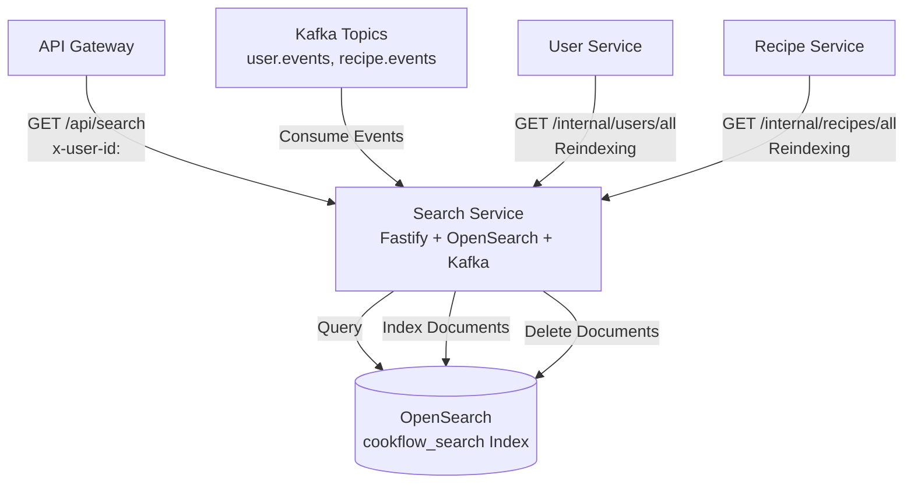
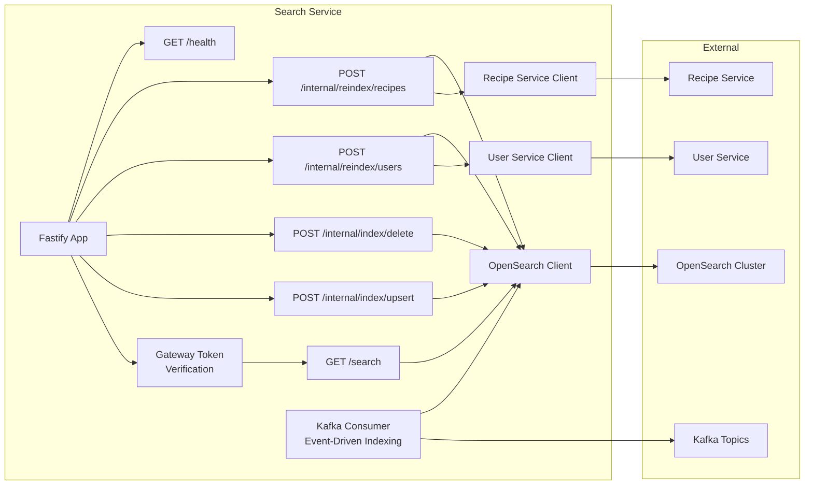
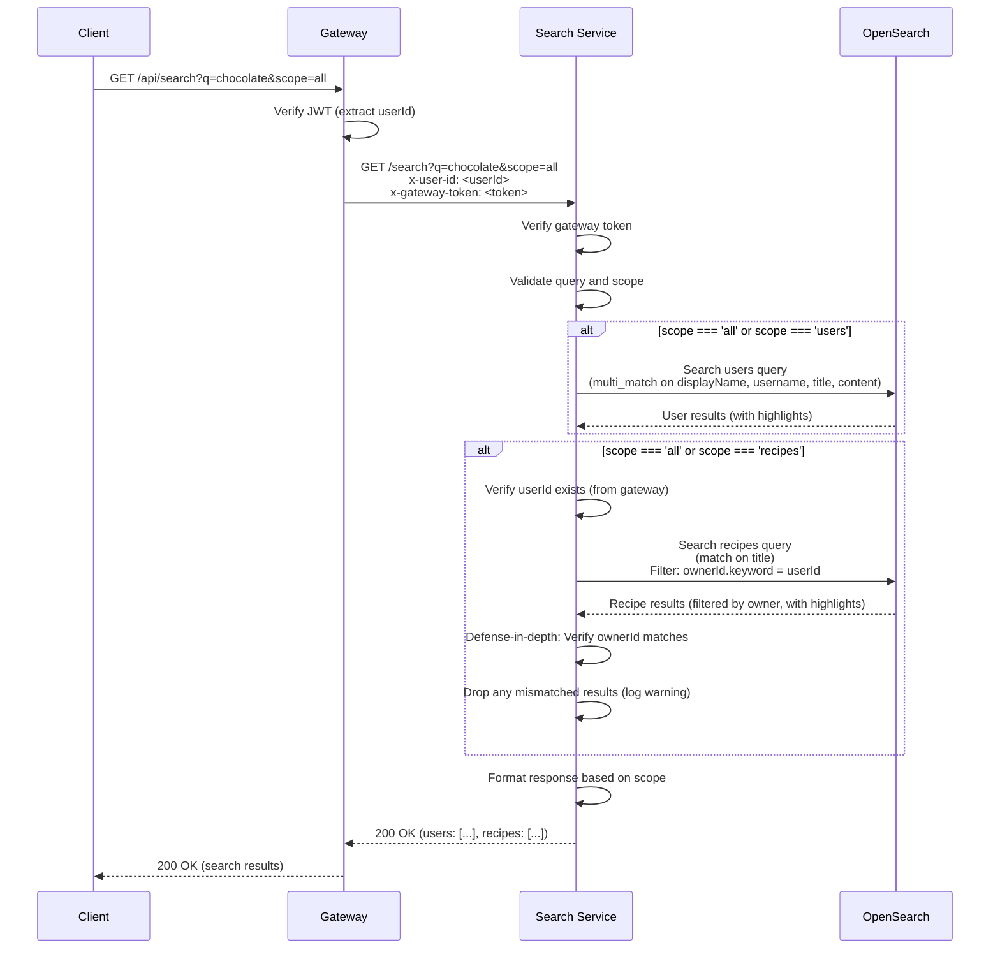
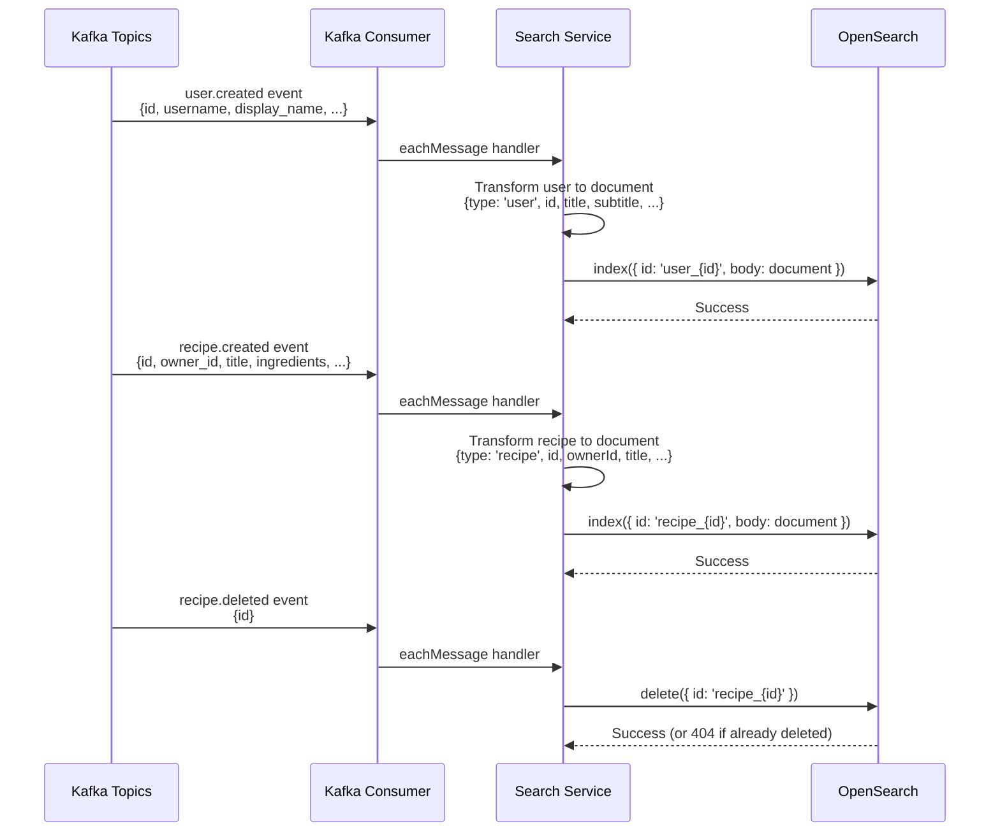
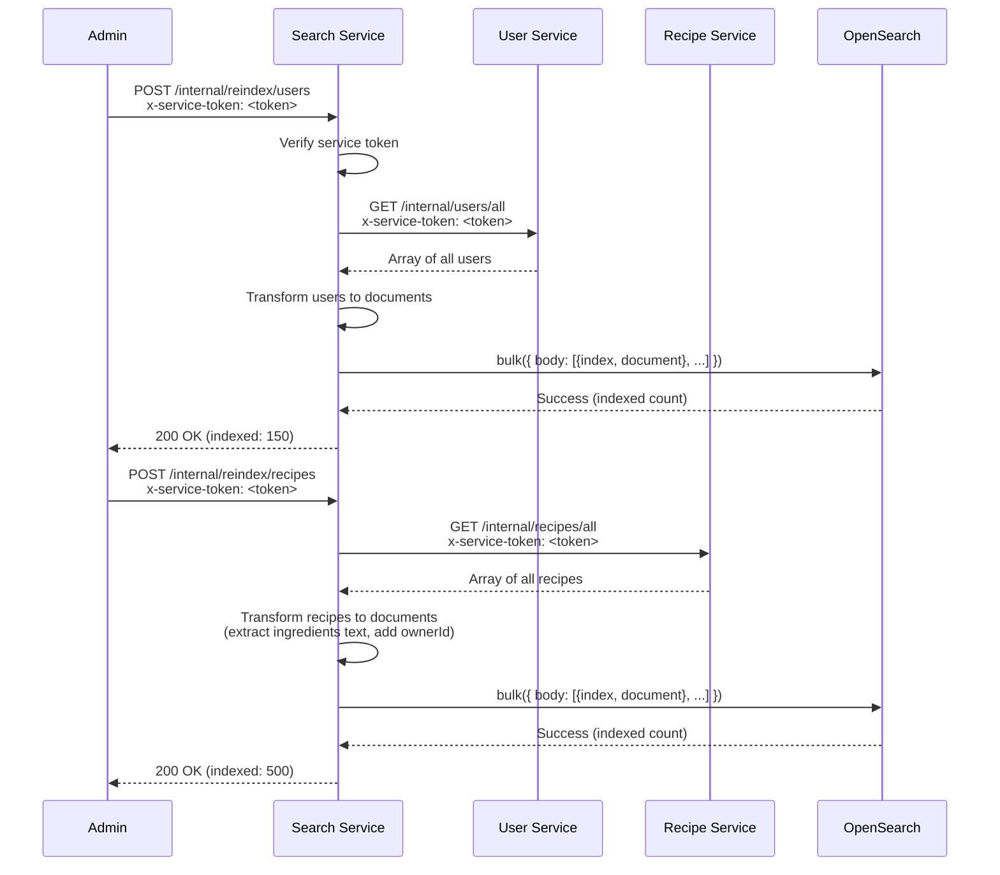
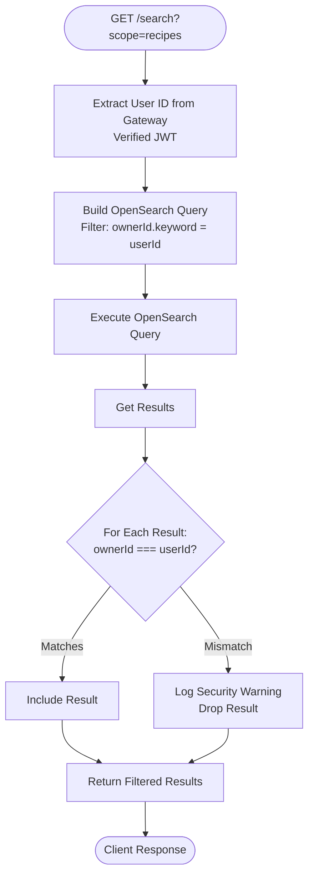

# Search Service - Design Document

## Table of Contents

1. [High-Level Design (HLD)](#high-level-design-hld)
2. [Low-Level Design (LLD)](#low-level-design-lld)
3. [Search Flow](#search-flow)
4. [Indexing Flow](#indexing-flow)
5. [Access Control](#access-control)

## High-Level Design (HLD)

### System Context

The Search Service provides global search functionality using OpenSearch.



### Responsibilities

1. **Global Search**: Full-text search across users and recipes
2. **Event-Driven Indexing**: Consume Kafka events for real-time index updates
3. **Manual Indexing**: Provide reindexing endpoints for bulk operations
4. **Access Control**: Enforce recipe access control (filter by owner)
5. **Highlighting**: Provide search result highlights

## Low-Level Design (LLD)

### Service Architecture



### Component Details

#### 1. OpenSearch Index Schema

**Index Name**: `cookflow_search` (configurable)

**Document ID Format**: `{type}_{id}` (e.g., `user_550e8400-...`, `recipe_550e8400-...`)

**Index Settings**:
```json
{
  "settings": {
    "analysis": {
      "analyzer": {
        "default": {
          "type": "standard"
        }
      }
    },
    "number_of_shards": 1,
    "number_of_replicas": 0
  }
}
```

**Field Mappings**:
- **type**: `keyword` (user | recipe)
- **id**: `keyword`
- **title**: `text` with `keyword` subfield (display name for users, recipe title for recipes)
- **subtitle**: `text` (username for users, description for recipes)
- **content**: `text` (bio for users, ingredients text for recipes)
- **ownerId**: `text` with `keyword` subfield (for recipes, query-time filtering)
- **username**: `keyword` (for users)
- **displayName**: `text` (for users)
- **avatarUrl**: `keyword` (for users)
- **thumbnailUrl**: `keyword` (for recipes)
- **updatedAt**: `date` (for sorting)

## Search Flow

### Complete Search Flow



### Search Query Construction

**User Search Query**:
```json
{
  "size": 10,
  "query": {
    "bool": {
      "must": [
        { "term": { "type.keyword": "user" } },
        {
          "multi_match": {
            "query": "chocolate",
            "fields": ["displayName^3", "username^4", "title^2", "content^1"],
            "type": "best_fields",
            "operator": "or"
          }
        }
      ]
    }
  },
  "highlight": {
    "fields": {
      "displayName": {},
      "username": {},
      "content": {}
    }
  }
}
```

**Recipe Search Query** (with access control):
```json
{
  "size": 10,
  "query": {
    "bool": {
      "must": [
        { "term": { "type.keyword": "recipe" } },
        {
          "match": {
            "title": "chocolate"
          }
        }
      ],
      "filter": [
        { "term": { "ownerId.keyword": "550e8400-..." } }
      ]
    }
  },
  "highlight": {
    "fields": {
      "title": {}
    }
  }
}
```

## Indexing Flow

### Event-Driven Indexing (Kafka Consumer)



### Manual Reindexing Flow



## Access Control

### Recipe Search Access Control

**Query-Time Enforcement**:
- **Filter**: `filter: [{ term: { 'ownerId.keyword': userId } }]` - Only user's own recipes
- **Defense-in-Depth**: Verify ownerId matches after receiving results (should never drop, but prevents regressions)

**Access Control Flow**:


**Key Points**:
- **Query Filter**: Primary enforcement at query time
- **Server Verification**: Defense-in-depth after receiving results
- **Logging**: Warns if any hits are dropped (security audit trail)

### User Search Access Control

- **Public**: All users are searchable (no filtering)
- **No Access Control**: User search is public

## Performance Considerations

### Search Performance

**Query Performance**:
- **Text Search**: O(log n) - OpenSearch inverted index
- **Filter Performance**: O(log n) - OpenSearch term filter
- **Highlighting**: Minimal overhead

**Index Settings**:
- **Shards**: 1 (for local dev, scale horizontally in production)
- **Replicas**: 0 (for local dev, add replicas in production for HA)

### Indexing Performance

**Bulk Operations**:
- **Reindexing**: Fetches all documents, then bulk indexes (efficient for large datasets)
- **Event-Driven**: Individual document indexing (real-time updates)

**OpenSearch Bulk API**:
- **Batch Size**: OpenSearch handles bulk operations efficiently
- **Refresh**: Refresh index after bulk operations (configurable)

## Security Considerations

1. **Gateway Token**: All protected endpoints verify `x-gateway-token` header
2. **Service Token**: Internal endpoints require `x-service-token` header
3. **User ID**: Extracted from gateway (verified JWT), never from client
4. **Access Control**: Recipes filtered by ownerId at query time + server-side verification
5. **OpenSearch Security**: OpenSearch connection should be secured in production (TLS, authentication)
6. **Input Sanitization**: Search queries validated and sanitized

## Future Enhancements

1. **Advanced Search**: Filters, sorting, faceted search
2. **Search Analytics**: Track popular searches, trends
3. **Auto-Complete**: Search suggestions
4. **Fuzzy Search**: Typo-tolerant search
5. **Multi-Language**: Language detection and indexing
6. **Search Ranking**: Relevance-based ranking (TF-IDF, BM25 tuning)
7. **Search History**: User search history tracking
8. **Personalized Search**: Personalized search results based on user preferences

