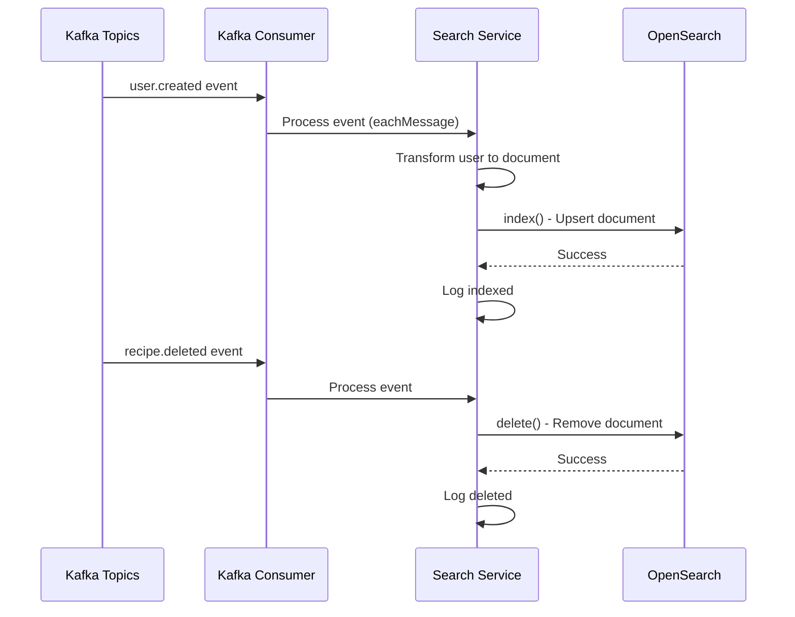
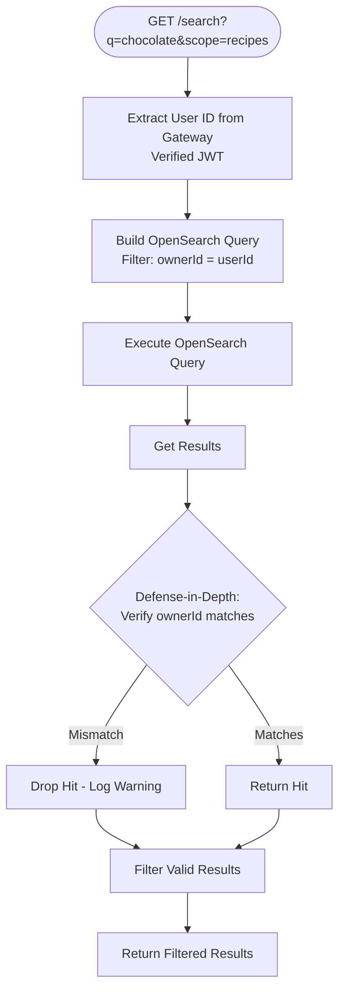

# Search Service

Search service for MyCookbook using OpenSearch for global search functionality. Provides full-text search for users and recipes with access control.

## Overview

The Search Service provides global search functionality using OpenSearch. It indexes users and recipes, supports multi-field search with highlighting, and enforces access control (recipes filtered by owner, users are public). The service uses Kafka for event-driven indexing and provides manual reindexing endpoints.

## Features

- **Global Search**: Search across users and recipes
- **Multi-Scope Search**: Search all, users only, or recipes only
- **OpenSearch Integration**: Full-text search with highlighting
- **Event-Driven Indexing**: Kafka-based indexing for real-time updates
- **Access Control**: Recipes filtered by owner (only user's own recipes), users are public
- **Manual Reindexing**: Endpoints to reindex all users or recipes
- **Bulk Operations**: Support for bulk indexing and deletion

## Architecture

- **Framework**: Fastify (TypeScript/Node.js)
- **Search Engine**: OpenSearch
- **Messaging**: Kafka (for event-driven indexing)
- **Authentication**: Gateway token authentication
- **Port**: 8007 (default)

## Environment Variables

| Variable | Default | Description |
|----------|---------|-------------|
| `PORT` | `8007` | Service port |
| `OPENSEARCH_URL` | `http://localhost:9200` | OpenSearch cluster URL |
| `OPENSEARCH_INDEX_NAME` | `cookflow_search` | Index name |
| `KAFKA_BROKERS` | `localhost:9092` | Kafka broker addresses (comma-separated) |
| `KAFKA_TOPIC_USERS` | `user.events` | Kafka topic for user events |
| `KAFKA_TOPIC_RECIPES` | `recipe.events` | Kafka topic for recipe events |
| `SERVICE_TOKEN` | **Required** | Service-to-service authentication token |
| `GATEWAY_TOKEN` | `SERVICE_TOKEN` | Gateway authentication token |
| `USER_SERVICE_URL` | `http://localhost:8002` | User service URL for reindexing |
| `RECIPE_SERVICE_URL` | `http://localhost:8003` | Recipe service URL for reindexing |
| `HTTP_TIMEOUT_MS` | `5000` | HTTP timeout for reindexing operations |

## API Endpoints

### Protected Endpoints (Require JWT via Gateway)

#### GET /search

Global search endpoint. Search users and/or recipes.

**Headers**: `Authorization: Bearer <access_token>` (via gateway)

**Query Parameters**:
- `q` (required): Search query string
- `scope` (optional): `all` (default), `users`, or `recipes`
- `limitUsers` (optional): Number of user results (default: 10, max: 50)
- `limitRecipes` (optional): Number of recipe results (default: 10, max: 50)

**Response** (200 OK, scope: `all`):
```json
{
  "users": [
    {
      "id": "550e8400-e29b-41d4-a716-446655440000",
      "username": "johndoe",
      "displayName": "John Doe",
      "bio": "Passionate cook",
      "avatarUrl": "https://example.com/avatar.jpg",
      "highlight": {
        "displayName": "John <em>Doe</em>",
        "username": "<em>johndoe</em>",
        "bio": "Passionate <em>cook</em>"
      }
    }
  ],
  "recipes": [
    {
      "id": "550e8400-e29b-41d4-a716-446655440001",
      "title": "Perfect <em>Chocolate</em> Chip Cookies",
      "description": "A classic recipe",
      "thumbnailUrl": "https://img.youtube.com/vi/example/mqdefault.jpg",
      "highlight": {
        "title": "Perfect <em>Chocolate</em> Chip Cookies"
      }
    }
  ]
}
```

**Response** (200 OK, scope: `users`):
```json
{
  "users": [...]
}
```

**Response** (200 OK, scope: `recipes`):
```json
{
  "recipes": [...]
}
```

**Response** (200 OK, empty query):
```json
{
  "users": [],
  "recipes": []
}
```

**Error Responses**:
- `400`: Invalid scope (must be "all", "users", or "recipes")
- `401`: Unauthorized (missing/invalid token)
- `403`: Recipe search attempted without userId (shouldn't happen with gateway)
- `500`: Internal server error

**Access Control**:
- **Users**: Public search (no filtering)
- **Recipes**: Filtered by owner (only user's own recipes, enforced at query time)

**Example cURL**:
```bash
export ACCESS_TOKEN="your-access-token"

# Search all (users and recipes)
curl -X GET "http://localhost:8080/api/search?q=chocolate&scope=all&limitUsers=10&limitRecipes=10" \
  -H "Authorization: Bearer $ACCESS_TOKEN" \
  -s | jq

# Search users only
curl -X GET "http://localhost:8080/api/search?q=john&scope=users&limitUsers=20" \
  -H "Authorization: Bearer $ACCESS_TOKEN" \
  -s | jq

# Search recipes only
curl -X GET "http://localhost:8080/api/search?q=cookies&scope=recipes&limitRecipes=20" \
  -H "Authorization: Bearer $ACCESS_TOKEN" \
  -s | jq
```

### Internal Endpoints (Service-to-Service)

These endpoints are called by other services for indexing operations.

#### POST /internal/index/upsert

Upsert documents (bulk supported). Called by Kafka consumers or reindexing operations.

**Headers**: `x-service-token: <service-token>`

**Request** (single document):
```json
{
  "type": "user",
  "id": "550e8400-e29b-41d4-a716-446655440000",
  "title": "John Doe",
  "subtitle": "johndoe",
  "content": "Passionate cook",
  "username": "johndoe",
  "displayName": "John Doe",
  "avatarUrl": "https://example.com/avatar.jpg",
  "updatedAt": "2024-01-01T00:00:00Z"
}
```

**Request** (bulk documents):
```json
{
  "documents": [
    {
      "type": "user",
      "id": "...",
      ...
    },
    {
      "type": "recipe",
      "id": "...",
      "ownerId": "...",
      ...
    }
  ]
}
```

**Response** (200 OK):
```json
{
  "success": true,
  "indexed": 10
}
```

**Document Types**:
- **user**: User profile documents
- **recipe**: Recipe documents

**Example cURL**:
```bash
export SERVICE_TOKEN="your-service-token"

curl -X POST http://localhost:8007/internal/index/upsert \
  -H "Content-Type: application/json" \
  -H "x-service-token: $SERVICE_TOKEN" \
  -d '{
    "type": "user",
    "id": "550e8400-e29b-41d4-a716-446655440000",
    "title": "John Doe",
    "subtitle": "johndoe",
    "content": "Passionate cook",
    "username": "johndoe",
    "displayName": "John Doe",
    "avatarUrl": "https://example.com/avatar.jpg",
    "updatedAt": "2024-01-01T00:00:00Z"
  }' \
  -s | jq
```

#### POST /internal/index/delete

Delete document from index.

**Headers**: `x-service-token: <service-token>`

**Request**:
```json
{
  "type": "user" | "recipe",
  "id": "550e8400-e29b-41d4-a716-446655440000"
}
```

**Response** (200 OK):
```json
{
  "success": true
}
```

**Error Responses**:
- `400`: Missing type or id
- `404`: Document not found (treated as success - already deleted)

**Example cURL**:
```bash
curl -X POST http://localhost:8007/internal/index/delete \
  -H "Content-Type: application/json" \
  -H "x-service-token: $SERVICE_TOKEN" \
  -d '{
    "type": "user",
    "id": "550e8400-e29b-41d4-a716-446655440000"
  }' \
  -s | jq
```

#### POST /internal/reindex/users

Reindex all users from User Service. Fetches all users and indexes them.

**Headers**: `x-service-token: <service-token>`

**Response** (200 OK):
```json
{
  "success": true,
  "indexed": 150
}
```

**Process**:
1. Fetch all users from User Service (`GET /internal/users/all`)
2. Transform users to search documents
3. Bulk index documents in OpenSearch

**Example cURL**:
```bash
curl -X POST http://localhost:8007/internal/reindex/users \
  -H "x-service-token: $SERVICE_TOKEN" \
  -s | jq
```

#### POST /internal/reindex/recipes

Reindex all recipes from Recipe Service. Fetches all recipes and indexes them.

**Headers**: `x-service-token: <service-token>`

**Response** (200 OK):
```json
{
  "success": true,
  "indexed": 500
}
```

**Process**:
1. Fetch all recipes from Recipe Service (`GET /internal/recipes/all`)
2. Transform recipes to search documents
3. Bulk index documents in OpenSearch

**Example cURL**:
```bash
curl -X POST http://localhost:8007/internal/reindex/recipes \
  -H "x-service-token: $SERVICE_TOKEN" \
  -s | jq
```

### Health Endpoint

#### GET /health

Health check endpoint. Checks OpenSearch connectivity.

**Response** (200 OK, healthy):
```json
{
  "status": "healthy",
  "opensearch": "healthy"
}
```

**Response** (200 OK, unhealthy):
```json
{
  "status": "unhealthy",
  "opensearch": "unhealthy",
  "error": "Connection failed"
}
```

## Running Locally

### Prerequisites

- Node.js 18+
- OpenSearch (local or remote cluster)
- Kafka (for event-driven indexing, optional)
- TypeScript
- User Service running (for reindexing)
- Recipe Service running (for reindexing)

### Setup

1. **Start OpenSearch**:
   ```bash
   # Using Docker
   docker run -d -p 9200:9200 -p 9600:9600 \
     -e "discovery.type=single-node" \
     -e "OPENSEARCH_INITIAL_ADMIN_PASSWORD=admin123" \
     opensearchproject/opensearch:latest
   ```

2. **Install dependencies**:
   ```bash
   npm install
   ```

3. **Set environment variables**:
   ```bash
   export PORT=8007
   export OPENSEARCH_URL="http://localhost:9200"
   export OPENSEARCH_INDEX_NAME="cookflow_search"
   export KAFKA_BROKERS="localhost:9092"
   export SERVICE_TOKEN="your-service-token"
   export GATEWAY_TOKEN="your-gateway-token"
   export USER_SERVICE_URL="http://localhost:8002"
   export RECIPE_SERVICE_URL="http://localhost:8003"
   ```

4. **Run the service**:
   ```bash
   npm run dev
   ```

The service will automatically create the OpenSearch index on startup if it doesn't exist.

Or using Docker:

```bash
docker compose up --build
```

## Testing

### Search Testing

```bash
export ACCESS_TOKEN="your-access-token"

# Search for users
curl -X GET "http://localhost:8080/api/search?q=john&scope=users&limitUsers=10" \
  -H "Authorization: Bearer $ACCESS_TOKEN" \
  -s | jq

# Search for recipes
curl -X GET "http://localhost:8080/api/search?q=cookies&scope=recipes&limitRecipes=10" \
  -H "Authorization: Bearer $ACCESS_TOKEN" \
  -s | jq

# Search all
curl -X GET "http://localhost:8080/api/search?q=chocolate&scope=all&limitUsers=5&limitRecipes=5" \
  -H "Authorization: Bearer $ACCESS_TOKEN" \
  -s | jq
```

### Reindexing Testing

```bash
export SERVICE_TOKEN="your-service-token"

# Reindex all users
curl -X POST http://localhost:8007/internal/reindex/users \
  -H "x-service-token: $SERVICE_TOKEN" \
  -s | jq

# Reindex all recipes
curl -X POST http://localhost:8007/internal/reindex/recipes \
  -H "x-service-token: $SERVICE_TOKEN" \
  -s | jq
```

### Manual Indexing Testing

```bash
# Index a user manually
curl -X POST http://localhost:8007/internal/index/upsert \
  -H "Content-Type: application/json" \
  -H "x-service-token: $SERVICE_TOKEN" \
  -d '{
    "type": "user",
    "id": "550e8400-e29b-41d4-a716-446655440000",
    "title": "John Doe",
    "subtitle": "johndoe",
    "content": "Passionate cook",
    "username": "johndoe",
    "displayName": "John Doe",
    "avatarUrl": "https://example.com/avatar.jpg",
    "updatedAt": "2024-01-01T00:00:00Z"
  }' \
  -s | jq

# Delete from index
curl -X POST http://localhost:8007/internal/index/delete \
  -H "Content-Type: application/json" \
  -H "x-service-token: $SERVICE_TOKEN" \
  -d '{
    "type": "user",
    "id": "550e8400-e29b-41d4-a716-446655440000"
  }' \
  -s | jq
```

## Docker Deployment

### Build and Run

```bash
# Build image
docker build -t search-service .

# Run container
docker run -p 8007:8007 \
  -e OPENSEARCH_URL="http://opensearch:9200" \
  -e OPENSEARCH_INDEX_NAME="cookflow_search" \
  -e KAFKA_BROKERS="kafka:9092" \
  -e SERVICE_TOKEN="your-service-token" \
  -e GATEWAY_TOKEN="your-gateway-token" \
  -e USER_SERVICE_URL="http://user:8002" \
  -e RECIPE_SERVICE_URL="http://recipe:8003" \
  search-service
```

### Docker Compose

Create `docker-compose.yml` for standalone deployment (see docker-compose.yml section below).

## OpenSearch Index Schema

### Index Configuration

**Index Name**: `cookflow_search` (configurable via `OPENSEARCH_INDEX_NAME`)

**Settings**:
```json
{
  "settings": {
    "analysis": {
      "analyzer": {
        "default": {
          "type": "standard"
        }
      }
    },
    "number_of_shards": 1,
    "number_of_replicas": 0
  }
}
```

**Mappings**:
```json
{
  "mappings": {
    "properties": {
      "type": { "type": "keyword" },
      "id": { "type": "keyword" },
      "title": {
        "type": "text",
        "fields": {
          "keyword": { "type": "keyword" }
        }
      },
      "subtitle": { "type": "text" },
      "content": { "type": "text" },
      "ownerId": {
        "type": "text",
        "fields": {
          "keyword": { "type": "keyword" }
        }
      },
      "username": { "type": "keyword" },
      "displayName": { "type": "text" },
      "avatarUrl": { "type": "keyword" },
      "thumbnailUrl": { "type": "keyword" },
      "updatedAt": { "type": "date" }
    }
  }
}
```

### Document Types

**User Document**:
```json
{
  "type": "user",
  "id": "uuid",
  "title": "Display name (for search)",
  "subtitle": "Username",
  "content": "Bio",
  "username": "username",
  "displayName": "Display name",
  "avatarUrl": "Avatar URL",
  "updatedAt": "ISO 8601"
}
```

**Recipe Document**:
```json
{
  "type": "recipe",
  "id": "uuid",
  "title": "Recipe title",
  "subtitle": "Recipe description",
  "content": "Ingredients text (e.g., '2 cups flour, 1 cup sugar')",
  "ownerId": "Owner UUID (for access control)",
  "thumbnailUrl": "YouTube thumbnail URL (if YouTube)",
  "updatedAt": "ISO 8601"
}
```

## Kafka Integration

### Event Consumption

The service consumes events from Kafka topics:

- **Topic**: `user.events` (configurable via `KAFKA_TOPIC_USERS`)
- **Topic**: `recipe.events` (configurable via `KAFKA_TOPIC_RECIPES`)

**Consumer Group**: `search-service-indexer`

**Events Handled**:
- `user.created` → Index user
- `user.updated` → Update user index
- `user.deleted` → Delete user from index
- `recipe.created` → Index recipe
- `recipe.updated` → Update recipe index
- `recipe.deleted` → Delete recipe from index

**Event Processing**:


**Note**: Events are processed asynchronously. Service continues if Kafka is unavailable (non-fatal).

## Security Considerations

1. **Gateway Token**: All protected endpoints verify `x-gateway-token` header
2. **Service Token**: Internal endpoints require `x-service-token` header
3. **User ID**: Extracted from gateway (verified JWT), never from client
4. **Access Control**: Recipes filtered by ownerId at query time (defense-in-depth)
5. **OpenSearch Security**: OpenSearch connection should be secured in production (TLS, authentication)
6. **Input Validation**: All search queries validated and sanitized

## Access Control

### Recipe Search Access Control

**Query-Time Enforcement**:


**Key Points**:
- **Query Filter**: `filter: [{ term: { 'ownerId.keyword': userId } }]` - Enforced at query time
- **Defense-in-Depth**: Server-side verification after receiving results (should never drop, but prevents regressions)
- **Logging**: Warns if any hits are dropped (security audit trail)

### User Search Access Control

- **Public**: All users are searchable (no filtering)
- **No Access Control**: User search is public

## Performance Considerations

### Search Performance

**Query Complexity**:
- **Users**: O(log n) - Text search with term filter
- **Recipes**: O(log n) - Text search with term filter (ownerId)

**OpenSearch Optimization**:
- **Index Settings**: 1 shard, 0 replicas (local dev)
- **Multi-Field Search**: Searches across multiple fields with boosting
- **Highlighting**: Provides search result highlights

### Indexing Performance

**Bulk Operations**:
- **Reindexing**: Fetches all documents, then bulk indexes
- **Batch Size**: OpenSearch handles bulk operations efficiently
- **Concurrent**: Can run reindexing in background

**Event-Driven Indexing**:
- **Real-Time**: Events processed as they arrive
- **Async**: Non-blocking, doesn't slow down main service operations

## Migration and Bootstrap

### Index Bootstrap

The service automatically creates the OpenSearch index on startup if it doesn't exist:

```typescript
async function bootstrapIndex() {
  const exists = await opensearch.indices.exists({ index: OPENSEARCH_INDEX_NAME });
  if (!exists) {
    await opensearch.indices.create({
      index: OPENSEARCH_INDEX_NAME,
      body: { settings, mappings }
    });
  }
}
```

### Initial Indexing

**On First Deploy**:
1. Start service (index is created automatically)
2. Call `POST /internal/reindex/users` to index all users
3. Call `POST /internal/reindex/recipes` to index all recipes

**After Data Loss**:
- Re-run reindexing endpoints to restore index

## Future Enhancements

1. **Advanced Search**: Filters (recipe count, date range), sorting options
2. **Search Analytics**: Track popular searches, search trends
3. **Search Suggestions**: Auto-complete suggestions
4. **Fuzzy Search**: Typo-tolerant search
5. **Multi-Language**: Support for multiple languages
6. **Search Ranking**: Relevance-based ranking (not just recency)
7. **Faceted Search**: Filter by categories, tags, etc.
8. **Search History**: Track user search history

See [Design.md](./Design.md) for detailed architecture and integration patterns.

