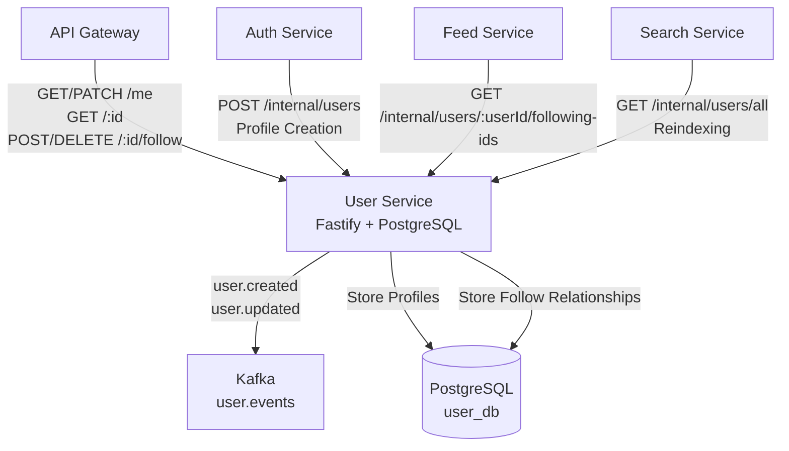
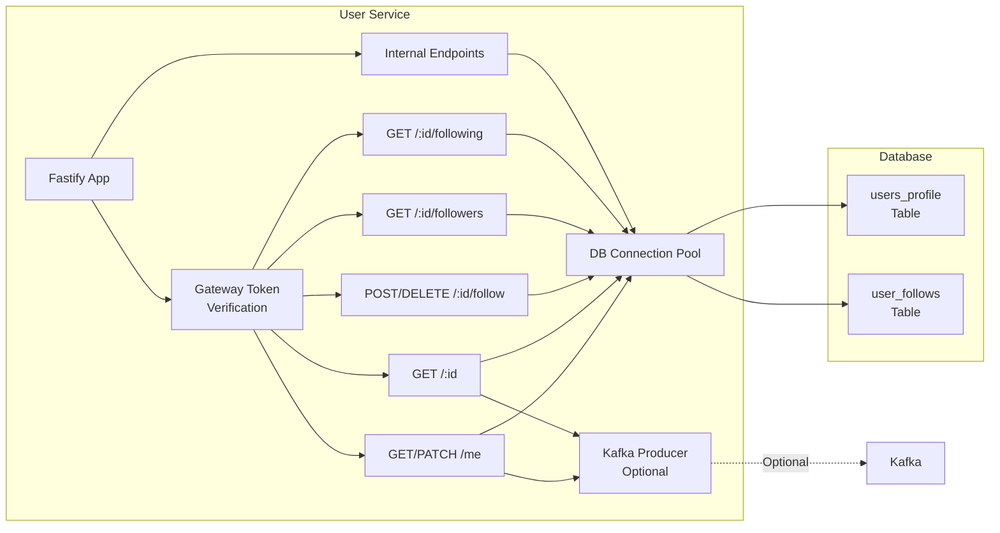
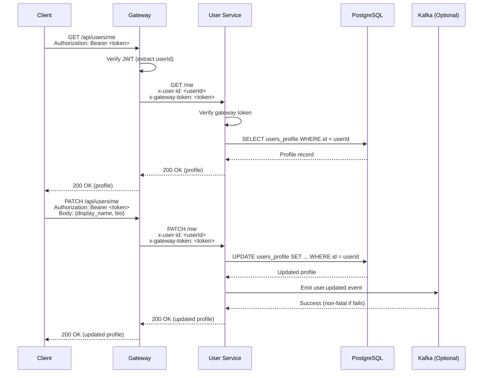
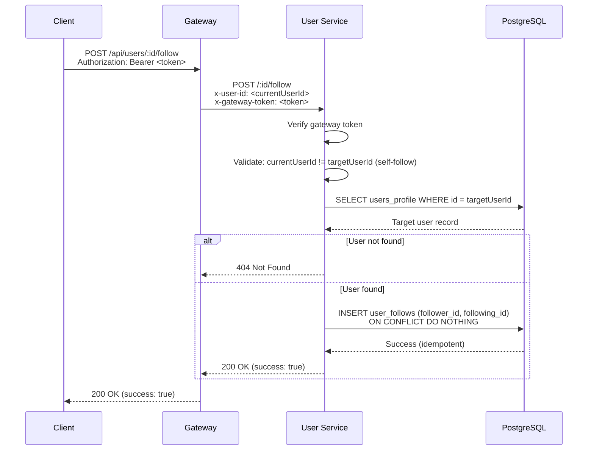
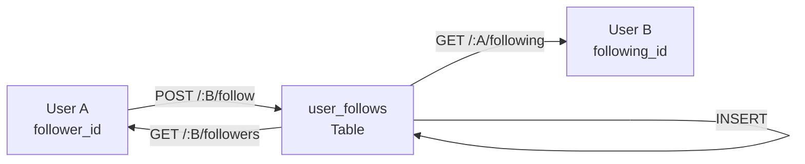
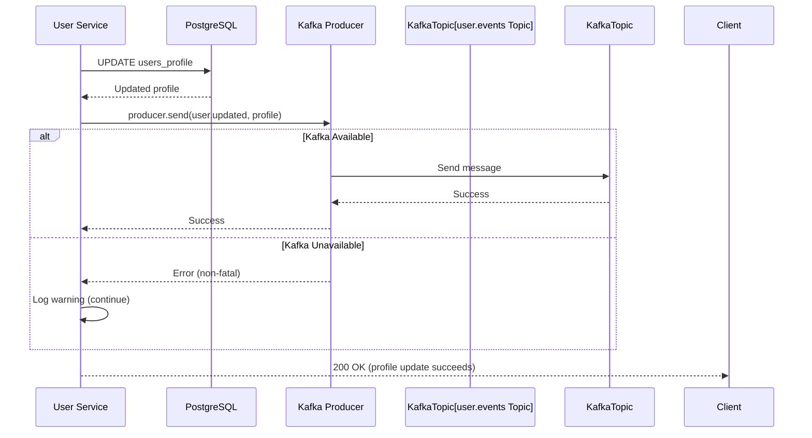

# User Service - Design Document

## Table of Contents

1. [High-Level Design (HLD)](#high-level-design-hld)
2. [Low-Level Design (LLD)](#low-level-design-lld)
3. [Data Structures](#data-structures)
4. [API Design](#api-design)
5. [Social Graph Flow](#social-graph-flow)
6. [Event Emission](#event-emission)

## High-Level Design (HLD)

### System Context

The User Service manages user profiles and social graph (follow relationships).



### Responsibilities

1. **Profile Management**: CRUD operations for user profiles
2. **Social Graph**: Manage follow/unfollow relationships
3. **Event Emission**: Emit user events to Kafka for search indexing
4. **Internal APIs**: Provide internal endpoints for other services

## Low-Level Design (LLD)

### Service Architecture



### Database Schema

**users_profile Table**:
```sql
CREATE TABLE users_profile (
  id UUID PRIMARY KEY,
  username TEXT UNIQUE NULL,
  display_name TEXT NULL,
  bio TEXT NULL,
  avatar_url TEXT NULL,
  preferences JSONB NULL,
  created_at TIMESTAMPTZ NOT NULL DEFAULT now(),
  updated_at TIMESTAMPTZ NOT NULL DEFAULT now()
);
```

**user_follows Table**:
```sql
CREATE TABLE user_follows (
  follower_id UUID NOT NULL,
  following_id UUID NOT NULL,
  created_at TIMESTAMPTZ NOT NULL DEFAULT now(),
  PRIMARY KEY (follower_id, following_id),
  FOREIGN KEY (follower_id) REFERENCES users_profile(id) ON DELETE CASCADE,
  FOREIGN KEY (following_id) REFERENCES users_profile(id) ON DELETE CASCADE,
  CHECK (follower_id != following_id)
);
```

## Data Structures

### Request Models

#### UpdateProfileRequest
```typescript
{
  display_name?: string;
  bio?: string;
  avatar_url?: string;
  preferences?: {
    theme?: string;
    units?: string;
    [key: string]: any;
  };
}
```

### Response Models

#### UserProfile
```typescript
{
  id: string;                    // UUID
  username: string | null;
  display_name: string | null;
  bio: string | null;
  avatar_url: string | null;
  preferences: Record<string, any>;
  created_at: string;            // ISO 8601
  updated_at: string;            // ISO 8601
}
```

#### UserProfileWithCounts
```typescript
{
  ...UserProfile;
  followers_count: number;
  following_count: number;
  is_following: boolean;         // Current user follows this user
}
```

## API Design

### Profile Endpoints Flow



### Follow Endpoints Flow



## Social Graph Flow

### Follow Relationship Management



### Followers/Following Queries

**Get Followers** (who follows this user):
```sql
SELECT u.id, u.username, u.display_name, u.avatar_url
FROM user_follows uf
JOIN users_profile u ON uf.follower_id = u.id
WHERE uf.following_id = $1
ORDER BY uf.created_at DESC
```

**Get Following** (who this user follows):
```sql
SELECT u.id, u.username, u.display_name, u.avatar_url
FROM user_follows uf
JOIN users_profile u ON uf.following_id = u.id
WHERE uf.follower_id = $1
ORDER BY uf.created_at DESC
```

**Check Follow Status**:
```sql
SELECT 1 FROM user_follows
WHERE follower_id = $1 AND following_id = $2
```

## Event Emission

### Kafka Integration

**Purpose**: Emit user events for search indexing and feed services

**Events**:
- `user.created`: Emitted when new profile is created (via internal endpoint)
- `user.updated`: Emitted when profile is updated (via PATCH /me)

**Event Format**:
```json
{
  "event": "user.created" | "user.updated",
  "id": "uuid",
  "username": "string | null",
  "display_name": "string | null",
  "bio": "string | null",
  "avatar_url": "string | null",
  "created_at": "ISO 8601",
  "updated_at": "ISO 8601"
}
```

**Event Emission Flow**:


**Key Points**:
- **Non-Fatal**: Event emission failures don't fail the request
- **Idempotent**: Events can be re-emitted if needed (search service handles duplicates)
- **Optional**: Service works without Kafka (events are skipped)

## Performance Considerations

### Database Queries

**Profile Lookups**:
- **Primary Key Lookup**: O(1) - `SELECT * FROM users_profile WHERE id = $1`
- **Username Lookup**: O(log n) - Indexed unique constraint

**Follow Queries**:
- **Get Followers/Following**: O(n log n) - Join with indexed user_follows
- **Check Follow Status**: O(log n) - Primary key lookup on (follower_id, following_id)

**Optimization**:
- **Composite Indexes**: `user_follows(follower_id, created_at)`, `user_follows(following_id, created_at)`
- **Cascade Deletes**: Follow relationships automatically deleted when user is deleted

### Connection Pooling

- **Max Connections**: 10 (default, configurable via `DB_POOL_MAX`)
- **Idle Timeout**: 30 seconds
- **Connection Timeout**: 2 seconds

## Security Considerations

1. **Gateway Token**: All protected endpoints verify `x-gateway-token` header
2. **Service Token**: Internal endpoints require `x-service-token` header
3. **User ID**: Extracted from gateway (verified JWT), never from client
4. **Self-Follow Prevention**: Database constraint prevents users from following themselves
5. **SQL Injection**: All queries use parameterized statements
6. **Email Privacy**: Email stored in auth service, not exposed in profile

## Integration Points

### Upstream (Calls This Service)

1. **Gateway**: Routes `/api/users/*` requests
2. **Auth Service**: Calls `POST /internal/users` after signup
3. **Feed Service**: Calls `GET /internal/users/:userId/following-ids` for feed queries
4. **Search Service**: Calls `GET /internal/users/all` for reindexing

### Downstream (This Service Calls)

1. **Kafka**: Emits user events (optional, non-fatal)

## Future Enhancements

1. **Username Support**: Full username system with validation and uniqueness
2. **Profile Privacy**: Public/private profile settings
3. **Blocking**: Block users from viewing profile or following
4. **Profile Analytics**: View counts, engagement metrics
5. **Batch Operations**: Batch follow/unfollow operations
6. **Follow Suggestions**: Algorithm-based follow recommendations

