# Workers Service - Design Document

## Table of Contents

1. [High-Level Design (HLD)](#high-level-design-hld)
2. [Low-Level Design (LLD)](#low-level-design-lld)
3. [Job Processing Flow](#job-processing-flow)
4. [Error Handling and Retries](#error-handling-and-retries)
5. [Transcript Fetching](#transcript-fetching)

## High-Level Design (HLD)

### System Context

The Workers Service processes recipe import jobs asynchronously by consuming Kafka messages.


### Responsibilities

1. **Kafka Consumer**: Consume recipe import job messages from Kafka
2. **Transcript Fetching**: Fetch YouTube video transcripts using yt-dlp
3. **AI Integration**: Call AI Orchestrator to extract structured recipe data
4. **Recipe Creation**: Store recipes via Recipe Service internal endpoints
5. **Job Status Management**: Update import job status throughout the process
6. **Error Handling**: Retry on transient failures, provide detailed error messages

### Design Principles

- **Asynchronous Processing**: Non-blocking, processes jobs in background
- **Idempotent**: Job processing is idempotent (can be retried safely)
- **Best-Effort Status Check**: Checks job status before processing to avoid wasted work
- **Fail-Fast**: Verifies yt-dlp availability on startup
- **Retry Strategy**: Exponential backoff with jitter for transient failures

## Low-Level Design (LLD)

### Service Architecture

```mermaid
graph LR
    subgraph "Workers Service"
        KafkaConsumer[Kafka Consumer<br/>kafkajs]
        ProcessJob[processJob Function]
        FetchTranscript[fetchTranscript<br/>yt-dlp + VTT Parser]
        ExtractRecipe[extractRecipe<br/>AI Orchestrator Client]
        CreateRecipe[createRecipeFromJob<br/>Recipe Service Client]
        UpdateStatus[updateJobStatus<br/>Recipe Service Client]
        StoreTranscript[storeTranscript<br/>Recipe Service Client]
        RetryHelper[retryWithBackoff<br/>Helper]
        HealthServer[Fastify Health Server<br/>Port 8005]
    end
    
    subgraph "External"
        Kafka[Kafka Topic<br/>recipe.jobs]
        YT[YouTube<br/>yt-dlp]
        AI[AI Orchestrator]
        Recipe[Recipe Service]
    end
    
    Kafka -->|Consume Messages| KafkaConsumer
    KafkaConsumer -->|eachMessage| ProcessJob
    ProcessJob --> FetchTranscript
    ProcessJob --> ExtractRecipe
    ProcessJob --> CreateRecipe
    ProcessJob --> UpdateStatus
    FetchTranscript --> YT
    FetchTranscript --> StoreTranscript
    ExtractRecipe --> AI
    CreateRecipe --> Recipe
    UpdateStatus --> Recipe
    StoreTranscript --> Recipe
    ExtractRecipe --> RetryHelper
    CreateRecipe --> RetryHelper
    UpdateStatus --> RetryHelper
    HealthServer -.->|Health Check| HealthServer
```



### Component Details

#### 1. Kafka Consumer Configuration

```typescript
const consumer = kafka.consumer({
  groupId: 'recipe-workers-group',
  sessionTimeout: 30000,      // 30s
  heartbeatInterval: 3000,     // 3s
  maxBytesPerPartition: 1048576, // 1MB
  maxWaitTimeInMs: 5000,       // 5s
  retry: {
    retries: 8,
    initialRetryTime: 100,
    multiplier: 2,
    maxRetryTime: 30000,
  },
});
```

**Key Points**:
- **Consumer Group**: `recipe-workers-group` (enables horizontal scaling)
- **Session Timeout**: 30 seconds
- **From Beginning**: `false` (only process new messages)

#### 2. yt-dlp Integration

**Purpose**: Fetch YouTube video transcripts

**Docker Image**:
```dockerfile
FROM node:18-alpine

# Install Python, pip, ffmpeg, and yt-dlp
RUN apk add --no-cache python3 py3-pip ffmpeg
RUN pip3 install yt-dlp
```

**Usage**:
```typescript
execFile('yt-dlp', [
  url,
  '--skip-download',
  '--write-auto-subs',
  '--sub-lang', 'en',
  '--sub-format', 'vtt',
  '-o', outTemplate,
], { maxBuffer: 50MB });
```

**Safety**:
- **Job ID Validation**: Validates job_id to prevent path traversal (`../`, `/`, `\`)
- **Temp Directory**: Per-job temp directory (`/tmp/mycookbook/{job_id}`)
- **Cleanup**: Always cleans up temp directory (even on errors)
- **Timeout**: 90 seconds for yt-dlp execution

#### 3. VTT Parser

**Purpose**: Parse WebVTT format to structured segments

**VTT Format**:
```
WEBVTT

00:00.000 --> 00:05.500
Hello and welcome to this recipe video

00:05.500 --> 00:10.000
First, we need 2 cups of flour
```

**Parsed Format**:
```typescript
[
  {
    start: 0.0,
    dur: 5.5,
    text: "Hello and welcome to this recipe video"
  },
  {
    start: 5.5,
    dur: 4.5,
    text: "First, we need 2 cups of flour"
  }
]
```

**Transcript Format** (for AI Orchestrator):
```
[0.00s] Hello and welcome to this recipe video
[5.50s] First, we need 2 cups of flour
[10.00s] Then add 1 cup of sugar
```

## Job Processing Flow

### Complete Job Processing Flow

```mermaid
flowchart TD
    Start([Kafka Message Consumed]) --> ParseMessage[Parse Job Message<br/>{job_id, owner_id, url}]
    ParseMessage -->|Invalid| LogError[Log Error, Skip Message]
    ParseMessage -->|Valid| CheckStatus[Best-Effort Status Check<br/>GET /internal/import-jobs/:id]
    CheckStatus -->|Terminal READY/FAILED| Skip[Skip Processing, Log]
    CheckStatus -->|Non-Terminal or Error| UpdateRunning[POST /internal/import-jobs/:id/status<br/>status: RUNNING]
    UpdateRunning -->|Error| RetryUpdate{Retry?}
    RetryUpdate -->|Yes| UpdateRunning
    RetryUpdate -->|No| MarkFailed1[Mark Job FAILED<br/>Error: Status update failed]
    UpdateRunning -->|Success| FetchTranscript[Fetch YouTube Transcript<br/>yt-dlp]
    FetchTranscript -->|Error| MarkFailed2[Mark Job FAILED<br/>Error: Transcript fetch failed]
    FetchTranscript -->|Success| ParseVTT[Parse VTT to Segments]
    ParseVTT --> StoreTranscript[POST /internal/import-jobs/:id/transcript<br/>Store Transcript Segments]
    StoreTranscript --> FormatTranscript[Format Transcript<br/>[XX.XXs] text]
    FormatTranscript --> ExtractRecipe[POST /extract to AI Orchestrator<br/>Retry with Backoff]
    ExtractRecipe -->|Error After Retries| MarkFailed3[Mark Job FAILED<br/>Error: AI extraction failed]
    ExtractRecipe -->|Success| ValidateResponse{Validate AI Response<br/>title, ingredients, steps?}
    ValidateResponse -->|Invalid| MarkFailed4[Mark Job FAILED<br/>Error: Invalid recipe data]
    ValidateResponse -->|Valid| CreateRecipe[POST /internal/recipes/from-import-job<br/>Create Recipe, Retry with Backoff]
    CreateRecipe -->|Error After Retries| MarkFailed5[Mark Job FAILED<br/>Error: Recipe creation failed]
    CreateRecipe -->|Success| UpdateReady[POST /internal/import-jobs/:id/status<br/>status: READY, recipe_id]
    UpdateReady -->|Error| RetryUpdate2{Retry?}
    RetryUpdate2 -->|Yes| UpdateReady
    RetryUpdate2 -->|No| LogWarning[Log Warning, Job Complete<br/>Recipe Created but Status Not Updated]
    UpdateReady -->|Success| Complete[Job Complete<br/>Recipe Created Successfully]
    MarkFailed1 --> End([End])
    MarkFailed2 --> End
    MarkFailed3 --> End
    MarkFailed4 --> End
    MarkFailed5 --> End
    Complete --> End
    Skip --> End
    LogError --> End
```

### Job Processing Steps

#### Step 1: Consume Job Message

**Kafka Message Format**:
```json
{
  "job_id": "550e8400-e29b-41d4-a716-446655440000",
  "owner_id": "550e8400-e29b-41d4-a716-446655440001",
  "source_type": "youtube",
  "url": "https://www.youtube.com/watch?v=example",
  "requested_at": "2024-01-01T00:00:00Z"
}
```

**Consumer Handler**:
```typescript
await consumer.run({
  eachMessage: async ({ topic, partition, message }) => {
    const jobMessage = JSON.parse(message.value.toString());
    await processJob(jobMessage);
  },
});
```

#### Step 2: Best-Effort Status Check

**Purpose**: Avoid wasted work if job was already processed

**Implementation**:
```typescript
const currentStatus = await checkJobStatus(job_id);
if (currentStatus === 'READY' || currentStatus === 'FAILED') {
  console.log(`Job ${job_id} is already terminal, skipping`);
  return;
}
```

**Non-Blocking**: If check fails, proceed with processing anyway (non-fatal)

#### Step 3: Update Status to RUNNING

**Endpoint**: `POST /internal/import-jobs/:job_id/status`

**Request**:
```json
{
  "status": "RUNNING"
}
```

**Retry Logic**: 3 retries with exponential backoff (500ms base)

#### Step 4: Fetch YouTube Transcript

**Process**:
1. **Validate Job ID**: Prevent path traversal attacks
2. **Create Temp Directory**: `/tmp/mycookbook/{job_id}`
3. **Execute yt-dlp**: Fetch VTT transcript (90s timeout)
4. **Parse VTT**: Convert to segments format
5. **Format Transcript**: Format as `[XX.XXs] text` for AI
6. **Store Transcript**: Store segments in Recipe Service
7. **Cleanup**: Always clean up temp directory

**Error Handling**:
- **Video Unavailable**: `"Video unavailable or private"`
- **No Captions**: `"No transcript available - this video may not have captions enabled"`
- **Short Transcript**: `"Transcript is too short (X characters). Recipe videos typically have longer transcripts."`
- **yt-dlp Error**: `"yt-dlp failed: <error details>"`

#### Step 5: Extract Recipe (AI Orchestrator)

**Endpoint**: `POST /extract`

**Request**:
```json
{
  "source_type": "youtube",
  "source_ref": "https://www.youtube.com/watch?v=example",
  "transcript": "[0.00s] Hello...\n[5.50s] First step...",
  "options": {
    "include_timestamps": true
  }
}
```

**Response**:
```json
{
  "title": "Perfect Chocolate Chip Cookies",
  "description": "A classic recipe",
  "ingredients": [
    {"qty": "2.5", "unit": "cup", "item": "flour"}
  ],
  "steps": [
    {"index": 1, "text": "Preheat oven", "timestamp_sec": 120}
  ]
}
```

**Retry Logic**: 2 retries (3 total attempts) with exponential backoff (2s base)

#### Step 6: Create Recipe

**Endpoint**: `POST /internal/recipes/from-import-job`

**Request**:
```json
{
  "job_id": "550e8400-...",
  "owner_id": "550e8400-...",
  "source_ref": "https://www.youtube.com/watch?v=example",
  "title": "Perfect Chocolate Chip Cookies",
  "description": "A classic recipe",
  "ingredients": [...],
  "steps": [...],
  "raw_transcript": "Full transcript text..."
}
```

**Idempotent**: Recipe Service handles idempotency (returns existing recipe_id if already created)

**Retry Logic**: 3 retries with exponential backoff (1000ms base)

#### Step 7: Update Status to READY

**Endpoint**: `POST /internal/import-jobs/:job_id/status`

**Request**:
```json
{
  "status": "READY",
  "recipe_id": "550e8400-e29b-41d4-a716-446655440002"
}
```

**Retry Logic**: 3 retries with exponential backoff (500ms base)

## Error Handling and Retries

### Retry Strategy

**Exponential Backoff with Jitter**:
```typescript
const delay = baseDelayMs * Math.pow(2, attempt);
const jitter = delay * 0.2 * (Math.random() * 2 - 1); // ±20%
const backoffMs = Math.max(100, delay + jitter);
await new Promise(resolve => setTimeout(resolve, backoffMs));
```

**Retry Configuration**:

| Operation | Max Retries | Base Delay | Retries Used |
|-----------|------------|------------|--------------|
| AI Extraction | 2 (3 total) | 2000ms | Yes |
| Status Update | 3 | 500ms | Yes |
| Recipe Creation | 3 | 1000ms | Yes |

**Retry Conditions**:
- **AI Extraction**: API errors, timeouts, network errors
- **Status Update**: Service errors, timeouts
- **Recipe Creation**: Service errors, timeouts, network errors

### Error Messages

**Transcript Fetch Errors**:
- `"yt-dlp failed: <error details>"` - yt-dlp execution error
- `"No transcript available - this video may not have captions enabled"` - No captions
- `"Transcript is too short (X characters). Recipe videos typically have longer transcripts."` - Very short transcript
- `"yt-dlp timeout after 90s"` - Execution timeout

**AI Extraction Errors**:
- `"AI extraction failed: <error>"` - Gemini API error after retries
- `"Invalid recipe data from AI"` - Missing required fields (title, ingredients, steps)

**Recipe Creation Errors**:
- `"Failed to create recipe: <error>"` - Recipe Service error after retries

## Transcript Fetching

### yt-dlp Execution

**Command**:
```bash
yt-dlp \
  "https://www.youtube.com/watch?v=example" \
  --skip-download \
  --write-auto-subs \
  --sub-lang en \
  --sub-format vtt \
  -o "/tmp/mycookbook/{job_id}/%(id)s.%(ext)s"
```

**Output**: VTT file (e.g., `example.en.vtt`)

**File Processing**:
1. **Find VTT File**: Prefer `.en.vtt` files, fallback to first `.vtt` file
2. **Read File**: Read VTT file content
3. **Parse Segments**: Convert VTT to structured segments
4. **Format Transcript**: Format as `[XX.XXs] text` for AI Orchestrator
5. **Store Segments**: Store segments in Recipe Service (for future use)
6. **Cleanup**: Delete temp directory

### VTT Parsing

**Timecode Parsing**:
```typescript
function timeToSec(t: string): number {
  // Format: "00:01:02.345" or "01:02.345"
  const parts = t.trim().split(':');
  if (parts.length === 3) {
    // HH:MM:SS.mmm
    const [hh, mm, rest] = parts;
    const [ss, ms] = rest.split('.');
    return Number(hh) * 3600 + Number(mm) * 60 + Number(ss) + Number(ms || 0) / 1000;
  } else if (parts.length === 2) {
    // MM:SS.mmm
    const [mm, rest] = parts;
    const [ss, ms] = rest.split('.');
    return Number(mm) * 60 + Number(ss) + Number(ms || 0) / 1000;
  }
  return 0;
}
```

**Segment Extraction**:
```typescript
// Find lines with "-->"
if (line.includes('-->')) {
  const parts = line.split('-->').map(s => s.trim().split(' ')[0]);
  const start = timeToSec(parts[0]);
  const end = timeToSec(parts[1]);
  
  // Collect text lines until blank line
  const textLines: string[] = [];
  // ... collect text ...
  
  // Strip HTML tags
  const text = textLines.join(' ').replace(/<[^>]+>/g, '');
  
  segments.push({
    start,
    dur: Math.max(0, end - start),
    text,
  });
}
```

**Safety Limits**:
- **Max Segments**: 2500 segments (capped for safety)
- **Timeout**: 90 seconds for yt-dlp execution

## Performance Considerations

### Concurrent Processing

**Current Implementation**:
- **eachMessage**: Processes one message at a time per partition
- **Concurrency**: Controlled by Kafka partitions (one worker per partition)
- **Horizontal Scaling**: Add more worker instances (each processes different partitions)

**Future Enhancement**:
- **WORKER_CONCURRENCY**: Reserved for bounded concurrency control
- **eachBatch**: Could use `eachBatch` for better throughput with bounded concurrency

### Processing Time

**Typical Processing Time** (per job):
- **Transcript Fetching**: 5-30 seconds (depends on video length)
- **AI Extraction**: 2-10 seconds (depends on transcript length and Gemini API)
- **Recipe Creation**: 100-500ms (database operation)
- **Total**: ~10-40 seconds per job

**Optimization Opportunities**:
- **Parallel Processing**: Process multiple jobs concurrently (bounded by WORKER_CONCURRENCY)
- **Transcript Caching**: Cache transcripts for duplicate URLs (future)
- **Batch AI Extraction**: Batch multiple transcripts (future)

### Resource Usage

**Memory**:
- **Temp Files**: Per-job temp directories (cleaned up after processing)
- **Transcript Storage**: Transcripts stored in Recipe Service (not kept in memory)

**CPU**:
- **VTT Parsing**: Minimal CPU usage (text parsing)
- **yt-dlp Execution**: Spawns external process (separate CPU usage)

**Network**:
- **YouTube**: Fetching transcripts (depends on video length)
- **AI Orchestrator**: API calls (depends on transcript length)
- **Recipe Service**: Multiple API calls (status updates, transcript storage, recipe creation)

## Security Considerations

1. **Service Token**: All internal API calls use `x-service-token` header
2. **Job ID Validation**: Job IDs validated to prevent path traversal attacks (`../`, `/`, `\`)
3. **Temp Directory**: Per-job temp directories with cleanup (even on errors)
4. **Input Validation**: YouTube URLs validated before processing
5. **Timeout**: yt-dlp execution timeout (90s) prevents hanging processes
6. **Error Messages**: Detailed error messages help with debugging (don't expose sensitive data)

## Integration Points

### Upstream (Calls This Service)

- **None** (Kafka consumer, not called directly)

### Downstream (This Service Calls)

1. **Recipe Service**:
   - `GET /internal/import-jobs/:job_id` - Check job status (best-effort)
   - `POST /internal/import-jobs/:job_id/status` - Update job status
   - `POST /internal/import-jobs/:job_id/transcript` - Store transcript segments
   - `POST /internal/recipes/from-import-job` - Create recipe

2. **AI Orchestrator**:
   - `POST /extract` - Extract recipe from transcript

3. **YouTube**:
   - `yt-dlp` command execution (fetching transcripts)

### Dependencies

- **Kafka**: Consume job messages (required)
- **Recipe Service**: Update job status and create recipes (required)
- **AI Orchestrator**: Extract recipe data (required)
- **yt-dlp**: Fetch YouTube transcripts (required, verified on startup)

## Monitoring and Observability

### Health Check

- **Endpoint**: `GET /health`
- **Port**: 8005 (hardcoded)
- **Response Time**: Should be < 100ms
- **No Dependencies**: Always returns healthy if service is running

### Metrics to Track

1. **Job Processing Rate**: Jobs processed per second
2. **Success Rate**: Percentage of jobs that complete successfully (READY vs FAILED)
3. **Processing Time**: P50, P95, P99 for job processing
4. **Error Rate**: Number of failed jobs per error type
5. **Retry Rate**: Number of retries per operation
6. **Transcript Fetch Time**: Time to fetch YouTube transcripts
7. **AI Extraction Time**: Time for AI Orchestrator to extract recipe
8. **Recipe Creation Time**: Time to create recipe in Recipe Service

### Logging

- **Job Processing**: Log start and completion of each job (job_id, URL, status)
- **Transcript Fetching**: Log segment count and processing time
- **AI Extraction**: Log extraction attempts and results
- **Errors**: Log all errors with context (job_id, error type, retry attempts)
- **Retries**: Log retry attempts with backoff delays
- **Sensitive Data**: Never log full transcripts or API keys

## Future Enhancements

1. **Photo-based Import**: OCR + LLM for recipe photos
2. **Multi-Language Support**: Detect and handle non-English transcripts
3. **Batch Processing**: Process multiple jobs in parallel (bounded concurrency)
4. **Transcript Caching**: Cache transcripts for duplicate URLs
5. **Custom Retry Policies**: Configurable retry policies per operation
6. **Dead Letter Queue**: Move failed jobs to DLQ for manual review
7. **Job Prioritization**: Priority queue for high-priority jobs
8. **Progress Updates**: Stream progress updates to client (via WebSocket)

