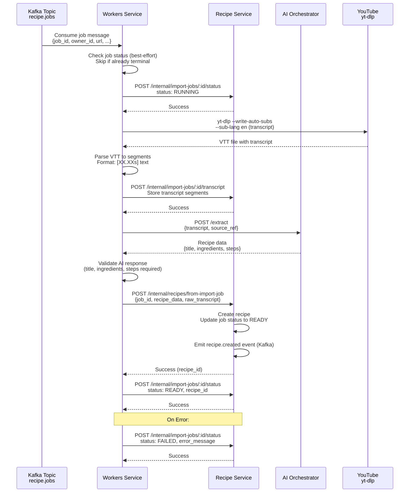

# Workers Service

Background workers for processing recipe import jobs. Consumes Kafka messages, fetches YouTube transcripts, and processes them through the AI pipeline to create recipes.

## Overview

The Workers Service is a Kafka consumer that processes recipe import jobs asynchronously. It fetches YouTube video transcripts using `yt-dlp`, calls the AI Orchestrator to extract structured recipe data, and stores the results via Recipe Service internal endpoints. The service handles errors gracefully with retries and provides detailed error messages for failed jobs.

## Responsibilities

- **Kafka Consumer**: Consume recipe import job messages from Kafka
- **Transcript Fetching**: Fetch YouTube video transcripts using `yt-dlp`
- **AI Integration**: Call AI Orchestrator to extract structured recipe data
- **Recipe Creation**: Store recipes via Recipe Service internal endpoints
- **Job Status Management**: Update import job status throughout the process (QUEUED → RUNNING → READY/FAILED)
- **Error Handling**: Retry on transient failures, provide detailed error messages

## Architecture

- **Framework**: Fastify (TypeScript/Node.js) for health check
- **Kafka Consumer**: `kafkajs` for consuming job messages
- **Transcript Fetching**: `yt-dlp` (Python tool, installed in Docker image)
- **Health Check**: HTTP server on port 8005
- **Processing**: Asynchronous job processing (main worker loop)

## Environment Variables

| Variable | Default | Description |
|----------|---------|-------------|
| `KAFKA_BROKERS` | **Required** | Comma-separated Kafka broker addresses |
| `KAFKA_TOPIC_JOBS` | `recipe.jobs` | Kafka topic to consume from |
| `RECIPE_INTERNAL_URL` | **Required** | Recipe service internal endpoint URL |
| `AI_ORCHESTRATOR_URL` | **Required** | AI Orchestrator service URL |
| `SERVICE_TOKEN` | **Required** | Token for service-to-service authentication |
| `WORKER_CONCURRENCY` | `4` | Reserved for future concurrency control (not currently used) |

## Process Flow

### Complete Job Processing Flow



### Job Processing Steps

1. **Consume Job Message**: Receive job message from Kafka topic `recipe.jobs`
2. **Best-Effort Status Check**: Check if job is already terminal (avoid wasted work)
3. **Update Status to RUNNING**: Mark job as processing
4. **Fetch YouTube Transcript**: Use `yt-dlp` to fetch video transcripts (VTT format)
5. **Parse Transcript**: Convert VTT to segments format `[XX.XXs] text`
6. **Store Transcript**: Store transcript segments in Recipe Service (for future use)
7. **Extract Recipe**: Call AI Orchestrator to extract structured recipe data
8. **Create Recipe**: Store recipe via Recipe Service internal endpoint
9. **Update Status to READY**: Mark job as complete with recipe_id

**On Error**:
- **Transcript Fetch Failure**: Update status to FAILED with error message
- **AI Extraction Failure**: Retry up to 2 times, then FAILED
- **Invalid AI Response**: Update status to FAILED with validation error
- **Recipe Creation Failure**: Update status to FAILED with error message

## Error Handling

### Error Categories

1. **Transcript Fetch Failures**:
   - Video not found or unavailable
   - No captions available
   - `yt-dlp` execution timeout (90 seconds)
   - → Job marked FAILED with descriptive error message

2. **AI Extraction Failures**:
   - Gemini API errors
   - Network timeouts
   - → Retry up to 2 times with exponential backoff (2s, 4s), then FAILED

3. **Invalid AI Responses**:
   - Missing required fields (title, ingredients, steps)
   - Invalid JSON format
   - → Job marked FAILED with validation error

4. **Recipe Creation Failures**:
   - Recipe Service errors
   - Database errors
   - → Job marked FAILED with error message

### Retry Strategy

**AI Extraction Retries**:
- **Max Retries**: 2 (3 total attempts)
- **Backoff**: Exponential with jitter
  - Attempt 1: 0ms delay
  - Attempt 2: 2000ms ± 20% jitter
  - Attempt 3: 4000ms ± 20% jitter

**Status Update Retries**:
- **Max Retries**: 3
- **Backoff**: 500ms base delay

**Recipe Creation Retries**:
- **Max Retries**: 3
- **Backoff**: 1000ms base delay

### Best-Effort Status Check

Before processing a job, worker checks if job is already terminal:
- **Purpose**: Avoid wasted work if job was already processed
- **Implementation**: `GET /internal/import-jobs/:job_id` (non-blocking)
- **If Terminal**: Skip processing (log and continue)
- **If Error**: Proceed with processing anyway (non-fatal)

## API Endpoints

### Health Endpoint

#### GET /health

Health check endpoint. Used by orchestration tools (Docker, Kubernetes) to check service health.

**Port**: 8005 (hardcoded in health server)

**Response** (200 OK):
```json
{
  "status": "healthy",
  "service": "workers"
}
```

**Example cURL**:
```bash
curl http://localhost:8005/health
```

## Running Locally

### Prerequisites

- Node.js 18+
- Python 3+ (for yt-dlp)
- `yt-dlp` installed: `pip install yt-dlp`
- Kafka running and accessible
- Recipe Service running and accessible
- AI Orchestrator running and accessible
- TypeScript

### Setup

1. **Install Node.js dependencies**:
```bash
npm install
   ```

2. **Install yt-dlp**:
   ```bash
   pip install yt-dlp
   # Or using system package manager:
   # brew install yt-dlp  (macOS)
   # apt-get install yt-dlp  (Debian/Ubuntu)
   ```

3. **Verify yt-dlp**:
   ```bash
   yt-dlp --version
   ```

4. **Set environment variables**:
   ```bash
   export KAFKA_BROKERS="localhost:9092"
   export KAFKA_TOPIC_JOBS="recipe.jobs"
   export RECIPE_INTERNAL_URL="http://localhost:8003"
   export AI_ORCHESTRATOR_URL="http://localhost:8004"
   export SERVICE_TOKEN="your-service-token"
   ```

5. **Run the service**:
   ```bash
npm run dev
```

**Note**: Service runs two processes:
- **Health Server**: HTTP server on port 8005 (for health checks)
- **Worker Loop**: Kafka consumer processing jobs

Or using Docker:

```bash
docker compose up --build
```

## Testing

### Testing Job Processing

```bash
# 1. Create import job via Recipe Service (or Gateway)
export ACCESS_TOKEN="your-access-token"

curl -X POST http://localhost:8080/api/recipes/import/youtube \
  -H "Authorization: Bearer $ACCESS_TOKEN" \
  -H "Content-Type: application/json" \
  -d '{
    "url": "https://www.youtube.com/watch?v=example"
  }' \
  -s | jq

# Output:
# {
#   "job_id": "550e8400-...",
#   "status": "QUEUED"
# }

# 2. Check job status (should eventually become READY or FAILED)
export JOB_ID="550e8400-..."

# Poll job status
while true; do
  STATUS=$(curl -X GET http://localhost:8080/api/recipes/import-jobs/$JOB_ID \
    -H "Authorization: Bearer $ACCESS_TOKEN" \
    -s | jq -r '.status')
  
  echo "Job Status: $STATUS"
  
  if [ "$STATUS" == "READY" ] || [ "$STATUS" == "FAILED" ]; then
    break
  fi
  
  sleep 3
done

# 3. Check created recipe (if READY)
if [ "$STATUS" == "READY" ]; then
  RECIPE_ID=$(curl -X GET http://localhost:8080/api/recipes/import-jobs/$JOB_ID \
    -H "Authorization: Bearer $ACCESS_TOKEN" \
    -s | jq -r '.recipe_id')
  
  curl -X GET http://localhost:8080/api/recipes/$RECIPE_ID \
    -H "Authorization: Bearer $ACCESS_TOKEN" \
    -s | jq
fi
```

### Testing Health Endpoint

```bash
curl http://localhost:8005/health
```

### Testing Direct Job Message (via Kafka)

```bash
# Send job message directly to Kafka (for testing)
# Requires kafka-console-producer or similar tool

echo '{
  "job_id": "550e8400-e29b-41d4-a716-446655440000",
  "owner_id": "550e8400-e29b-41d4-a716-446655440001",
  "source_type": "youtube",
  "url": "https://www.youtube.com/watch?v=example",
  "requested_at": "2024-01-01T00:00:00Z"
}' | kafka-console-producer \
  --broker-list localhost:9092 \
  --topic recipe.jobs \
  --property parse.key=true \
  --property key.separator=|
```

## Docker Deployment

### Build and Run

The Docker image includes Python 3, pip, ffmpeg, and yt-dlp for transcript fetching.

```bash
# Build image
docker build -t workers-service .

# Run container
docker run -p 8005:8005 \
  -e KAFKA_BROKERS="kafka:9092" \
  -e KAFKA_TOPIC_JOBS="recipe.jobs" \
  -e RECIPE_INTERNAL_URL="http://recipe:8003" \
  -e AI_ORCHESTRATOR_URL="http://ai-orchestrator:8004" \
  -e SERVICE_TOKEN="your-service-token" \
  workers-service
```

### Docker Compose

The service includes a `docker-compose.yml` for standalone deployment:

```yaml
services:
  workers:
    build: .
    ports:
      - "8005:8005"
    environment:
      KAFKA_BROKERS: ${KAFKA_BROKERS}
      KAFKA_TOPIC_JOBS: recipe.jobs
      RECIPE_INTERNAL_URL: ${RECIPE_INTERNAL_URL}
      AI_ORCHESTRATOR_URL: ${AI_ORCHESTRATOR_URL}
      SERVICE_TOKEN: ${SERVICE_TOKEN}
    depends_on:
      - kafka
      - recipe
      - ai-orchestrator
```

**Note**: Requires Kafka, Recipe Service, and AI Orchestrator to be running.

Run with:

```bash
docker compose up --build
```

## Transcript Fetching

### yt-dlp Integration

**Purpose**: Fetch YouTube video transcripts (captions/subtitles)

**Tool**: `yt-dlp` (Python-based YouTube downloader)

**Installation** (in Docker):
```dockerfile
# Dockerfile includes:
RUN apt-get update && apt-get install -y python3 python3-pip ffmpeg
RUN pip3 install yt-dlp
```

**Usage**:
```bash
yt-dlp --skip-download \
  --write-auto-subs \
  --sub-lang en \
  --sub-format vtt \
  -o /tmp/output.%(ext)s \
  "https://www.youtube.com/watch?v=example"
```

**Output**: VTT (WebVTT) file with transcript segments

**VTT Format**:
```
WEBVTT

00:00.000 --> 00:05.500
Hello and welcome to this recipe video

00:05.500 --> 00:10.000
First, we need 2 cups of flour
```

### VTT Parsing

**Process**:
1. **Parse Timecodes**: Extract start/end times from VTT format (`HH:MM:SS.mmm --> HH:MM:SS.mmm`)
2. **Extract Text**: Collect text lines until blank line
3. **Clean HTML**: Strip HTML tags (e.g., `<c>...</c>`)
4. **Create Segments**: Build array of `{start: number, dur: number, text: string}`
5. **Format Transcript**: Format as `[XX.XXs] text` for AI Orchestrator

**Segment Format**:
```typescript
{
  start: 0.0,      // Start time in seconds
  dur: 5.5,        // Duration in seconds
  text: "Hello and welcome to this recipe video"
}
```

**Transcript Format** (for AI Orchestrator):
```
[0.00s] Hello and welcome to this recipe video
[5.50s] First, we need 2 cups of flour
[10.00s] Then add 1 cup of sugar
```

**Safety Limits**:
- **Max Segments**: 2500 segments (capped for safety)
- **Timeout**: 90 seconds for yt-dlp execution

## Error Handling

### Error Messages

**Transcript Fetch Errors**:
- `"yt-dlp failed: Video unavailable"` - Video not found or private
- `"No transcript available - this video may not have captions enabled"` - No captions
- `"Transcript is too short (X characters). Recipe videos typically have longer transcripts."` - Very short transcript

**AI Extraction Errors**:
- `"AI extraction failed: <error>"` - Gemini API error after retries
- `"Invalid recipe data from AI"` - Missing required fields

**Job Status Errors**:
- `"Failed to update job status: <error>"` - Recipe Service error (after retries)

### Retry Logic

**AI Extraction**:
- **Max Attempts**: 3 (initial + 2 retries)
- **Backoff**: Exponential with jitter (2s, 4s base delays)
- **Label**: `extractRecipe(job_id)`

**Status Updates**:
- **Max Attempts**: 4 (initial + 3 retries)
- **Backoff**: Exponential with jitter (500ms base)
- **Labels**: `updateJobStatus(job_id)`, `createRecipeFromJob(job_id)`

### Idempotency

**Best-Effort Status Check**:
- Check job status before processing
- Skip if already terminal (READY or FAILED)
- Non-blocking (proceeds if check fails)

**Recipe Creation**:
- Recipe Service handles idempotency (checks if recipe already exists for job)
- Returns existing recipe_id if already created

## Dependencies

### System Dependencies

- **Python 3**: Required for yt-dlp
- **ffmpeg**: Required for yt-dlp video processing
- **yt-dlp**: Python package for YouTube transcript fetching

### Node.js Dependencies

- **kafkajs**: Kafka consumer client
- **fastify**: HTTP server for health check
- **child_process**: Execute yt-dlp command

## Security Considerations

1. **Service Token**: All internal API calls use `x-service-token` header
2. **Job ID Validation**: Job IDs validated to prevent path traversal attacks
3. **Temp Directory**: Per-job temp directories (`/tmp/mycookbook/{job_id}`)
4. **Cleanup**: Temp directories always cleaned up (even on errors)
5. **Input Validation**: YouTube URLs validated before processing
6. **Timeout**: yt-dlp execution timeout (90 seconds) prevents hanging processes

## Performance Considerations

### Concurrent Processing

**Current Implementation**:
- **Kafka Consumer**: Uses `eachMessage` handler (processes one message at a time per partition)
- **Concurrency**: Controlled by Kafka partitions (one worker per partition)
- **Future Enhancement**: `WORKER_CONCURRENCY` variable reserved for bounded concurrency control

### Transcript Fetching

- **Timeout**: 90 seconds per video
- **Temp Storage**: Per-job temp directories (cleaned up after processing)
- **Segment Limit**: 2500 segments max (prevents excessive processing)

### Retry Delays

- **Exponential Backoff**: Prevents overwhelming services during outages
- **Jitter**: Prevents thundering herd problem

## Integration

### Upstream (Calls This Service)

- **None** (Kafka consumer, not called directly)

### Downstream (This Service Calls)

1. **Recipe Service**:
   - `POST /internal/import-jobs/:job_id/status` - Update job status
   - `POST /internal/import-jobs/:job_id/transcript` - Store transcript
   - `POST /internal/recipes/from-import-job` - Create recipe
   - `GET /internal/import-jobs/:job_id` - Check job status (best-effort)

2. **AI Orchestrator**:
   - `POST /extract` - Extract recipe from transcript

### Dependencies

- **Kafka**: Consume job messages
- **Recipe Service**: Update job status and create recipes
- **AI Orchestrator**: Extract recipe data
- **YouTube**: Fetch video transcripts (via yt-dlp)

## Monitoring and Observability

### Health Check

- **Endpoint**: `GET /health`
- **Port**: 8005 (hardcoded)
- **Response Time**: Should be < 100ms
- **No Dependencies**: Always returns healthy if service is running

### Metrics to Track

1. **Job Processing Rate**: Jobs processed per second
2. **Success Rate**: Percentage of jobs that complete successfully (READY vs FAILED)
3. **Processing Time**: P50, P95, P99 for job processing (transcript fetch + AI extraction)
4. **Error Rate**: Number of failed jobs per error type
5. **Retry Rate**: Number of retries per operation
6. **Transcript Fetch Time**: Time to fetch YouTube transcripts
7. **AI Extraction Time**: Time for AI Orchestrator to extract recipe

### Logging

- **Job Processing**: Log start and completion of each job
- **Errors**: Log all errors with context (job_id, error type, retry attempts)
- **Transcript Fetching**: Log transcript segment count and processing time
- **Retries**: Log retry attempts with backoff delays
- **Sensitive Data**: Never log full transcripts or API keys

See [Design.md](./Design.md) for detailed architecture and integration patterns.

